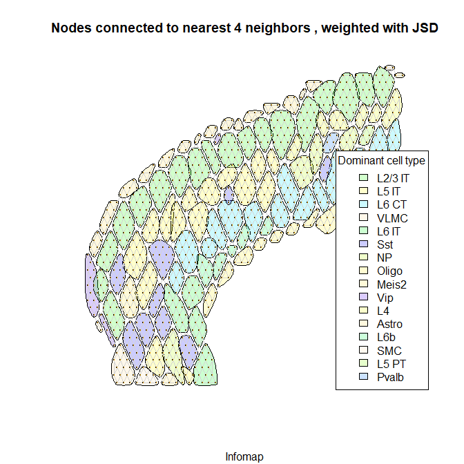

August 10th: Functions for separating nodes into border and non border groups
-----------------------------------------------------------------------------

    library(igraph)

    ## Warning: package 'igraph' was built under R version 3.6.3

    ## 
    ## Attaching package: 'igraph'

    ## The following objects are masked from 'package:stats':
    ## 
    ##     decompose, spectrum

    ## The following object is masked from 'package:base':
    ## 
    ##     union

    library(ggplot2)

    ## Warning: package 'ggplot2' was built under R version 3.6.3

    library(dplyr)

    ## Warning: package 'dplyr' was built under R version 3.6.3

    ## 
    ## Attaching package: 'dplyr'

    ## The following objects are masked from 'package:igraph':
    ## 
    ##     as_data_frame, groups, union

    ## The following objects are masked from 'package:stats':
    ## 
    ##     filter, lag

    ## The following objects are masked from 'package:base':
    ## 
    ##     intersect, setdiff, setequal, union

Load data, calculate communities, set parameters for plotting
=============================================================

Read in gene counts & weighted iGraph networks

    cell.type.distributions <- readRDS('../expression.vals.rds')
    g04 <- readRDS('../g04.rds')
    g08 <- readRDS('../g08.rds')

Save community objects using infomap and louvain:

    g04.infomap <- cluster_infomap(g04)
    g04.louvain <- cluster_louvain(g04)

    g08.infomap <- cluster_infomap(g08)
    g08.louvain <- cluster_louvain(g08)

Create functions for consistent color scheme of cell types across
different graphs and clustering results:

    #make list of any cell types over 15% for a given spot, and return the top (#1) for each community
    comm.top.celltypes <- function(communities.object, cell.types=cell.type.distributions){
      x <- lapply(communities(communities.object),function(z){
        x <- colMeans(cell.types[z,])
        x <- x[sort.list(x,decreasing = TRUE)]
        if (length(which(x>.3))>0){
          x[which(x>.3)]
        } else if (length(which(x>.15))>0){
          x[which(x>.15)]
        } else {
          x[1:2]
        }
      })
      as.factor(sapply(x,function(i){names(i)[1]}))
    }

    #colors used for maximum number of all cell types
    define.global.palette <- function(communities.object, cell.types=cell.type.distributions){
      global.pal <- topo.colors(length(unique(colnames(cell.types))),alpha=.2) #unique colorset for all available cell types
      names(global.pal) <- colnames(cell.types)
      global.pal
    }

    #colors used for this specific clustering (communities) object
    define.local.pal <- function(communities.object, cell.types=cell.type.distributions){
      communities.object$global.palette[as.character(unique(communities.object$top.celltypes))] #unique colorset used for this instance 
    }

    #assign correct plot color to each community
    define.community.colors <- function(communities.object, cell.types=cell.type.distributions){
      communities.object$local.palette[as.character(communities.object$top.celltypes)] 
    }

    set.community.attributes <- function(communities.object, subtitle='', cell.types=cell.type.distributions){
      communities.object$top.celltypes <- comm.top.celltypes(communities.object)
      communities.object$global.palette <- define.global.palette(communities.object)
      communities.object$local.palette <- define.local.pal(communities.object)
      communities.object$community.colors <- define.community.colors(communities.object)
      communities.object$subtitle <- subtitle
      communities.object
    }

    g04.infomap <- set.community.attributes(g04.infomap, 'Infomap')
    g04.louvain <- set.community.attributes(g04.louvain, 'Louvain')

    g08.infomap <- set.community.attributes(g08.infomap, 'Infomap')
    g08.louvain <- set.community.attributes(g08.louvain, 'Louvain')

Plot clustering results:
<https://igraph.org/python/doc/igraph.drawing-module.html>

    plot.communities <- function(basegraph, communities.object) {
      plot(basegraph, sub = communities.object$subtitle
        ,mark.groups = communities.object, mark.expand = 2, edge.width=0.2 
             ,edge.color = "lightgrey"
             ,mark.col = communities.object$community.colors
             ,mark.border="black")
      legend("bottomright",inset=.02,title="Dominant cell type"
             ,fill=communities.object$local.palette
             ,legend=names(communities.object$local.palette) 
             )
    }

    plot.communities(g04, g04.infomap)

    plot.communities(g08, g08.infomap)

    plot.communities(g04, g04.louvain)

    plot.communities(g08, g08.louvain)

Save list of nodes denoted as border regions for later enrichment analysis
==========================================================================

*How does `membership()` handle nodes that are in multiple communities
though?* Membership only assigns the 'best fit' (one label per node).

    find_true_border_edges <- function(basegraph, communities.object){
      #returns nx2 list of nodes that cross communities w different top cell types
      border.edges <- crossing(communities.object, basegraph)
      border.crossings <- ends(basegraph, E(basegraph)[border.edges]) #647
      print (paste("total number of edges:",length(border.edges))) #4019 (total number of edges)
      print (paste("community crossings:",sum(border.edges))) #647 edges that connect different communities
      #dim(border.crossings) #647 by 2
      #border.crossings[1:5,] #
      
      memb <- communities.object$top.celltypes[membership(communities.object)]
      
      edge.connects.different.dominant.celltypes <- memb[border.crossings[,1]] != memb[border.crossings[,2]]
      #length(edge.connects.different.dominant.celltypes)
      #sum(edge.connects.different.dominant.celltypes) #561 are true borders
      true.crossings <- border.crossings[edge.connects.different.dominant.celltypes,]
      print(paste("true community crossings:",dim(true.crossings)[1]))
      true.crossings
    }

    label_true_border_edges <- function(communities.object, true_border_edges){
      #returns nx2 list of top cell types for each node in the true border edges list
      memb <- communities.object$top.celltypes[membership(communities.object)] #top cell type of each community
      y <- memb[true_border_edges]
      dim(y) <- dim(true_border_edges)
      y
    }

    summarize_true_border_edges <- function(y){#y is a factor matrix from label_true_border_edges
      #sort each row, so visualizations on the true border edges can be created
      celltype.border.edges <- as.character(y)
      dim(celltype.border.edges) <- dim(y)
      celltype.border.edges <- t(apply(celltype.border.edges,1,sort))
      celltype.border.edges <- apply( celltype.border.edges , 1 , paste , collapse = " --- " )
      
      result <- as.data.frame(celltype.border.edges) %>%
        group_by(celltype.border.edges) %>%
        summarise(edge.count = n()) %>%
        arrange(-1*edge.count)
      result
    }

    g08.infomap.border_edges <- find_true_border_edges(g08, g08.infomap)

    ## [1] "total number of edges: 4019"
    ## [1] "community crossings: 1396"
    ## [1] "true community crossings: 1075"

    y2 <- label_true_border_edges(g08.infomap, g08.infomap.border_edges)
    #dim(y2)
    y2[1:15,]

    ##       [,1]    [,2]   
    ##  [1,] L2/3 IT L4     
    ##  [2,] SMC     L5 IT  
    ##  [3,] SMC     L5 IT  
    ##  [4,] SMC     Astro  
    ##  [5,] Oligo   L6 CT  
    ##  [6,] Oligo   L6 CT  
    ##  [7,] Oligo   L6 CT  
    ##  [8,] Oligo   L6 CT  
    ##  [9,] L5 IT   L2/3 IT
    ## [10,] L5 IT   L2/3 IT
    ## [11,] L5 IT   L2/3 IT
    ## [12,] L5 IT   L2/3 IT
    ## [13,] L2/3 IT Astro  
    ## [14,] L2/3 IT Astro  
    ## [15,] L2/3 IT Astro  
    ## 16 Levels: Astro L2/3 IT L4 L5 IT L5 PT L6 CT L6 IT L6b Lamp5 Meis2 ... VLMC

It looks like Astro-L2/3IT is the most common cross-community border.

    summarize_true_border_edges(y2) #would be cool if I added columns with the # of A spots & number of B spots too (non border spots)

    ## # A tibble: 43 x 2
    ##    celltype.border.edges edge.count
    ##    <fct>                      <int>
    ##  1 Astro --- L2/3 IT            141
    ##  2 L2/3 IT --- L5 IT            108
    ##  3 L6 CT --- Oligo               94
    ##  4 L5 IT --- L6 CT               73
    ##  5 L2/3 IT --- L4                70
    ##  6 L6 CT --- NP                  60
    ##  7 L4 --- NP                     44
    ##  8 L5 IT --- Sst                 43
    ##  9 L6 IT --- Sst                 31
    ## 10 L2/3 IT --- Lamp5             27
    ## # ... with 33 more rows

Code for selecting a specific cell type edge and target cell type to study
==========================================================================

    astro.rows <- y2[,1]=='Astro' | y2[,2]=='Astro'
    sum(astro.rows) #167 total

    ## [1] 167

    l2l3it.rows <- y2[,1]=='L2/3 IT' | y2[,2]=='L2/3 IT'
    sum(l2l3it.rows)

    ## [1] 428

    sum(astro.rows & l2l3it.rows) #146 astro-l2l3it edges

    ## [1] 141

    memb <- g08.infomap$top.celltypes[membership(g08.infomap)] #membership of every single spot
    cases <- unique(as.numeric(g08.infomap.border_edges[astro.rows & l2l3it.rows,])) #unique nodes in the 146 astro-l2l3it edges
    cases <- cases[memb[cases]=='Astro'] #only pull the astro nodes in astro-l2leit edges (59)
    all.astro <- which(memb=='Astro')

Identify astro spots in astro-L2/L3 IT edges. And then identify controls
(astro spots that are not in any other cross community edge, i.e. an
interior spot).

    length(all.astro)

    ## [1] 81

    length(cases)

    ## [1] 58

    non.border.controls <- all.astro[!all.astro %in% as.numeric(g08.infomap.border_edges)] #for control (non border spots), remove any in our target
    length(non.border.controls)

    ## [1] 15

    case.control.colors <- rep(1,1072)
    case.control.colors[cases] <- 2
    case.control.colors[non.border.controls] <- 3
    case.control.colors <- as.factor(-1*case.control.colors)

    case.control.size <- rep(1,1072)
    case.control.size[cases] <- 3
    case.control.size[non.border.controls] <- 3

    plot.cases.and.controls <- function(basegraph, communities.object,vertex.colors,vertex.sizes) {
      plot(basegraph, sub = communities.object$subtitle
        ,mark.groups = communities.object, mark.expand = 2, edge.width=0.2 
             ,edge.color = "lightgrey"
             ,mark.col = communities.object$community.colors
             ,mark.border="black"
             ,vertex.size=vertex.sizes
             ,vertex.color=vertex.colors)
      legend("bottomright",inset=.02,title="Dominant cell type"
             ,fill=communities.object$local.palette
             ,legend=names(communities.object$local.palette) 
             )
    }

    plot.cases.and.controls(g08 ,g08.infomap ,case.control.colors, case.control.size)

