Will need to rerun for a slideseq dataset too! Seurat vignettes updated
7-16-2020.

The spatial data to be analyzed is available publicly from 10x Genomics.
1,072 spatially tagged samples for 47,094 genes. Used Seurat
anchor-based algorithm to label each sample spot with composition of 23
different cell types:

    ##                      x   y          Vip        Lamp5       Sst         Sncg
    ## AAACAGAGCGACTCCT-1  94 -14 0.000000e+00 0.000000e+00 0.0000000 0.000000e+00
    ## AAACCGGGTAGGTACC-1  28 -42 3.129354e-02 0.000000e+00 0.2121399 0.000000e+00
    ## AAACCGTTCGTCCAGG-1  42 -52 1.937322e-05 1.452998e-05 0.0000000 5.811775e-05
    ## AAACTCGTGATATAAG-1 113 -23 0.000000e+00 0.000000e+00 0.0000000 0.000000e+00
    ## AAAGGGATGTAGCAAG-1  62 -24 1.519495e-01 2.589553e-03 0.2130934 0.000000e+00
    ## AAATAACCATACGGGA-1  88 -14 3.022401e-01 8.213392e-02 0.0000000 1.093476e-04
    ##                    Serpinf1       Pvalb       Endo Peri      L6 CT       L6b
    ## AAACAGAGCGACTCCT-1        0 0.000000000 0.00000000    0 0.00000000 0.0000000
    ## AAACCGGGTAGGTACC-1        0 0.008067108 0.00000000    0 0.00000000 0.0000000
    ## AAACCGTTCGTCCAGG-1        0 0.000000000 0.02895847    0 0.00000000 0.0000000
    ## AAACTCGTGATATAAG-1        0 0.000000000 0.00000000    0 0.01954665 0.3814934
    ## AAAGGGATGTAGCAAG-1        0 0.015878955 0.00000000    0 0.00000000 0.0000000
    ## AAATAACCATACGGGA-1        0 0.000000000 0.00000000    0 0.00000000 0.0000000
    ##                    L6 IT   L2/3 IT CR     L5 PT         NP         L4    L5 IT
    ## AAACAGAGCGACTCCT-1     0 1.0000000  0 0.0000000 0.00000000 0.00000000 0.000000
    ## AAACCGGGTAGGTACC-1     0 0.3179080  0 0.1659479 0.00000000 0.26464364 0.000000
    ## AAACCGTTCGTCCAGG-1     0 0.0000000  0 0.0000000 0.00000000 0.00000000 0.000000
    ## AAACTCGTGATATAAG-1     0 0.0000000  0 0.0000000 0.01035563 0.00000000 0.000000
    ## AAAGGGATGTAGCAAG-1     0 0.0000000  0 0.0000000 0.00000000 0.05377252 0.562716
    ## AAATAACCATACGGGA-1     0 0.6155166  0 0.0000000 0.00000000 0.00000000 0.000000
    ##                        Oligo Meis2      Astro Macrophage      VLMC       SMC
    ## AAACAGAGCGACTCCT-1 0.0000000     0 0.00000000 0.00000000 0.0000000 0.0000000
    ## AAACCGGGTAGGTACC-1 0.0000000     0 0.00000000 0.00000000 0.0000000 0.0000000
    ## AAACCGTTCGTCCAGG-1 0.1205828     0 0.07998056 0.01847914 0.5404101 0.2114969
    ## AAACTCGTGATATAAG-1 0.5886043     0 0.00000000 0.00000000 0.0000000 0.0000000
    ## AAAGGGATGTAGCAAG-1 0.0000000     0 0.00000000 0.00000000 0.0000000 0.0000000
    ## AAATAACCATACGGGA-1 0.0000000     0 0.00000000 0.00000000 0.0000000 0.0000000
    ##                          max
    ## AAACAGAGCGACTCCT-1 1.0000000
    ## AAACCGGGTAGGTACC-1 0.3179080
    ## AAACCGTTCGTCCAGG-1 0.5404101
    ## AAACTCGTGATATAAG-1 0.5886043
    ## AAAGGGATGTAGCAAG-1 0.5627160
    ## AAATAACCATACGGGA-1 0.6155166

Plot original stained tissue image and UMAP clusters.

    SpatialDimPlot(cortex_final, crop = FALSE, pt.size.factor = 0, label.size = 3)

    SpatialDimPlot(cortex_final, crop = TRUE, pt.size.factor = 0, label.size = 3)

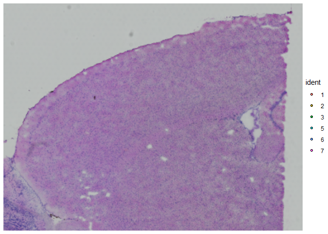

    SpatialDimPlot(cortex_final, crop = TRUE, label = FALSE)

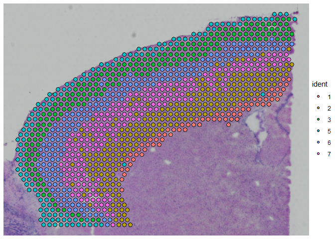

    rm(cortex_final) # <- uncomment this to save RAM

Save X-Y coordinates for plotting network graphs in the same shape as
the original slide:

    layout.for.igraph <- as.matrix(spatial.data.frame[,1:2]) 
    set_default_igraph_attr <- function(g,max.out.degree=NA){
      graph_attr(g,"layout") <- layout.for.igraph
      vertex_attr(g,"size") <- 1 #set here, instead of passing in "vertex.size=1" to plot(g)
      vertex_attr(g,"label") <- NA 
      edge_attr(g,"color") <- adjustcolor("SkyBlue2", alpha.f=1)
      if (is.weighted(g)){
        edge_attr(g, "width") <- E(g)$weight*5
      }
      if (!is.na(max.out.degree)){
        graph_attr(g,"max.out.degree") <- max.out.degree
        graph_attr(g,"main") <- paste("Nodes connected to nearest",max.out.degree,"neighbors")
        if (is.weighted(g)) {graph_attr(g,"main") <- paste(graph_attr(g,"main"),", weighted with JSD")}
      }
      set_default_igraph_attr <- g
    }

Calculate Jensen-Shannon Divergence for every pair of samples’ predicted
cell type distributions:

    n <- nrow(spatial.data.frame)
    jsd.matrix <- matrix(data=NA,nrow=n,ncol=n)
    for (i in seq(n)){
      for (v in seq(n)){
        if (!is.na(jsd.matrix[v,i])) {
          jsd.matrix[i,v] <- jsd.matrix[v,i]
          next
        }
        current <- 0
        if (i != v) {suppressMessages(current <- as.numeric(JSD(expression.vals[c(i,v),])))}
        jsd.matrix[i,v] <- current
      }
    }
    rm(i,v,current)
    dim(jsd.matrix)

    ## [1] 1072 1072

New July 16: use distance ranks to create network graph, instead of
setting a distance threshold. Build edgelist of closest N neighbors for
each node.

    make_graph_of_closest_neighbors <- function(max.out.degree) {
      #out.degree = max number of edges for each node 
      temp <- distance.matrix[1:max.out.degree,]
      results <- vector('numeric')
      for (i in seq(n)){
        #print (paste("i",i))
        x <- temp[, i]
        #print (x)
        for (v in x){
          #print (paste(".v",v))
          #print (temp[,v])
          if (i %in% temp[, v]){
            #print (paste('yes',i,v))
            results <- c(results,i,v)}
        }
      }
      results <- matrix(results, ncol=2, byrow=TRUE) #build an edge list
      results <- unique(t(apply(results,1,sort))) #after sorting cols 1 & 2, can prevent duplicate rows
      g <- graph_from_edgelist(results, directed=FALSE)
      g <- set_default_igraph_attr(g,max.out.degree=max.out.degree)
      make_graph_of_closest_neighbors <- g
    }

Use new function to create networks of closest 4, 6, 8, 12 neighbors:
---------------------------------------------------------------------

    g04 <- make_graph_of_closest_neighbors(4)
    g06 <- make_graph_of_closest_neighbors(6)
    g08 <- make_graph_of_closest_neighbors(8)
    g12 <- make_graph_of_closest_neighbors(12)
    summary(g04,graph.attributes=TRUE)

    ## IGRAPH a436fbc U--- 1072 2064 -- 
    ## + attr: layout (g/n), max.out.degree (g/n), main (g/c), size (v/n),
    ## | label (v/l), color (e/c)

    summary(g08,graph.attributes=TRUE)

    ## IGRAPH a4a774a U--- 1072 4060 -- 
    ## + attr: layout (g/n), max.out.degree (g/n), main (g/c), size (v/n),
    ## | label (v/l), color (e/c)

    plot(g04)

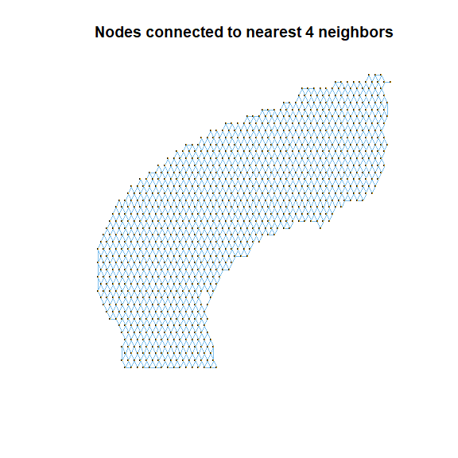

    plot(g08) 

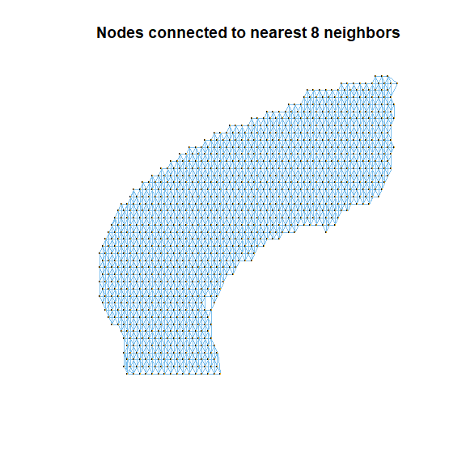

Use JSD to create weighted networks
-----------------------------------

Weight the networks using 1 - JSD. (JSD=0 for perfectly identical cell
type distributions).

    make_graph_weighted_with_JSD <- function(base_graph){
      #starting with base_graph, weight edges with the Jensen Shannon Divergence of the 2 nodes attached by the edge
      g <- as_adjacency_matrix(base_graph,type="both",sparse=FALSE) > 0 #create adjacency matrix, TRUE or . (null)
      #jsd=0 for identical dist. so use 1 minus JSD and ignore JSD=1 (total dissimilarity)
      g <- ifelse(g & 1-jsd.matrix>0, 1-jsd.matrix, 0) 
      g <- graph_from_adjacency_matrix(g, mode="undirected",weighted=TRUE)
      g <- set_default_igraph_attr(g, max.out.degree = if (!is.null(graph_attr(base_graph,"max.out.degree"))) {graph_attr(base_graph,"max.out.degree")} else {NA})
    }

    g04.weighted <- make_graph_weighted_with_JSD(g04)
    g06.weighted <- make_graph_weighted_with_JSD(g06)
    g08.weighted <- make_graph_weighted_with_JSD(g08)
    g12.weighted <- make_graph_weighted_with_JSD(g12)
    plot(g04.weighted)

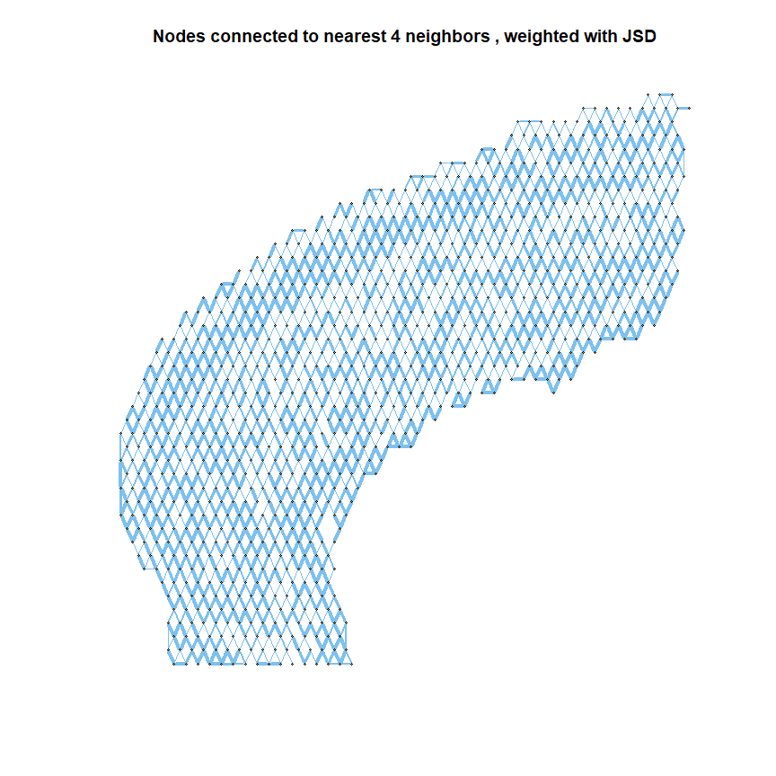

    plot(g08.weighted)

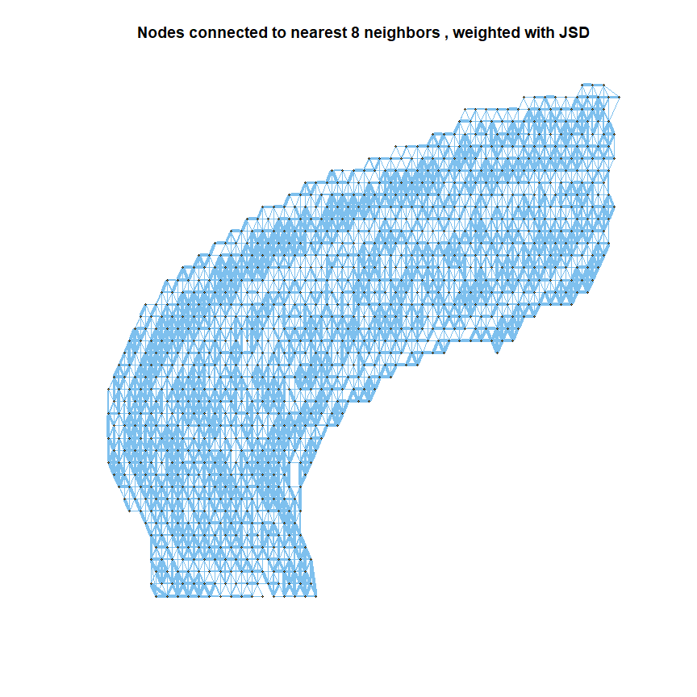

Apply Louvain Community detection
---------------------------------

Color By Dominant Cell Type for Each Community
----------------------------------------------

    plot_communities_by_dominant_cell_type <- function(basegraph, communities.algo=NA
                                                       , print.table=FALSE, expr=expression.vals){
      #communities.algo is a string: cluster_louvain, cluster_infomap
      communities.object <- NA
      if (is.na(communities.algo) | communities.algo=="cluster_louvain") {
        communities.object <- cluster_louvain(basegraph)
      }else if (communities.algo=="cluster_infomap"){
        communities.object <- cluster_infomap(basegraph)
      }
      if (is.na(communities.object)) {break}
      comm.top.celltypes <- lapply(communities(communities.object),function(z){
        x <- colMeans(expr[z,])
        x <- x[sort.list(x,decreasing = TRUE)]
        if (length(which(x>.3))>0){
          x[which(x>.3)]
        } else if (length(which(x>.15))>0){
          x[which(x>.15)]
        } else {
          x[1:2]
        }
      })
      comm.highest.label <- as.factor(sapply(comm.top.celltypes, function(x){names(x)[1]}))
      comm.labels <- sapply(comm.top.celltypes, function(x){paste(names(x),sprintf(x,fmt = '[%#.2f]'),collapse="; ")})
      names(comm.labels) <- paste("Community #",names(comm.labels),sep="")
      #comm.highest.val <- sapply(comm.top.celltypes, function(x){x[1]},USE.NAMES = FALSE)
      if (print.table) {
        print ("")
        print (paste("Highest Cell Types per Community,",graph_attr(basegraph,"main")))
        print (comm.labels)
      }
      #take care here to use a global to set palette and ensure it is large enough to handle 23 cell types:
      #by using global palette, cell types will retain same color on different plots
      #set alpha to < 1.0, so that community overlaps can be seen
      global.pal <- topo.colors(length(unique(colnames(expression.vals))),alpha=.2)
      names(global.pal) <- colnames(expression.vals)
      local.pal <- global.pal[as.character(unique(comm.highest.label))] #unique colorset used for this instance 
      comm.pal <- local.pal[as.character(comm.highest.label)] #colors used by each community
      plot(basegraph
           #, sub="asdfasdf"
           ,mark.groups=communities.object, mark.expand = 2, edge.width=0.2 
           ,edge.color="lightgrey"
           ,mark.col=comm.pal
           ,mark.border="black")
      legend("bottomright",inset=.02,title="Dominant cell type"
             ,fill=local.pal
             ,legend=names(local.pal) 
             )
    }

    plot_communities_by_dominant_cell_type(g04.weighted, "cluster_louvain", print.table=FALSE)

    ## Warning in if (is.na(communities.object)) {: the condition has length > 1 and
    ## only the first element will be used

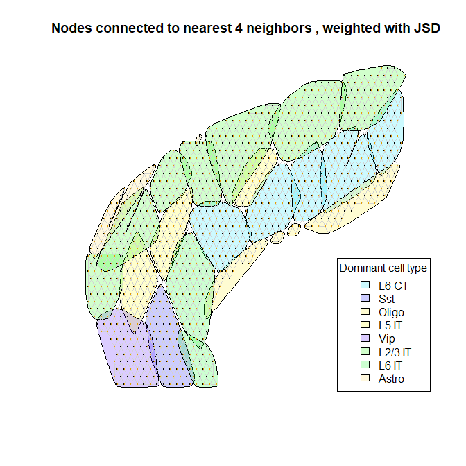

    plot_communities_by_dominant_cell_type(g04.weighted, "cluster_infomap", print.table=FALSE)

    ## Warning in if (is.na(communities.object)) {: the condition has length > 1 and
    ## only the first element will be used

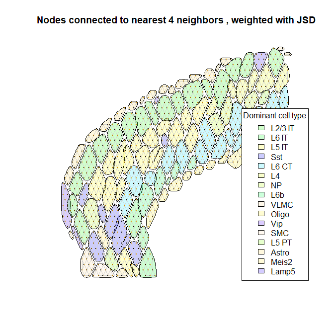
**^Why is the subtitle still not working? Should print what community
detection algo was used, and meta measures like Modularity**

    plot_communities_by_dominant_cell_type(g08.weighted, "cluster_louvain")

    ## Warning in if (is.na(communities.object)) {: the condition has length > 1 and
    ## only the first element will be used

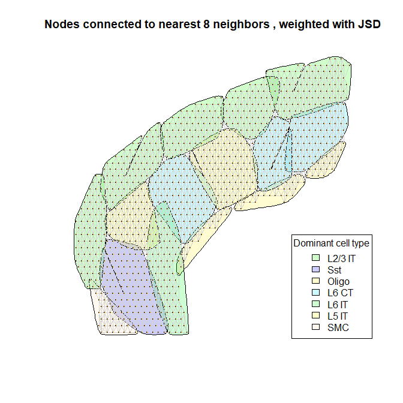

    plot_communities_by_dominant_cell_type(g08.weighted, "cluster_infomap")

    ## Warning in if (is.na(communities.object)) {: the condition has length > 1 and
    ## only the first element will be used

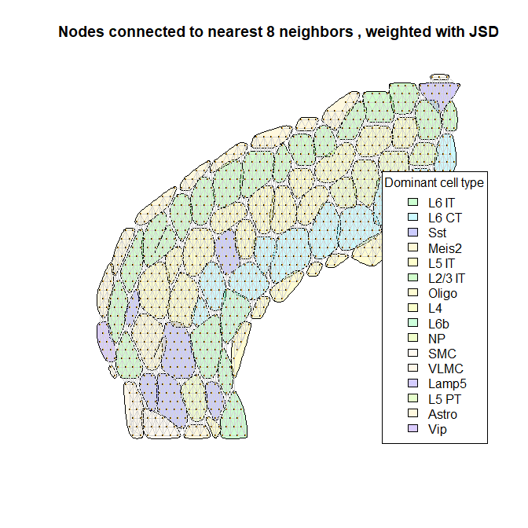

Characterize a specific community
---------------------------------

Create functions for exploring specific communities: **Broken: wont
print x axis if only one cell type in boxplot**

    plot_community_location <- function(basegraph,communities.object,community.i){
      #plot a single community: 
      plot(basegraph, mark.groups=communities.object[[community.i]], mark.expand = 2, edge.width=1
           ,edge.color=ifelse(crossing(communities.object,basegraph),"red","black")
           #,main=paste(graph_attr(basegraph,"main"),paste(", community #",community.i,sep=""))
           ,sub=paste("Community #",community.i," highlighted (n=",length(communities.object[[community.i]]),")",sep="")
           )
    }

    get_prevalent_cell_types <- function(communities.object, community.i, cutoff=.05, expr=expression.vals){
      targets <- communities.object[[community.i]]
      x <- expr[targets,]
      row.names(x) <- as.character(targets)
      prevalent_cell_types <- names(which(apply(x,2,mean)>cutoff)) #cell types that average over 5% of composition of samples in this community
      x[,prevalent_cell_types]
    }

    plot_prevalent_cell_types <- function(communities.object, community.i, cutoff=.05, expr=expression.vals){
      title <- paste("Prevalent Cell Types for Community #",community.i," (n=",sep="")
      title <- paste(title,length(communities.object[[community.i]]),")",sep="")
      boxplot(get_prevalent_cell_types(communities.object, community.i, cutoff, expr),main=title)
    }

    plot_cell_type_distributions <- function(communities.object, community.i, cutoff=.05, expr=expression.vals){
      y <- as.data.frame(get_prevalent_cell_types(communities.object, community.i))
      barplot(t(y), col=as.factor(colnames(y)), legend.text = TRUE
            ,names.arg=rep("",dim(y)[1])
            ,main=paste('Cell Type Compositions for Samples in Community #',1,sep="")
            )
    }

    plot_cell_type_distributions_gg <- function(communities.object, community.i, cutoff=.05, expr=expression.vals){
      #cant use ggplot when doing multiple plots together, but it would be nice...
      y <- as.data.frame(get_prevalent_cell_types(communities.object, community.i))
      y['sample'] <- as.character(row.names(y))
      y <- y %>% pivot_longer(-sample,names_to='cell.type',values_to='composition')
      ggplot(y, aes(fill=cell.type, y = composition, x = sample))+
        ggtitle(paste('Cell Type Compositions for Samples in Community #',community.i,sep=""))+
        geom_bar(position="stack", stat="identity")+
        theme(axis.text.x=element_blank())
    }

    plot_EDA_for_community <- function(basegraph,community.i,communities.object=NA, cutoff=.05, expr=expression.vals){
      #par(mfrow=c(2,1))
      if (is.na(communities.object)) {communities.object <- cluster_louvain(basegraph)}
      plot_community_location(basegraph,communities.object,community.i)
      plot_cell_type_distributions(communities.object,community.i,cutoff,expr)
      plot_prevalent_cell_types(communities.object,community.i,cutoff,expr)
      #p1 + p2 #cant use mfrow for ggplot (plot_prevalent_cell_types)
    }

The 65 nodes in community \#1 seem to have similar cell type
distributions:

    base <- g04.weighted
    i <- 1
    plot_EDA_for_community(base, i)

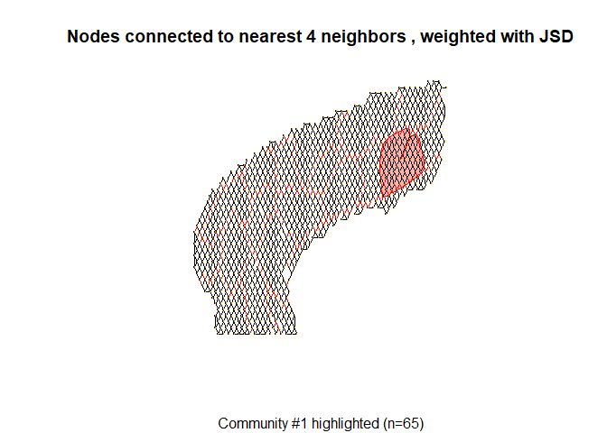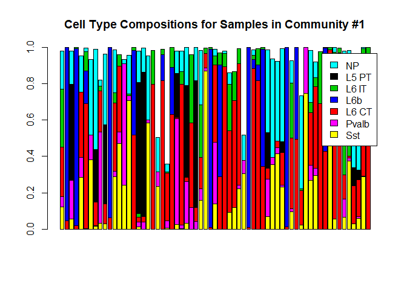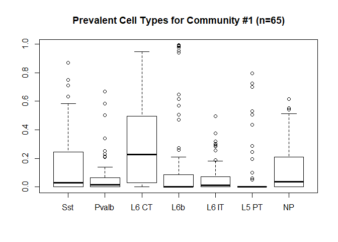

    base <- g08.weighted
    i <- 13
    plot_EDA_for_community(base, i)

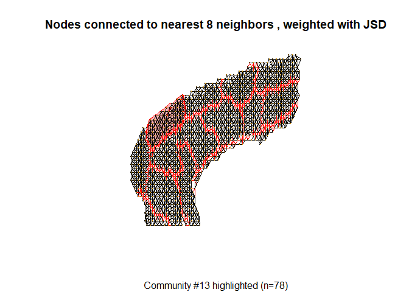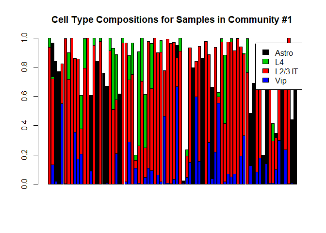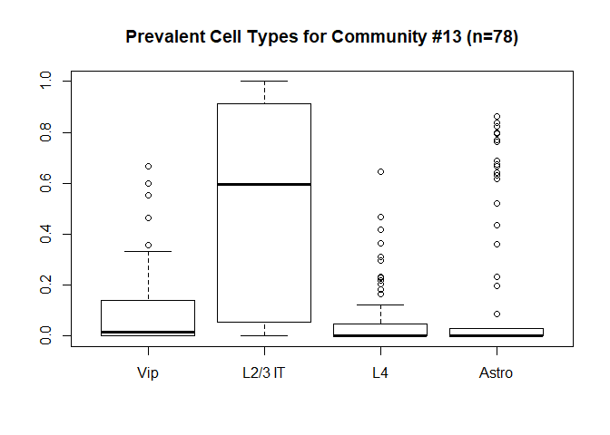

Create random graphs, to assess frequency of getting communities of similar size
================================================================================

Can see if getting large community membership size is probable. Will use
both Modularity and mean community size as the measure (high modularity
is interpreted as dense intra community connections and sparse inter
community connections).

    deg <- 4
    B <- 10000

    simulation.results <- t(replicate(B,{
    null.g <- sample_degseq(rep(deg,n), method = "simple.no.multiple")
    null.g <- set_default_igraph_attr(null.g)
    null.cl <- cluster_louvain(null.g)
    c(modularity(null.cl),mean(membership(null.cl)))
    }))
    colnames(simulation.results) <- c("modularity","mean community size")

Repeated 1,000 times, modularity for random 4-degree networks is no
where close to what is observed in the tissue:

    boxplot(simulation.results[,1], ylim=c(.5,1)
            , main = paste("Modularity:",B,"simulations vs. Observed (red)")
            , sub = get.graph.attribute(g04.weighted,"main"))
    points(modularity(lc04),col="red",pch=19)

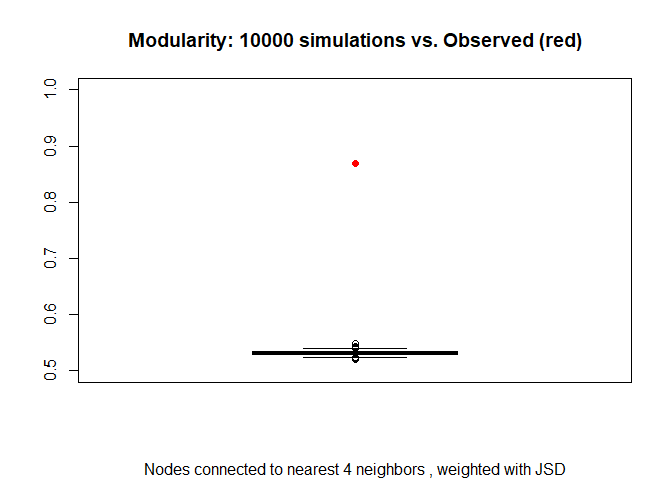

After 1,000 runs, very rare for mean community size to reach what is
observed in the actual Louvain(4) network.

    boxplot(simulation.results[,2]
            , main = paste("Mean community size:",B,"simulations vs. Observed (red)")
            , sub = get.graph.attribute(g04.weighted,"main"))
    points(mean(membership(lc04)),col="red",pch=19)

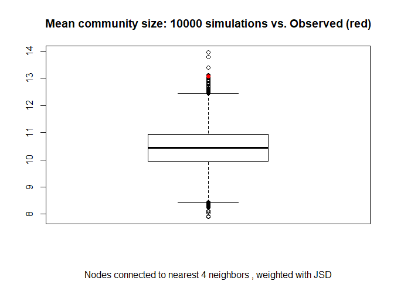

### Later

-   Interactive Shiny app - use sliders to adjust number of nearest
    neighbor edges, and to “blob” together communities, \* Use radio
    buttons to select which community detection algo to use.
-   Hover over community to see its name and a chart with aggregate cell
    type distribution of that community
-   Apply algorithm to slide-seq data, and another 10x dataset (need to
    find anchoring reference though)

Community Annotations:
======================

When “blobbing” together communities, may need to draw polygons
individually, instead of relying on plot(). Or would be nice to label
communities with their dominant cell type.
<a href="https://stackoverflow.com/questions/47971179/igrph-adding-text-to-community-plot" class="uri">https://stackoverflow.com/questions/47971179/igrph-adding-text-to-community-plot</a>

    for (g in seq_along(mark.groups)) {
    v <- V(graph)[mark.groups[[g]]]
    igraph.polygon(layout[v, , drop = FALSE], vertex.size = vs, 
                   expand.by = mark.expand[g]/200, shape = mark.shape[g], 
                   col = mark.col[g], border = mark.border[g])

Manually adding text:
`text(c(-1.15, 0.8, 0.9), c(0.35, -0.7, 0.8), c("A", "B", "C"))`
