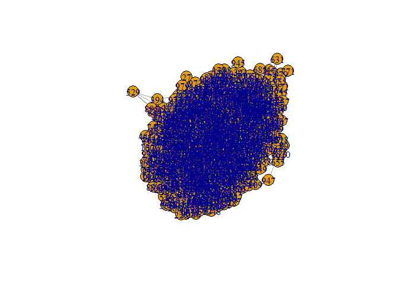

Will need to rerun for a slideseq dataset too! Seurat vignettes updated
7-16-2020.

The spatial data to be analyzed is available publicly from 10x Genomics.
1,072 spatially tagged samples for 47,094 genes. Used Seurat
anchor-based algorithm to label each sample spot with composition of 23
different cell types:

Plot original stained tissue image and UMAP clusters.

    SpatialDimPlot(cortex_final, crop = FALSE, pt.size.factor = 0, label.size = 3)

    SpatialDimPlot(cortex_final, crop = TRUE, pt.size.factor = 0, label.size = 3)

    SpatialDimPlot(cortex_final, crop = TRUE, label = FALSE)

    rm(cortex_final) # <- uncomment this to save RAM

Save X-Y coordinates for plotting network graphs in the same shape as
the original slide:

    layout.for.igraph <- as.matrix(spatial.data.frame[,1:2]) 
    set_default_igraph_attr <- function(g,max.out.degree=NA){
      graph_attr(g,"layout") <- layout.for.igraph
      vertex_attr(g,"size") <- 1 #set here, instead of passing in "vertex.size=1" to plot(g)
      vertex_attr(g,"label") <- NA 
      edge_attr(g,"color") <- adjustcolor("SkyBlue2", alpha.f=1)
      if (is.weighted(g)){
        edge_attr(g, "width") <- E(g)$weight*5
      }
      if (!is.na(max.out.degree)){
        graph_attr(g,"max.out.degree") <- max.out.degree
        graph_attr(g,"main") <- paste("Nodes connected to nearest",max.out.degree,"neighbors")
        if (is.weighted(g)) {graph_attr(g,"main") <- paste(graph_attr(g,"main"),", weighted with JSD")}
      }
      set_default_igraph_attr <- g
    }

Calculate Jensen-Shannon Divergence for every pair of samples’ predicted
cell type distributions:

    n <- nrow(spatial.data.frame)
    jsd.matrix <- matrix(data=NA,nrow=n,ncol=n)
    for (i in seq(n)){
      for (v in seq(n)){
        if (!is.na(jsd.matrix[v,i])) {
          jsd.matrix[i,v] <- jsd.matrix[v,i]
          next
        }
        current <- 0
        if (i != v) {suppressMessages(current <- as.numeric(JSD(expression.vals[c(i,v),])))}
        jsd.matrix[i,v] <- current
      }
    }
    rm(i,v,current)
    dim(jsd.matrix)

    ## [1] 1072 1072

New July 16: use distance ranks to create network graph, instead of
setting a distance threshold. Build edgelist of closest N neighbors for
each node.

    make_graph_of_closest_neighbors <- function(max.out.degree) {
      #out.degree = max number of edges for each node 
      temp <- distance.matrix[1:max.out.degree,]
      results <- vector('numeric')
      for (i in seq(n)){
        #print (paste("i",i))
        x <- temp[, i]
        #print (x)
        for (v in x){
          #print (paste(".v",v))
          #print (temp[,v])
          if (i %in% temp[, v]){
            #print (paste('yes',i,v))
            results <- c(results,i,v)}
        }
      }
      results <- matrix(results, ncol=2, byrow=TRUE) #build an edge list
      results <- unique(t(apply(results,1,sort))) #after sorting cols 1 & 2, can prevent duplicate rows
      g <- graph_from_edgelist(results, directed=FALSE)
      g <- set_default_igraph_attr(g,max.out.degree=max.out.degree)
      make_graph_of_closest_neighbors <- g
    }

Use new function to create networks of closest 4, 6, 8, 12 neighbors:
---------------------------------------------------------------------

    g04 <- make_graph_of_closest_neighbors(4)
    g06 <- make_graph_of_closest_neighbors(6)
    g08 <- make_graph_of_closest_neighbors(8)
    g12 <- make_graph_of_closest_neighbors(12)
    summary(g04,graph.attributes=TRUE)

    ## IGRAPH 9ba4c69 U--- 1072 2064 -- 
    ## + attr: layout (g/n), max.out.degree (g/n), main (g/c), size (v/n),
    ## | label (v/l), color (e/c)

    summary(g08,graph.attributes=TRUE)

    ## IGRAPH 9c25ddf U--- 1072 4060 -- 
    ## + attr: layout (g/n), max.out.degree (g/n), main (g/c), size (v/n),
    ## | label (v/l), color (e/c)

    plot(g04)

    plot(g08) 

\#\# Use JSD to create weighted networks Weight the networks using 1 -
JSD. (JSD=0 for perfectly identical cell type distributions).

    make_graph_weighted_with_JSD <- function(base_graph){
      #starting with base_graph, weight edges with the Jensen Shannon Divergence of the 2 nodes attached by the edge
      g <- as_adjacency_matrix(base_graph,type="both",sparse=FALSE) > 0 #create adjacency matrix, TRUE or . (null)
      #jsd=0 for identical dist. so use 1 minus JSD and ignore JSD=1 (total dissimilarity)
      g <- ifelse(g & 1-jsd.matrix>0, 1-jsd.matrix, 0) 
      g <- graph_from_adjacency_matrix(g, mode="undirected",weighted=TRUE)
      g <- set_default_igraph_attr(g, max.out.degree = if (!is.null(graph_attr(base_graph,"max.out.degree"))) {graph_attr(base_graph,"max.out.degree")} else {NA})
    }

    g04.weighted <- make_graph_weighted_with_JSD(g04)
    g06.weighted <- make_graph_weighted_with_JSD(g06)
    g08.weighted <- make_graph_weighted_with_JSD(g08)
    g12.weighted <- make_graph_weighted_with_JSD(g12)
    plot(g04.weighted)

    plot(g08.weighted)

\#\# Apply Louvain Community detection

Color By Dominant Cell Type for Each Community
----------------------------------------------

    plot_communities_by_dominant_cell_type <- function(basegraph, communities.object=NA, expr=expression.vals){
      if (is.na(communities.object)) {communities.object <- cluster_louvain(basegraph)}
      comm.top.celltypes <- lapply(communities(communities.object),function(z){
        x <- colMeans(expr[z,])
        x <- x[sort.list(x,decreasing = TRUE)]
        if (length(which(x>.3))>0){
          x[which(x>.3)]
        } else if (length(which(x>.15))>0){
          x[which(x>.15)]
        } else {
          x[1:2]
        }
      })
      comm.highest.label <- as.factor(sapply(comm.top.celltypes, function(x){names(x)[1]}))
      comm.labels <- sapply(comm.top.celltypes, function(x){paste(names(x),sprintf(x,fmt = '[%#.2f]'),collapse="; ")})
      names(comm.labels) <- paste("Community #",names(comm.labels),sep="")
      #comm.highest.val <- sapply(comm.top.celltypes, function(x){x[1]},USE.NAMES = FALSE)
      print (paste("Highest Cell Types per Community,",graph_attr(basegraph,"main")))
      print (comm.labels)

      #!!!need to use a global to set palette and ensure it is large enough to handle 23 cell types 
      pal <- categorical_pal(length(unique(comm.highest.label)))
      plot(basegraph, mark.groups=communities.object, mark.expand = 2, edge.width=0.2 
           ,edge.color="lightgrey"
           ,mark.col = pal[as.numeric(comm.highest.label)]
           ,mark.border="black")
      legend("bottomright",inset=.02,title="Dominant cell type"
             ,fill = pal[unique(as.numeric(comm.highest.label))]
             ,legend=unique(comm.highest.label))
    }

    plot_communities_by_dominant_cell_type(g04.weighted)

    ## [1] "Highest Cell Types per Community, Nodes connected to nearest 4 neighbors , weighted with JSD"
    ##                             Community #1 
    ##                           "L6 CT [0.30]" 
    ##                             Community #2 
    ##               "Sst [0.27]; L5 IT [0.17]" 
    ##                             Community #3 
    ##                           "Oligo [0.93]" 
    ##                             Community #4 
    ##                           "Oligo [1.00]" 
    ##                             Community #5 
    ##                           "L6 CT [0.32]" 
    ##                             Community #6 
    ##                           "L5 IT [0.34]" 
    ##                             Community #7 
    ##                           "L5 IT [0.56]" 
    ##                             Community #8 
    ##                           "Oligo [0.99]" 
    ##                             Community #9 
    ##                           "L6 CT [0.33]" 
    ##                            Community #10 
    ##               "Vip [0.12]; Meis2 [0.12]" 
    ##                            Community #11 
    ##                           "L6 CT [0.36]" 
    ##                            Community #12 
    ##                         "L2/3 IT [0.63]" 
    ##                            Community #13 
    ## "L2/3 IT [0.20]; Vip [0.16]; Sst [0.16]" 
    ##                            Community #14 
    ##                         "L2/3 IT [0.37]" 
    ##                            Community #15 
    ##                           "L5 IT [0.40]" 
    ##                            Community #16 
    ##                           "L6 IT [0.40]" 
    ##                            Community #17 
    ##                           "L6 CT [0.26]" 
    ##                            Community #18 
    ##                         "L2/3 IT [0.57]" 
    ##                            Community #19 
    ##                         "L2/3 IT [0.34]" 
    ##                            Community #20 
    ##                         "L2/3 IT [0.34]" 
    ##                            Community #21 
    ##                           "Astro [0.53]" 
    ##                            Community #22 
    ##                           "Oligo [0.92]" 
    ##                            Community #23 
    ##              "L2/3 IT [0.26]; L4 [0.25]" 
    ##                            Community #24 
    ##                           "Astro [0.81]" 
    ##                            Community #25 
    ##               "L6 IT [0.30]; Sst [0.25]"

**^Need to set a palette of 23 colors (\# of cell types) globally. Then
every cell type is converted to an integer (and that integer is used to
lookup from the global palette).**

**^^Also need to make sure communities are opacity / alpha low, so
overlapping communities can be seen**

    plot_communities_by_dominant_cell_type(g08.weighted)

    ## [1] "Highest Cell Types per Community, Nodes connected to nearest 8 neighbors , weighted with JSD"
    ##                                        Community #1 
    ##                         "L2/3 IT [0.27]; L4 [0.27]" 
    ##                                        Community #2 
    ##                                        "Sst [0.25]" 
    ##                                        Community #3 
    ##                                      "Oligo [0.96]" 
    ##                                        Community #4 
    ##                        "L6 CT [0.25]; L5 IT [0.24]" 
    ##                                        Community #5 
    ##                                      "L6 IT [0.42]" 
    ##                                        Community #6 
    ##                                    "L2/3 IT [0.38]" 
    ##                                        Community #7 
    ##                                      "Oligo [0.96]" 
    ##                                        Community #8 
    ##                                      "L6 CT [0.35]" 
    ##                                        Community #9 
    ##                                      "Oligo [0.89]" 
    ##                                       Community #10 
    ##                                      "L5 IT [0.43]" 
    ##                                       Community #11 
    ##                           "L6 CT [0.26]; NP [0.18]" 
    ##                                       Community #12 
    ## "SMC [0.21]; Vip [0.18]; VLMC [0.17]; Meis2 [0.15]" 
    ##                                       Community #13 
    ##                                    "L2/3 IT [0.52]" 
    ##                                       Community #14 
    ##                                    "L2/3 IT [0.29]" 
    ##                                       Community #15 
    ##                                      "L5 IT [0.30]" 
    ##                                       Community #16 
    ##                                    "L2/3 IT [0.48]"

Characterize the communities of the g4 network.
-----------------------------------------------

Explore communities igraph objects:

Create functions for exploring specific communities:

    plot_community_location <- function(basegraph,communities.object,community.i){
      #plot a single community: 
      plot(basegraph, mark.groups=communities.object[[community.i]], mark.expand = 2, edge.width=1
           ,edge.color=ifelse(crossing(communities.object,basegraph),"red","black")
           #,main=paste(graph_attr(basegraph,"main"),paste(", community #",community.i,sep=""))
           ,sub=paste("Community #",community.i," highlighted (n=",length(communities.object[[community.i]]),")",sep="")
           )
    }

    get_prevalent_cell_types <- function(communities.object, community.i, cutoff=.05, expr=expression.vals){
      targets <- communities.object[[community.i]]
      x <- expr[targets,]
      row.names(x) <- as.character(targets)
      prevalent_cell_types <- names(which(apply(x,2,mean)>cutoff)) #cell types that average over 5% of composition of samples in this community
      x[,prevalent_cell_types]
    }

    plot_prevalent_cell_types <- function(communities.object, community.i, cutoff=.05, expr=expression.vals){
      title <- paste("Prevalent Cell Types for Community #",community.i," (n=",sep="")
      title <- paste(title,length(communities.object[[community.i]]),")",sep="")
      boxplot(get_prevalent_cell_types(communities.object, community.i, cutoff, expr),main=title)
    }

    plot_cell_type_distributions <- function(communities.object, community.i, cutoff=.05, expr=expression.vals){
      y <- as.data.frame(get_prevalent_cell_types(communities.object, community.i))
      barplot(t(y), col=as.factor(colnames(y)), legend.text = TRUE
            ,names.arg=rep("",dim(y)[1])
            ,main=paste('Cell Type Compositions for Samples in Community #',1,sep="")
            )
    }

    plot_cell_type_distributions_gg <- function(communities.object, community.i, cutoff=.05, expr=expression.vals){
      #cant use ggplot when doing multiple plots together, but it would be nice...
      y <- as.data.frame(get_prevalent_cell_types(communities.object, community.i))
      y['sample'] <- as.character(row.names(y))
      y <- y %>% pivot_longer(-sample,names_to='cell.type',values_to='composition')
      ggplot(y, aes(fill=cell.type, y = composition, x = sample))+
        ggtitle(paste('Cell Type Compositions for Samples in Community #',community.i,sep=""))+
        geom_bar(position="stack", stat="identity")+
        theme(axis.text.x=element_blank())
    }

    plot_EDA_for_community <- function(basegraph,community.i,communities.object=NA, cutoff=.05, expr=expression.vals){
      #par(mfrow=c(2,1))
      if (is.na(communities.object)) {communities.object <- cluster_louvain(basegraph)}
      plot_community_location(basegraph,communities.object,community.i)
      plot_cell_type_distributions(communities.object,community.i,cutoff,expr)
      plot_prevalent_cell_types(communities.object,community.i,cutoff,expr)
      #p1 + p2 #cant use mfrow for ggplot (plot_prevalent_cell_types)
    }

The 65 nodes in community \#1 seem to have similar cell type
distributions:

    base <- g04.weighted
    i <- 1
    plot_EDA_for_community(base, i)

    base <- g08.weighted
    i <- 13
    plot_EDA_for_community(base, i)

Create random graphs, to assess frequency of getting communities of similar size
================================================================================

    deg <- 4
    null.g <- sample_degseq(rep(deg,n), method = "simple.no.multiple")
    plot(null.g)

    V(g04.weighted)[1072]

    ## + 1/1072 vertex, from 9d02abc:
    ## [1] 1072

    V(g04.weighted)[4]

    ## + 1/1072 vertex, from 9d02abc:
    ## [1] 4

    as.numeric(neighbors(g04.weighted,4)) #neighbors of node 4

    ## [1]  870  984  998 1013
