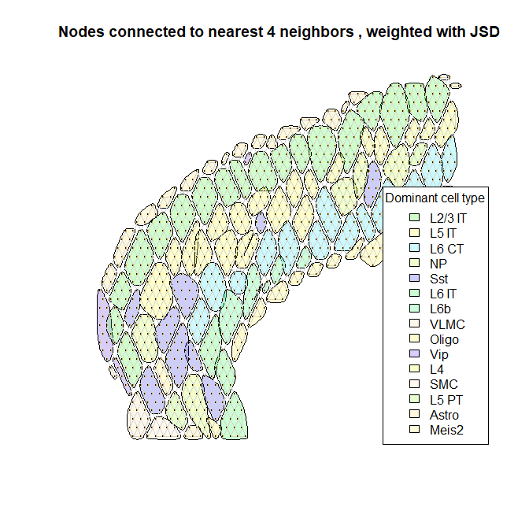

Will need to rerun for a slideseq dataset too! Seurat vignettes updated
7-16-2020.

The spatial data to be analyzed is available publicly from 10x Genomics.
1,072 spatially tagged samples for 47,094 genes. Used Seurat
anchor-based algorithm to label each sample spot with composition of 23
different cell types:

    ##                      x   y          Vip        Lamp5       Sst         Sncg
    ## AAACAGAGCGACTCCT-1  94 -14 0.000000e+00 0.000000e+00 0.0000000 0.000000e+00
    ## AAACCGGGTAGGTACC-1  28 -42 3.129354e-02 0.000000e+00 0.2121399 0.000000e+00
    ## AAACCGTTCGTCCAGG-1  42 -52 1.937322e-05 1.452998e-05 0.0000000 5.811775e-05
    ## AAACTCGTGATATAAG-1 113 -23 0.000000e+00 0.000000e+00 0.0000000 0.000000e+00
    ## AAAGGGATGTAGCAAG-1  62 -24 1.519495e-01 2.589553e-03 0.2130934 0.000000e+00
    ## AAATAACCATACGGGA-1  88 -14 3.022401e-01 8.213392e-02 0.0000000 1.093476e-04
    ##                    Serpinf1       Pvalb       Endo Peri      L6 CT       L6b
    ## AAACAGAGCGACTCCT-1        0 0.000000000 0.00000000    0 0.00000000 0.0000000
    ## AAACCGGGTAGGTACC-1        0 0.008067108 0.00000000    0 0.00000000 0.0000000
    ## AAACCGTTCGTCCAGG-1        0 0.000000000 0.02895847    0 0.00000000 0.0000000
    ## AAACTCGTGATATAAG-1        0 0.000000000 0.00000000    0 0.01954665 0.3814934
    ## AAAGGGATGTAGCAAG-1        0 0.015878955 0.00000000    0 0.00000000 0.0000000
    ## AAATAACCATACGGGA-1        0 0.000000000 0.00000000    0 0.00000000 0.0000000
    ##                    L6 IT   L2/3 IT CR     L5 PT         NP         L4    L5 IT
    ## AAACAGAGCGACTCCT-1     0 1.0000000  0 0.0000000 0.00000000 0.00000000 0.000000
    ## AAACCGGGTAGGTACC-1     0 0.3179080  0 0.1659479 0.00000000 0.26464364 0.000000
    ## AAACCGTTCGTCCAGG-1     0 0.0000000  0 0.0000000 0.00000000 0.00000000 0.000000
    ## AAACTCGTGATATAAG-1     0 0.0000000  0 0.0000000 0.01035563 0.00000000 0.000000
    ## AAAGGGATGTAGCAAG-1     0 0.0000000  0 0.0000000 0.00000000 0.05377252 0.562716
    ## AAATAACCATACGGGA-1     0 0.6155166  0 0.0000000 0.00000000 0.00000000 0.000000
    ##                        Oligo Meis2      Astro Macrophage      VLMC       SMC
    ## AAACAGAGCGACTCCT-1 0.0000000     0 0.00000000 0.00000000 0.0000000 0.0000000
    ## AAACCGGGTAGGTACC-1 0.0000000     0 0.00000000 0.00000000 0.0000000 0.0000000
    ## AAACCGTTCGTCCAGG-1 0.1205828     0 0.07998056 0.01847914 0.5404101 0.2114969
    ## AAACTCGTGATATAAG-1 0.5886043     0 0.00000000 0.00000000 0.0000000 0.0000000
    ## AAAGGGATGTAGCAAG-1 0.0000000     0 0.00000000 0.00000000 0.0000000 0.0000000
    ## AAATAACCATACGGGA-1 0.0000000     0 0.00000000 0.00000000 0.0000000 0.0000000
    ##                          max
    ## AAACAGAGCGACTCCT-1 1.0000000
    ## AAACCGGGTAGGTACC-1 0.3179080
    ## AAACCGTTCGTCCAGG-1 0.5404101
    ## AAACTCGTGATATAAG-1 0.5886043
    ## AAAGGGATGTAGCAAG-1 0.5627160
    ## AAATAACCATACGGGA-1 0.6155166

    saveRDS(cortex_final@assays$SCT@data@Dimnames[1][[1]], file="gene.list.rds")
    saveRDS(cortex_final@assays$SCT@data, file="SCT.dgCMatrix.rds")
    saveRDS(as.matrix(cortex_final@assays$SCT@data), file="SCT.rds")

Plot original stained tissue image and UMAP clusters.

    SpatialDimPlot(cortex_final, crop = FALSE, pt.size.factor = 0, label.size = 3)

    SpatialDimPlot(cortex_final, crop = TRUE, pt.size.factor = 0, label.size = 3)

    SpatialDimPlot(cortex_final, crop = TRUE, label = FALSE)

    rm(cortex_final) # <- uncomment this to save RAM

Save X-Y coordinates for plotting network graphs in the same shape as
the original slide:

    layout.for.igraph <- as.matrix(spatial.data.frame[,1:2]) 
    set_default_igraph_attr <- function(g,max.out.degree=NA){
      graph_attr(g,"layout") <- layout.for.igraph
      vertex_attr(g,"size") <- 1 #set here, instead of passing in "vertex.size=1" to plot(g)
      vertex_attr(g,"label") <- NA 
      edge_attr(g,"color") <- adjustcolor("SkyBlue2", alpha.f=1)
      if (is.weighted(g)){
        edge_attr(g, "width") <- E(g)$weight*5
      }
      if (!is.na(max.out.degree)){
        graph_attr(g,"max.out.degree") <- max.out.degree
        graph_attr(g,"main") <- paste("Nodes connected to nearest",max.out.degree,"neighbors")
        if (is.weighted(g)) {graph_attr(g,"main") <- paste(graph_attr(g,"main"),", weighted with JSD")}
      }
      set_default_igraph_attr <- g
    }

Calculate Jensen-Shannon Divergence for every pair of samples' predicted
cell type distributions:

    n <- nrow(spatial.data.frame)
    jsd.matrix <- matrix(data=NA,nrow=n,ncol=n)
    for (i in seq(n)){
      for (v in seq(n)){
        if (!is.na(jsd.matrix[v,i])) {
          jsd.matrix[i,v] <- jsd.matrix[v,i]
          next
        }
        current <- 0
        if (i != v) {suppressMessages(current <- as.numeric(JSD(expression.vals[c(i,v),])))}
        jsd.matrix[i,v] <- current
      }
    }
    rm(i,v,current)
    dim(jsd.matrix)

    ## [1] 1072 1072

New July 16: use distance ranks to create network graph, instead of
setting a distance threshold. Build edgelist of closest N neighbors for
each node.

    make_graph_of_closest_neighbors <- function(max.out.degree) {
      #out.degree = max number of edges for each node 
      temp <- distance.matrix[1:max.out.degree,]
      results <- vector('numeric')
      for (i in seq(n)){
        #print (paste("i",i))
        x <- temp[, i]
        #print (x)
        for (v in x){
          #print (paste(".v",v))
          #print (temp[,v])
          if (i %in% temp[, v]){
            #print (paste('yes',i,v))
            results <- c(results,i,v)}
        }
      }
      results <- matrix(results, ncol=2, byrow=TRUE) #build an edge list
      results <- unique(t(apply(results,1,sort))) #after sorting cols 1 & 2, can prevent duplicate rows
      g <- graph_from_edgelist(results, directed=FALSE)
      g <- set_default_igraph_attr(g,max.out.degree=max.out.degree)
      make_graph_of_closest_neighbors <- g
    }

Use new function to create networks of closest 4, 6, 8, 12 neighbors:
---------------------------------------------------------------------

    g04 <- make_graph_of_closest_neighbors(4)
    g06 <- make_graph_of_closest_neighbors(6)
    g08 <- make_graph_of_closest_neighbors(8)
    g12 <- make_graph_of_closest_neighbors(12)
    summary(g04,graph.attributes=TRUE)

    ## IGRAPH a11424e U--- 1072 2064 -- 
    ## + attr: layout (g/n), max.out.degree (g/n), main (g/c), size (v/n),
    ## | label (v/l), color (e/c)

    summary(g08,graph.attributes=TRUE)

    ## IGRAPH a1821fd U--- 1072 4060 -- 
    ## + attr: layout (g/n), max.out.degree (g/n), main (g/c), size (v/n),
    ## | label (v/l), color (e/c)

    plot(g04)

    plot(g08) 

Use JSD to create weighted networks
-----------------------------------

Weight the networks using 1 - JSD. (JSD=0 for perfectly identical cell
type distributions).

    make_graph_weighted_with_JSD <- function(base_graph){
      #starting with base_graph, weight edges with the Jensen Shannon Divergence of the 2 nodes attached by the edge
      g <- as_adjacency_matrix(base_graph,type="both",sparse=FALSE) > 0 #create adjacency matrix, TRUE or . (null)
      #jsd=0 for identical dist. so use 1 minus JSD and ignore JSD=1 (total dissimilarity)
      g <- ifelse(g & 1-jsd.matrix>0, 1-jsd.matrix, 0) 
      g <- graph_from_adjacency_matrix(g, mode="undirected",weighted=TRUE)
      g <- set_default_igraph_attr(g, max.out.degree = if (!is.null(graph_attr(base_graph,"max.out.degree"))) {graph_attr(base_graph,"max.out.degree")} else {NA})
    }

    g04.weighted <- make_graph_weighted_with_JSD(g04)
    g06.weighted <- make_graph_weighted_with_JSD(g06)
    g08.weighted <- make_graph_weighted_with_JSD(g08)
    g12.weighted <- make_graph_weighted_with_JSD(g12)
    plot(g04.weighted)

    plot(g08.weighted)

Apply Louvain Community detection
---------------------------------

Color By Dominant Cell Type for Each Community
----------------------------------------------

    plot_communities_by_dominant_cell_type <- function(basegraph, communities.algo=NA
                                                       , print.table=FALSE, expr=expression.vals){
      #communities.algo is a string: cluster_louvain, cluster_infomap
      communities.object <- NA
      if (is.na(communities.algo) | communities.algo=="cluster_louvain") {
        communities.object <- cluster_louvain(basegraph)
      }else if (communities.algo=="cluster_infomap"){
        communities.object <- cluster_infomap(basegraph)
      }
      if (is.na(communities.object)) {break}
      comm.top.celltypes <- lapply(communities(communities.object),function(z){
        x <- colMeans(expr[z,])
        x <- x[sort.list(x,decreasing = TRUE)]
        if (length(which(x>.3))>0){
          x[which(x>.3)]
        } else if (length(which(x>.15))>0){
          x[which(x>.15)]
        } else {
          x[1:2]
        }
      })
      comm.highest.label <- as.factor(sapply(comm.top.celltypes, function(x){names(x)[1]}))
      comm.labels <- sapply(comm.top.celltypes, function(x){paste(names(x),sprintf(x,fmt = '[%#.2f]'),collapse="; ")})
      names(comm.labels) <- paste("Community #",names(comm.labels),sep="")
      #comm.highest.val <- sapply(comm.top.celltypes, function(x){x[1]},USE.NAMES = FALSE)
      if (print.table) {
        print ("")
        print (paste("Highest Cell Types per Community,",graph_attr(basegraph,"main")))
        print (comm.labels)
      }
      #take care here to use a global to set palette and ensure it is large enough to handle 23 cell types:
      #by using global palette, cell types will retain same color on different plots
      #set alpha to < 1.0, so that community overlaps can be seen
      global.pal <- topo.colors(length(unique(colnames(expression.vals))),alpha=.2)
      names(global.pal) <- colnames(expression.vals)
      local.pal <- global.pal[as.character(unique(comm.highest.label))] #unique colorset used for this instance 
      comm.pal <- local.pal[as.character(comm.highest.label)] #colors used by each community
      plot(basegraph
           #, sub="asdfasdf"
           ,mark.groups=communities.object, mark.expand = 2, edge.width=0.2 
           ,edge.color="lightgrey"
           ,mark.col=comm.pal
           ,mark.border="black")
      legend("bottomright",inset=.02,title="Dominant cell type"
             ,fill=local.pal
             ,legend=names(local.pal) 
             )
    }

    plot_communities_by_dominant_cell_type(g04.weighted, "cluster_louvain", print.table=FALSE)

    ## Warning in if (is.na(communities.object)) {: the condition has length > 1 and
    ## only the first element will be used

    plot_communities_by_dominant_cell_type(g04.weighted, "cluster_infomap", print.table=FALSE)

    ## Warning in if (is.na(communities.object)) {: the condition has length > 1 and
    ## only the first element will be used

    plot_communities_by_dominant_cell_type(g08.weighted, "cluster_louvain", print.table=FALSE)

    ## Warning in if (is.na(communities.object)) {: the condition has length > 1 and
    ## only the first element will be used

    plot_communities_by_dominant_cell_type(g08.weighted, "cluster_infomap", print.table=FALSE)

    ## Warning in if (is.na(communities.object)) {: the condition has length > 1 and
    ## only the first element will be used

**^Why is the subtitle still not working? Should print what community
detection algo was used, and meta measures like Modularity**

Characterize a specific community
---------------------------------

Create functions for exploring specific communities: **Broken: wont
print x axis if only one cell type in boxplot**

    plot_community_location <- function(basegraph,communities.object,community.i){
      #plot a single community: 
      plot(basegraph, mark.groups=communities.object[[community.i]], mark.expand = 2, edge.width=1
           ,edge.color=ifelse(crossing(communities.object,basegraph),"red","black")
           #,main=paste(graph_attr(basegraph,"main"),paste(", community #",community.i,sep=""))
           ,sub=paste("Community #",community.i," highlighted (n=",length(communities.object[[community.i]]),")",sep="")
           )
    }

    get_prevalent_cell_types <- function(communities.object, community.i, cutoff=.05, expr=expression.vals){
      targets <- communities.object[[community.i]]
      x <- expr[targets,]
      row.names(x) <- as.character(targets)
      prevalent_cell_types <- names(which(apply(x,2,mean)>cutoff)) #cell types that average over 5% of composition of samples in this community
      x[,prevalent_cell_types]
    }

    plot_prevalent_cell_types <- function(communities.object, community.i, cutoff=.05, expr=expression.vals){
      title <- paste("Prevalent Cell Types for Community #",community.i," (n=",sep="")
      title <- paste(title,length(communities.object[[community.i]]),")",sep="")
      boxplot(get_prevalent_cell_types(communities.object, community.i, cutoff, expr),main=title)
    }

    plot_cell_type_distributions <- function(communities.object, community.i, cutoff=.05, expr=expression.vals){
      y <- as.data.frame(get_prevalent_cell_types(communities.object, community.i))
      barplot(t(y), col=as.factor(colnames(y)), legend.text = TRUE
            ,names.arg=rep("",dim(y)[1])
            ,main=paste('Cell Type Compositions for Samples in Community #',1,sep="")
            )
    }

    plot_cell_type_distributions_gg <- function(communities.object, community.i, cutoff=.05, expr=expression.vals){
      #cant use ggplot when doing multiple plots together, but it would be nice...
      y <- as.data.frame(get_prevalent_cell_types(communities.object, community.i))
      y['sample'] <- as.character(row.names(y))
      y <- y %>% pivot_longer(-sample,names_to='cell.type',values_to='composition')
      ggplot(y, aes(fill=cell.type, y = composition, x = sample))+
        ggtitle(paste('Cell Type Compositions for Samples in Community #',community.i,sep=""))+
        geom_bar(position="stack", stat="identity")+
        theme(axis.text.x=element_blank())
    }

    plot_EDA_for_community <- function(basegraph,community.i,communities.object=NA, cutoff=.05, expr=expression.vals){
      #par(mfrow=c(2,1))
      if (is.na(communities.object)) {communities.object <- cluster_louvain(basegraph)}
      plot_community_location(basegraph,communities.object,community.i)
      plot_cell_type_distributions(communities.object,community.i,cutoff,expr)
      plot_prevalent_cell_types(communities.object,community.i,cutoff,expr)
      #p1 + p2 #cant use mfrow for ggplot (plot_prevalent_cell_types)
    }

The 65 nodes in community \#1 seem to have similar cell type
distributions:

    base <- g04.weighted
    i <- 1
    plot_EDA_for_community(base, i)

    base <- g08.weighted
    i <- 13
    plot_EDA_for_community(base, i)

Create random graphs, to assess frequency of getting communities of similar size
================================================================================

Can see if getting large community membership size is probable. Will use
both Modularity and mean community size as the measure (high modularity
is interpreted as dense intra community connections and sparse inter
community connections).

    deg <- 4
    B <- 10000

    simulation.results <- t(replicate(B,{
    null.g <- sample_degseq(rep(deg,n), method = "simple.no.multiple")
    null.g <- set_default_igraph_attr(null.g)
    null.cl <- cluster_louvain(null.g)
    c(modularity(null.cl),mean(membership(null.cl)))
    }))
    colnames(simulation.results) <- c("modularity","mean community size")

Repeated 1,000 times, modularity for random 4-degree networks is no
where close to what is observed in the tissue:

    boxplot(simulation.results[,1], ylim=c(.5,1)
            , main = paste("Modularity:",B,"simulations vs. Observed (red)")
            , sub = get.graph.attribute(g04.weighted,"main"))
    points(modularity(lc04),col="red",pch=19)

After 1,000 runs, very rare for mean community size to reach what is
observed in the actual Louvain(4) network.

    boxplot(simulation.results[,2]
            , main = paste("Mean community size:",B,"simulations vs. Observed (red)")
            , sub = get.graph.attribute(g04.weighted,"main"))
    points(mean(membership(lc04)),col="red",pch=19)

Save list of nodes denoted as border regions for later enrichment analysis
==========================================================================

August 5th.

    comm.g08 <- cluster_louvain(g08.weighted) 
    #comm.g08 #16 groups, modularity 0.84
    #typeof(communities(comm.g08)) #list
    comm.top.celltypes <- lapply(communities(comm.g08),function(z){
      x <- colMeans(expression.vals[z,])
      x <- x[sort.list(x,decreasing = TRUE)]
      if (length(which(x>.3))>0){
        x[which(x>.3)]
      } else if (length(which(x>.15))>0){
        x[which(x>.15)]
      } else {
        x[1:2]
      }
    })
    #comm.top.celltypes
    comm.highest.label <- as.factor(sapply(comm.top.celltypes, function(x){names(x)[1]}))
    comm.labels <- sapply(comm.top.celltypes, function(x){paste(names(x),sprintf(x,fmt = '[%#.2f]'),collapse="; ")})
    names(comm.labels) <- paste("Community #",names(comm.labels),sep="")
    #comm.highest.label #length 16, factor.
    #comm.labels 

    border.edges <- crossing(comm.g08, g08.weighted)
    border.crossings <- ends(g08.weighted, E(g08.weighted)[border.edges]) #647
    length(border.edges) #4019 (total number of edges)

    ## [1] 4019

    sum(border.edges) #647 edges that connect different communities

    ## [1] 647

    dim(border.crossings) #647 by 2

    ## [1] 647   2

    border.crossings[1:5,] #

    ##      [,1] [,2]
    ## [1,]    1  594
    ## [2,]    2  427
    ## [3,]    3  150
    ## [4,]    3  630
    ## [5,]    3  639

    #length(membership(comm.g08))
    #table(membership(comm.g08))

    comm.highest.label

    ##       1       2       3       4       5       6       7       8       9      10 
    ## L2/3 IT     Sst   Oligo   L6 CT   L6 IT L2/3 IT   Oligo   L6 CT   Oligo   L5 IT 
    ##      11      12      13      14      15      16 
    ##   L6 CT     SMC L2/3 IT L2/3 IT   L5 IT L2/3 IT 
    ## Levels: L2/3 IT L5 IT L6 CT L6 IT Oligo SMC Sst

    membership(comm.g08)[1:5] #1, 14, 12, 9, 15

    ## [1]  1 14 12  9 15

    table(membership(comm.g08))

    ## 
    ##   1   2   3   4   5   6   7   8   9  10  11  12  13  14  15  16 
    ##  95 111  24  93  85  71  26  80  20  65  55  30  78  72  99  68

    memb <- comm.highest.label[membership(comm.g08)] #for all 1072 spots, list dominant cell type for that spots community
    table(memb)

    ## memb
    ## L2/3 IT   L5 IT   L6 CT   L6 IT   Oligo     SMC     Sst 
    ##     384     164     228      85      70      30     111

    edge.connects.different.dominant.celltypes <- memb[border.crossings[,1]] != memb[border.crossings[,2]]
    length(edge.connects.different.dominant.celltypes)

    ## [1] 647

    sum(edge.connects.different.dominant.celltypes) #561 are true borders

    ## [1] 561

    true.crossings <- border.crossings[edge.connects.different.dominant.celltypes,]
    border.nodes <- unique(c(true.crossings[,1],true.crossings[,2]))
    dim(true.crossings)

    ## [1] 561   2

    length(border.nodes) #461 nodes to analyze.

    ## [1] 461

    sum(V(g08.weighted) %in% border.nodes)

    ## [1] 461

    #function(basegraph, print.table=FALSE, expr=expression.vals){
    communities.object <- comm.g08

    #take care here to use a global to set palette and ensure it is large enough to handle 23 cell types:
    #by using global palette, cell types will retain same color on different plots
    #set alpha to < 1.0, so that community overlaps can be seen
    global.pal <- topo.colors(length(unique(colnames(expression.vals))),alpha=.2)
    names(global.pal) <- colnames(expression.vals)
    local.pal <- global.pal[as.character(unique(comm.highest.label))] #unique colorset used for this instance 
    comm.pal <- local.pal[as.character(comm.highest.label)] #colors used by each community
    plot(g08.weighted
         ,mark.groups=communities.object, mark.expand = 2, edge.width=0.2 
         ,edge.color="lightgrey"
         ,mark.col=comm.pal
         ,mark.border="black"
         ,vertex.size=2
         ,vertex.color=as.factor(V(g08.weighted) %in% border.nodes))
    legend("bottomright",inset=.02,title="Dominant cell type"
           ,fill=local.pal
           ,legend=names(local.pal) 
           )

    border.nodes

    ##   [1]    2    3    4    5    7    9   13   14   16   17   19   22   23   27   31
    ##  [16]   32   34   37   40   42   44   48   50   55   56   57   60   63   65   68
    ##  [31]   71   74   77   79   80   81   82   83   87   88   89   90   91   95   97
    ##  [46]   98  100  102  108  110  111  112  114  115  119  120  123  129  130  132
    ##  [61]  133  134  135  136  141  145  146  148  149  150  152  154  156  157  158
    ##  [76]  161  165  167  171  175  176  180  184  186  192  193  194  199  203  205
    ##  [91]  206  208  209  210  211  214  215  216  217  226  229  232  235  237  238
    ## [106]  239  241  247  252  255  256  260  264  266  272  274  277  278  280  283
    ## [121]  285  287  289  290  299  301  302  303  306  308  309  311  312  313  314
    ## [136]  315  316  317  318  320  322  323  326  327  329  332  333  334  335  340
    ## [151]  343  351  353  356  365  366  368  369  370  371  376  377  378  379  380
    ## [166]  381  383  385  387  388  389  392  393  394  397  398  399  406  407  408
    ## [181]  411  419  421  422  424  425  427  428  442  447  448  449  450  452  455
    ## [196]  457  459  460  463  464  465  468  470  471  473  474  479  493  494  499
    ## [211]  501  506  507  509  513  516  518  528  530  535  541  544  545  554  557
    ## [226]  562  565  566  577  581  583  585  588  595  599  600  603  605  608  611
    ## [241]  613  618  619  624  625  626  627  630  631  632  633  635  641  642  653
    ## [256]  660  664  666  669  674  677  683  687  693  694  698  702  706  708  718
    ## [271]  721  731  734  735  748  752  762  766  768  770  789  797  800  805  812
    ## [286]  815  826  830  833  834  836  841  843  848  854  856  863  869  870  874
    ## [301]  883  888  896  916  920  946  948  958  961  966  984 1042  639  622  998
    ## [316] 1013  485 1049 1039  887  918  153  931  930  188  875 1045  636  219  433
    ## [331]  531  740  781  705  675  183  978  985  939  682  713  265  480  414  488
    ## [346]  903 1058  478  417  656  827  822  699  919 1066  808  813  724  515  244
    ## [361]  462 1072  360 1053  341  986  467  539  213  865 1064  609  726  995  855
    ## [376]  991 1055  902  435 1047  522  604  817  953  225  783  236  742 1036  807
    ## [391]  523  738  973  667  701  933  661  776 1028  819  850  884 1003  914  697
    ## [406]  686  374  839  570  423  763  893  944 1001  877  999  915  858  792  790
    ## [421]  508  957 1018  911  795  974  491  969  629  921  926  806  992  924  811
    ## [436]  867  787  901  838 1007  741  889  890  644 1071  840  885  990  829  908
    ## [451] 1063  941 1070  844  873  861  925  972  907  977 1052

Rerun for different base graph
==============================

    find_border_nodes <- function(basegraph){
      comm <- cluster_infomap(basegraph)
      
      border.edges <- crossing(comm, basegraph)
      border.crossings <- ends(basegraph, E(basegraph)[border.edges]) #647
      #dim(border.crossings) #647 by 2
      #border.crossings[1:5,]
      
      #for each community, make string with any cell types that make up more that 0.15 composition
      comm.top.celltypes <- lapply(communities(comm),function(z){
        x <- colMeans(expression.vals[z,])
        x <- x[sort.list(x,decreasing = TRUE)]
        if (length(which(x>.3))>0){
          x[which(x>.3)]
        } else if (length(which(x>.15))>0){
          x[which(x>.15)]
        } else {
          x[1:2]
        }
      })
      comm.highest.label <- as.factor(sapply(comm.top.celltypes, function(x){names(x)[1]})) #make list of highest cell type in each community
      memb <- comm.highest.label[membership(comm)] #for all 1072 spots, list dominant cell type for that spots community
      
      edge.connects.different.dominant.celltypes <- memb[border.crossings[,1]] != memb[border.crossings[,2]]
      #length(edge.connects.different.dominant.celltypes)
      #sum(edge.connects.different.dominant.celltypes) #561 are true borders
      true.crossings <- border.crossings[edge.connects.different.dominant.celltypes,]
      unique(c(true.crossings[,1],true.crossings[,2]))
      }

    test <- function(basegraph){
      #basegraph <- g04.weighted
      comm <- cluster_infomap(basegraph)
      
      border.edges <- crossing(comm, basegraph)
      border.crossings <- ends(basegraph, E(basegraph)[border.edges]) #647
      print (paste(c("number of edges in basegraph:", length(border.edges)))) #4019 (total number of edges)
      print (paste(c("border edge sum:", sum(border.edges)))) #647 edges that connect different communities
      #dim(border.crossings) #647 by 2
      #border.crossings[1:5,]
      
      #for each community, make string with any cell types that make up more that 0.15 composition
      comm.top.celltypes <- lapply(communities(comm),function(z){
        x <- colMeans(expression.vals[z,])
        x <- x[sort.list(x,decreasing = TRUE)]
        if (length(which(x>.3))>0){
          x[which(x>.3)]
        } else if (length(which(x>.15))>0){
          x[which(x>.15)]
        } else {
          x[1:2]
        }
      })
      comm.highest.label <- as.factor(sapply(comm.top.celltypes, function(x){names(x)[1]})) #make list of highest cell type in each community
      memb <- comm.highest.label[membership(comm)] #for all 1072 spots, list dominant cell type for that spots community
      
      edge.connects.different.dominant.celltypes <- memb[border.crossings[,1]] != memb[border.crossings[,2]]
      #length(edge.connects.different.dominant.celltypes)
      #sum(edge.connects.different.dominant.celltypes) #561 are true borders
      true.crossings <- border.crossings[edge.connects.different.dominant.celltypes,]
      border.nodes <- unique(c(true.crossings[,1],true.crossings[,2]))
      #dim(true.crossings)
      print (paste(c("sum true border nodes:", sum(V(basegraph) %in% border.nodes))))
      
      global.pal <- topo.colors(length(unique(colnames(expression.vals))),alpha=.2)
      names(global.pal) <- colnames(expression.vals)
      local.pal <- global.pal[as.character(unique(comm.highest.label))] #unique colorset used for this instance 
      comm.pal <- local.pal[as.character(comm.highest.label)] #colors used by each community
      plot(basegraph
           ,mark.groups=comm, mark.expand = 2, edge.width=0.2 
           ,edge.color="lightgrey"
           ,mark.col=comm.pal
           ,mark.border="black"
           ,vertex.size=2
           ,vertex.color=as.factor(V(basegraph) %in% border.nodes))
    }

    test(g04.weighted)

    ## [1] "number of edges in basegraph:" "2049"                         
    ## [1] "border edge sum:" "639"             
    ## [1] "sum true border nodes:" "677"

    test(g08.weighted)

    ## [1] "number of edges in basegraph:" "4019"                         
    ## [1] "border edge sum:" "1380"            
    ## [1] "sum true border nodes:" "796"

    find_border_nodes(g04.weighted)

    ##   [1]    3    4    5    6    7   11   13   14   15   16   17   18   20   22   23
    ##  [16]   24   25   26   27   28   32   33   34   35   41   42   44   47   48   49
    ##  [31]   51   52   53   55   56   57   58   59   60   63   65   68   69   70   71
    ##  [46]   73   74   79   83   88   89   91   92   93   95   98  100  102  104  108
    ##  [61]  110  111  112  115  116  117  118  119  120  121  122  124  125  126  128
    ##  [76]  129  130  131  132  133  134  136  139  142  143  144  145  146  148  149
    ##  [91]  150  151  152  153  154  155  156  157  158  159  160  161  162  163  165
    ## [106]  167  168  170  171  172  175  177  179  180  181  184  185  186  187  188
    ## [121]  190  192  193  194  195  196  197  199  200  201  202  206  207  208  209
    ## [136]  210  211  215  216  217  227  228  229  231  238  239  240  241  243  247
    ## [151]  250  252  254  255  256  259  260  261  266  270  272  273  274  277  278
    ## [166]  279  280  284  285  287  289  293  295  297  298  299  300  302  303  304
    ## [181]  308  309  310  311  312  315  318  320  321  322  323  324  325  326  328
    ## [196]  329  330  333  337  346  348  349  350  352  353  357  360  361  362  363
    ## [211]  365  366  368  371  372  374  375  376  378  380  381  387  388  389  390
    ## [226]  392  397  399  402  404  405  407  408  410  411  418  419  421  424  428
    ## [241]  432  434  435  441  442  443  445  447  448  451  452  453  456  457  458
    ## [256]  459  463  464  465  466  469  470  471  473  474  479  481  482  486  487
    ## [271]  490  491  493  495  496  497  499  500  501  504  507  509  513  515  516
    ## [286]  517  520  525  526  529  533  534  540  541  544  545  546  551  552  556
    ## [301]  557  558  562  563  565  566  569  571  575  576  592  593  598  599  601
    ## [316]  605  608  614  624  625  626  630  631  632  633  638  641  645  649  650
    ## [331]  652  653  654  660  662  664  665  666  667  669  670  675  678  687  691
    ## [346]  692  693  695  698  707  714  718  719  725  735  744  749  755  759  761
    ## [361]  764  766  768  771  786  800  809  812  830  833  835  837  847  854  857
    ## [376]  861  866  869  880  881  884  888  899  900  917  919  924  926  929  958
    ## [391]  961  998 1013  214  750 1049  288  843  972  547   97  887  619  440  671
    ## [406]  543  860  636  746  237  920  731  754  688  103  640  354  696  940  398
    ## [421]  182  379  222  436  642  848  244  335  137  892  494  862  853  931  978
    ## [436]  535  915 1014  903  536  684  218  427  455  656  827  928  646 1071  874
    ## [451]  902  686  823  141  723  226  905  994  409  568 1062  549  897  319  738
    ## [466]  518  834  230  391  713  677  406  813 1072 1053  454  721  267  685  990
    ## [481]  467  765 1041  934  643  976  522  225  865 1034  916 1064  672  777  962
    ## [496]  726  257  808  618  567  583  798 1040 1055  265  450  610 1047  844  806
    ## [511]  898  985  817  539  213  984  383  950  886  414 1058  475  923 1039 1010
    ## [526]  356 1063  763  913  846  955  393 1050  577  787  737  991 1002  306  789
    ## [541]  805  701  933  910  775  794 1046  661  973  528  882  850  462  637 1025
    ## [556]  705  679  839  596  810  587  720 1021  879  611  852  709  944  585 1061
    ## [571]  877  966  422  863  999  616  694  770  904  793  508  896  815  883  792
    ## [586]  604  939  514  838 1057  673  943  706 1060  893  963  702  802  948 1048
    ## [601]  836  855  734  822 1038 1044  730  828  742  620  801  921  957 1042  621
    ## [616]  995 1036  953  762  748  555  623  627  682  969  572  981  699  894  683
    ## [631]  947  757  739  858  784  889  629  697  639  740  668  819  895  711  975
    ## [646]  747  901 1020  840  704  986 1001  908  935 1006  826 1011 1070 1016  982
    ## [661]  758 1012  980  997 1056 1007 1017  938 1023  925 1030  856 1026  936  909
    ## [676] 1003  914 1068  906 1066 1051  964

    find_border_nodes(g08.weighted)

    ##   [1]    2    3    4    5    6    7    8    9   10   11   12   13   14   15   16
    ##  [16]   17   18   19   20   22   23   24   26   27   28   29   31   32   33   34
    ##  [31]   35   36   38   39   40   41   42   43   44   46   47   48   50   51   52
    ##  [46]   55   56   57   58   59   60   63   65   69   70   71   73   74   75   76
    ##  [61]   77   79   80   82   83   87   88   89   90   91   92   93   95   97   98
    ##  [76]  100  101  102  103  104  108  109  110  111  112  113  114  116  117  118
    ##  [91]  119  120  121  123  124  126  127  128  129  130  131  132  133  134  135
    ## [106]  136  137  138  139  140  141  142  143  144  145  146  148  149  150  151
    ## [121]  152  153  154  155  156  157  158  159  160  161  162  163  165  166  167
    ## [136]  168  169  170  171  172  174  175  177  179  180  181  182  184  186  189
    ## [151]  190  192  193  194  195  197  199  200  201  203  205  206  207  208  209
    ## [166]  210  211  213  214  215  216  217  218  220  222  224  225  226  228  229
    ## [181]  230  231  232  234  237  238  239  240  241  242  243  244  245  247  250
    ## [196]  251  252  254  255  256  257  258  259  260  261  262  265  266  267  269
    ## [211]  270  272  273  274  276  277  278  279  280  283  284  285  287  288  289
    ## [226]  290  294  295  296  297  298  299  300  301  302  303  304  306  307  308
    ## [241]  309  311  313  314  315  316  317  318  321  322  323  324  325  326  327
    ## [256]  329  332  333  335  337  338  343  346  350  351  352  353  354  355  356
    ## [271]  357  360  361  362  363  365  366  368  369  370  371  372  373  375  376
    ## [286]  377  378  379  380  381  383  387  388  389  391  392  393  394  395  397
    ## [301]  398  399  403  404  407  408  409  410  411  413  415  416  417  418  419
    ## [316]  420  421  422  424  427  428  429  434  435  438  440  441  442  443  446
    ## [331]  447  448  449  450  451  452  453  454  455  457  459  460  463  464  465
    ## [346]  466  468  469  471  474  475  479  482  484  486  487  489  493  495  496
    ## [361]  497  498  499  500  501  503  504  505  507  508  509  513  517  518  519
    ## [376]  520  525  528  529  530  532  533  534  535  541  543  544  545  547  549
    ## [391]  551  552  556  557  558  562  563  564  565  569  571  574  576  577  578
    ## [406]  579  581  582  583  585  588  590  592  595  597  598  599  600  601  603
    ## [421]  605  608  610  611  613  614  618  619  620  621  624  625  626  630  631
    ## [436]  632  635  636  638  639  641  642  645  646  648  649  650  652  653  654
    ## [451]  659  660  663  664  665  666  668  669  670  671  672  673  677  678  681
    ## [466]  683  684  685  687  688  690  692  693  695  698  702  703  704  706  707
    ## [481]  708  709  714  715  717  718  719  721  722  723  724  725  729  730  731
    ## [496]  735  737  738  739  743  744  746  749  752  755  756  759  761  763  764
    ## [511]  766  768  770  771  772  775  779  786  788  789  792  794  796  797  798
    ## [526]  800  805  809  812  814  815  817  821  823  827  830  831  833  834  835
    ## [541]  836  837  841  843  847  848  854  856  857  862  865  866  869  870  871
    ## [556]  880  881  883  888  897  899  900  910  917  920  921  935  936  938  945
    ## [571]  948  958  961  965  966  984  988 1016 1020 1026 1042 1058  622  998 1013
    ## [586]  485  750 1008 1049 1010  791 1064  863  972  572 1030  887  918  931   49
    ## [601]  594  860  934  492  930  711  643  892  777  696 1046  188  905  976 1065
    ## [616]  940  990 1021  502  587  219   84  799  851  637  433  531  740  781  705
    ## [631]  183  978  872  989  942  985  682  480  414  488  903 1007  478  656  822
    ## [646]  699  867  874  919 1057 1066  849  584  686 1017  125  904  975  402  713
    ## [661]  886  894  293  745 1011  923  808  490  382  515  627  345  813  913 1072
    ## [676] 1053  173  341  986  467  539  633  748  204  758  846 1039  212  962  609
    ## [691]  726  801  982  995  855 1040  991 1055  628  901 1047  439  522  604  953
    ## [706]  960  236  742  980  896  950  806 1024 1036  807  828  911 1006  952  955
    ## [721]  902  320  784 1068  787  973 1002  462  932  667  701  933  694  853  765
    ## [736]  906  312  661 1023 1028  776  819  634  882  850  884 1003  406 1063 1025
    ## [751]  425  914  423  623  374  839  342  405  596  483  810 1012  691  720  879
    ## [766]  893 1060  727 1035  944  876 1061  877  999  852  915  858 1019  521  816
    ## [781]  957 1018  795  974  939  829  943  491  826  969  629  864 1048  697 1050
    ## [796]  895  546  926  736 1041  970  992  820  924  891  811  981  747  927 1045
    ## [811] 1001  890  741  889 1059  644 1071  840  912  689  949  844  928  908  941
    ## [826] 1070 1056  845  754  861  868  757  937  997 1054  925  873 1027  907  977
    ## [841] 1044 1034 1052 1032

    saveRDS(find_border_nodes(g04.weighted), file="g4.border.nodes.rds")
    saveRDS(find_border_nodes(g08.weighted), file="g8.border.nodes.rds")
    saveRDS(expression.vals, file="expression.vals.rds")

Enrichment analysis of border-region samples
============================================

Need to use different workstation, because ClusterProfiler breaks
dependencies used for Seurat.

    #library(clusterProfiler)

### Later

-   Interactive Shiny app - use sliders to adjust number of nearest
    neighbor edges, and to "blob" together communities, \* Use radio
    buttons to select which community detection algo to use.
-   Hover over community to see its name and a chart with aggregate cell
    type distribution of that community
-   Apply algorithm to slide-seq data, and another 10x dataset (need to
    find anchoring reference though)

-   plot relationship between modularity, neighbor degree, and
    community algorithm.

Community Annotations:
======================

When "blobbing" together communities, may need to draw polygons
individually, instead of relying on plot(). Or would be nice to label
communities with their dominant cell type.
<https://stackoverflow.com/questions/47971179/igrph-adding-text-to-community-plot>

    for (g in seq_along(mark.groups)) {
    v <- V(graph)[mark.groups[[g]]]
    igraph.polygon(layout[v, , drop = FALSE], vertex.size = vs, 
                   expand.by = mark.expand[g]/200, shape = mark.shape[g], 
                   col = mark.col[g], border = mark.border[g])

Manually adding text:
`text(c(-1.15, 0.8, 0.9), c(0.35, -0.7, 0.8), c("A", "B", "C"))`
