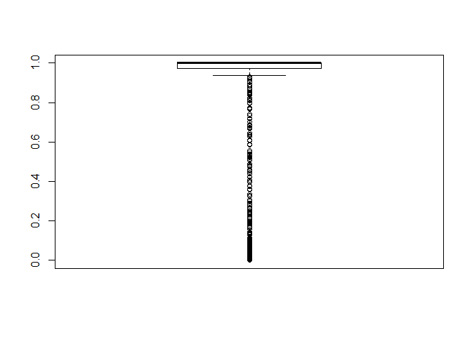
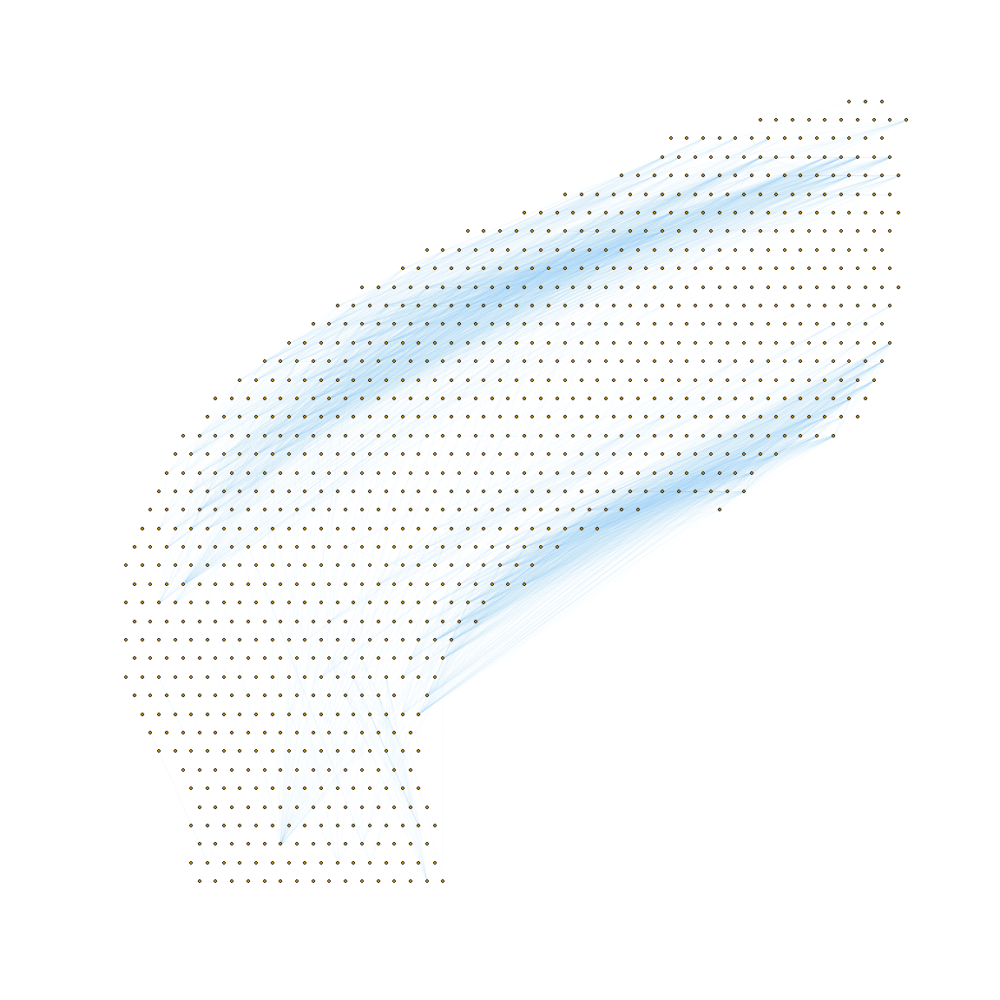
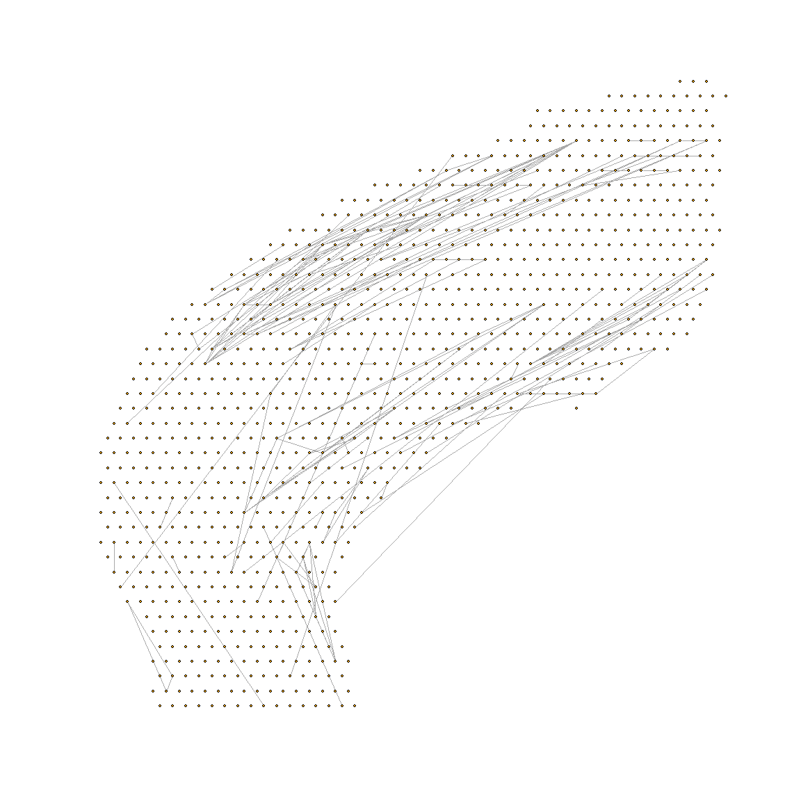
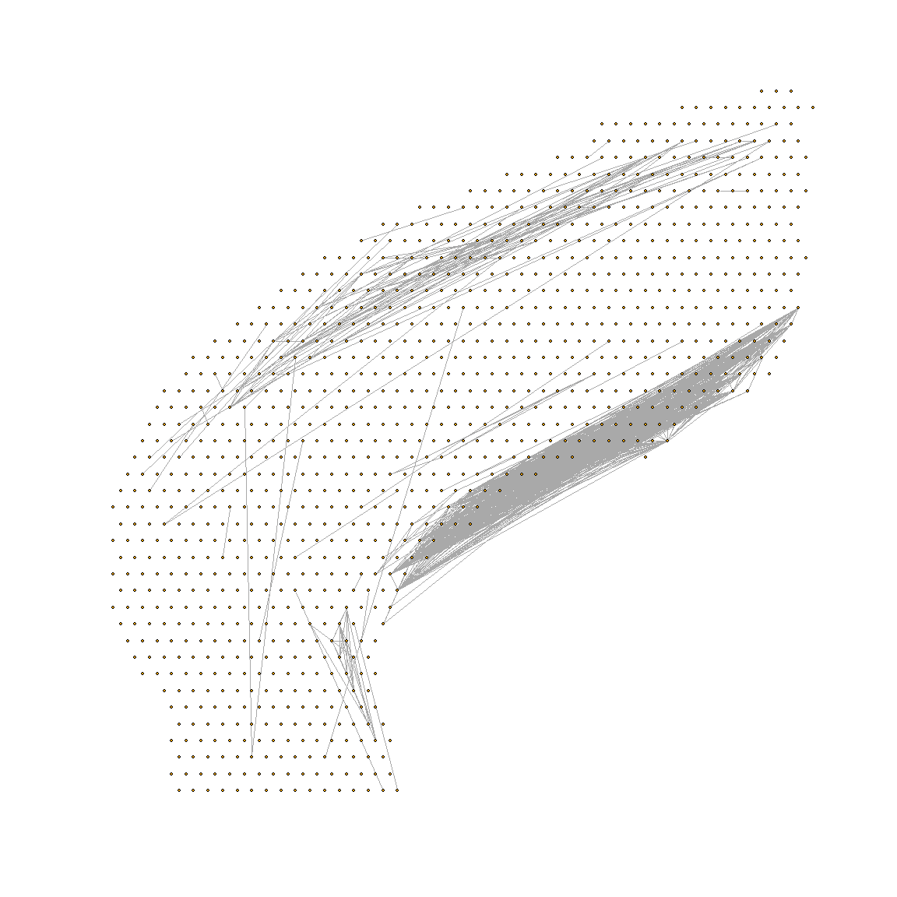

The spatial data to be analyzed is available publically from 10x
Genomics. 1,072 spatially tagged samples for 47,094 genes. Retreive
data:

    head(spatial.data.frame[1:5,1:3])

    ##                      x   y          Vip
    ## AAACAGAGCGACTCCT-1  94 -14 0.000000e+00
    ## AAACCGGGTAGGTACC-1  28 -42 3.129354e-02
    ## AAACCGTTCGTCCAGG-1  42 -52 1.937322e-05
    ## AAACTCGTGATATAAG-1 113 -23 0.000000e+00
    ## AAAGGGATGTAGCAAG-1  62 -24 1.519495e-01

    head(distance.matrix[1:5,1:3])

    ##                    AAACAGAGCGACTCCT-1 AAACCGGGTAGGTACC-1 AAACCGTTCGTCCAGG-1
    ## AAACAGAGCGACTCCT-1            0.00000           71.69379           64.40497
    ## AAACCGGGTAGGTACC-1           71.69379            0.00000           17.20465
    ## AAACCGTTCGTCCAGG-1           64.40497           17.20465            0.00000
    ## AAACTCGTGATATAAG-1           21.02380           87.09765           76.69420
    ## AAAGGGATGTAGCAAG-1           33.52611           38.47077           34.40930

Calculate Jensen-Shannon Divergence for every pair of samples’ predicted
cell type distributions:

    n <- nrow(spatial.data.frame)
    jsd.matrix <- matrix(data=NA,nrow=n,ncol=n)
    for (i in seq(n)){
      for (v in seq(n)){
        if (!is.na(jsd.matrix[v,i])) {
          jsd.matrix[i,v] <- jsd.matrix[v,i]
          next
        }
        current <- 0
        if (i != v) {suppressMessages(current <- as.numeric(JSD(expression.vals[c(i,v),])))}
        jsd.matrix[i,v] <- current
      }
    }
    rm(i,v,current)
    dim(jsd.matrix)

    ## [1] 1072 1072

    sum(is.na(jsd.matrix))

    ## [1] 0

Save the JSD and the physical distance for every pairwise combo of
samples. 1,072 samples -&gt; 575,127 tuples.

    seq.n <- seq(n)
    jsd.vs.dist <- cbind(jsd.matrix[seq.n > 1,1], distance.matrix[seq.n > 1,1]) #load all jsd and distances from 1st sample
    #typeof(jsd.vs.dist)
    #dim(jsd.vs.dist)
    colnames(jsd.vs.dist) <- c("JS.Divergence","Physical.Distance")
    colnames(jsd.vs.dist)

    ## [1] "JS.Divergence"     "Physical.Distance"

    for (i in seq(2:n-1)){
      #print (dim(cbind(jsd.matrix[seq.n > i,i], dist.matrix[seq.n>i,i])))
      jsd.vs.dist <- rbind(jsd.vs.dist,cbind(jsd.matrix[seq.n>i,i], distance.matrix[seq.n > i,i]))
    }
    rm(i)
    #typeof(jsd.vs.dist)
    #dim(jsd.vs.dist)
    jsd.vs.dist <- data.frame(jsd.vs.dist)
    summary(jsd.vs.dist)

    ##  JS.Divergence    Physical.Distance
    ##  Min.   :0.0000   Min.   :  1.414  
    ##  1st Qu.:0.7146   1st Qu.: 16.492  
    ##  Median :0.9572   Median : 29.155  
    ##  Mean   :0.8172   Mean   : 33.588  
    ##  3rd Qu.:1.0000   3rd Qu.: 48.332  
    ##  Max.   :1.0000   Max.   :100.578

Maybe find a suitable cutoff (.1? .15?) to define “closely matched”
pairs. Then draw a graph and link only samples that are closely matched.
Then… do shared neighbor algo or community detection??

As we use stricter and stricter cutoffs (down to 0), only identical
samples will pass the threshold. So any shared neighbor analysis or even
just using those JSD under the threshold as the edges of a graph… will
only show the most strongly identical samples.

Then as we loosen the threshold, more edges should get added. these are
the similar but not totally identical samples (maybe indicating some
sort of gradient).

This is still just ad hoc making algo to split tissue into subtissues
(as a gradient, even, where subtissues collide). When graphing, should
be like FEMA flood maps - some places are clearly red, others clearly
blue. Then a border area between the two is a blue-and-red
diagonal-striped mix of the two.

Some identical sample-pairs may be dispersed (not physically connected).
May need to have some special approach to identify and call those out
for visualization too! \[eg Identical samples, by JSD, but they are
separated by more than 3 edges in the physical distance graph -&gt; this
is a dispersed type of sample\].

**For harmanci: when you work, is it in bursts? Work with collaborators
or alone? How well must you know the underlying lab techniques (I have a
hard time with all the varied spatial methods)?**

    quantile(jsd.vs.dist[,1],seq(0,.1,.01)) #percnetiles of all 500k+ JSD values

    ##            0%            1%            2%            3%            4% 
    ## -1.601713e-16  3.037833e-02  7.904533e-02  1.238260e-01  1.670206e-01 
    ##            5%            6%            7%            8%            9% 
    ##  2.085609e-01  2.459622e-01  2.829148e-01  3.179995e-01  3.517476e-01 
    ##           10% 
    ##  3.848959e-01

    threshold.percentile <- .0075
    threshold.jsd.value <- as.numeric(quantile(jsd.vs.dist[,1],threshold.percentile))
    threshold.percentile * length(jsd.vs.dist[,1]) #number of connections past this threshold

    ## [1] 4313.452

    threshold.percentile * length(jsd.vs.dist[,1]) / n #avg number of connections per node (sample)

    ## [1] 4.023743

    i <- 1
    #length(jsd.matrix[-i,i]) #every sample will have 1,071 others to compare to
    boxplot(jsd.matrix[-i,i])

    length(which(jsd.matrix[,i] < threshold.jsd.value)) #number of samples with JSD < threshold percentile for sample i

    ## [1] 42

    rm(i)

    #jsd.matrix[,i][(which(jsd.matrix[,i] < threshold.jsd.value))]
    jsd.less.than.threhold <- as.matrix(jsd.matrix < threshold.jsd.value)
    jsd.less.than.threhold[1:5,1:5]

    ##       [,1]  [,2]  [,3]  [,4]  [,5]
    ## [1,]  TRUE FALSE FALSE FALSE FALSE
    ## [2,] FALSE  TRUE FALSE FALSE FALSE
    ## [3,] FALSE FALSE  TRUE FALSE FALSE
    ## [4,] FALSE FALSE FALSE  TRUE FALSE
    ## [5,] FALSE FALSE FALSE FALSE  TRUE

Plot only edges where JSD is less than the threshold (0.0075%ile of all
JSD values). This is the strictest way to join samples: only when JSD
matches very well, relative to the whole tissue.

    g <- graph_from_adjacency_matrix(jsd.less.than.threhold, mode="undirected", diag = FALSE)
     #iGraph plotting help: https://kateto.net/netscix2016.html
    layout.for.igraph <- as.matrix(spatial.data.frame[,1:2])
    plot(g, vertex.label=NA, vertex.size=1
         , layout = layout.for.igraph
         , edge.color=adjustcolor("SkyBlue2", alpha.f=.05)) #layout_with_kk is pretty good too

June 19th… try shared neighbor (Jaccard distance)
=================================================

We already have the JSD for every single sample. What if we calculate
Jaccard distance for all pairs of samples, using top 10 smallest JSD
(the samples int he top 1% of smallest JSD)?

Calculate Jaccard Distance for every pair of samples, by setting
percentile threhold of 0.01 for each sample and comparing overlap:

    #list(c(1,2,3),c(4,5,6,7))
    find.jsd.peers <- function(i, threshold=.01) which(jsd.matrix[,i] <= quantile(jsd.matrix[,i], threshold))
    lowest.jsd.peers <- lapply(seq(n),find.jsd.peers)
    lowest.jsd.peers[1]

    ## [[1]]
    ##  [1]    1   62   67  126  147  243  253  328  426  831 1027

    jaccard.matrix <- matrix(data=NA,nrow=n,ncol=n)
    for (i in seq(n)){
      for (v in seq(n)){
        if (!is.na(jaccard.matrix[v,i])) {
          jaccard.matrix[i,v] <- jaccard.matrix[v,i]
          next
        }
        current <- 0
        if (i != v) {#suppressMessages(current <- as.numeric(JSD(expression.vals[c(i,v),])))
          #a <- which(jsd.matrix[,i] <= quantile(jsd.matrix[,i], .01))
          #b <- which(jsd.matrix[,v] <= quantile(jsd.matrix[,v], .01))
          a <- lowest.jsd.peers[i]
          b <- lowest.jsd.peers[v]
          c <- length(union(a,b))
          if (c >0) {
            current <- length(intersect(a,b)) / c
          }
          }
        jaccard.matrix[i,v] <- current
      }
    }
    rm(i,v,current,a,b,c,find.jsd.peers)
    dim(jaccard.matrix)

    ## [1] 1072 1072

    sum(is.na(jaccard.matrix))

    ## [1] 0

Plot those with Jaccard distnace &gt; .01, based on samples’ peers with
JSD in top 1% for that sample.

    g <- graph_from_adjacency_matrix(as.matrix(jaccard.matrix > .01), mode="undirected", diag = FALSE)
    plot(g, vertex.label=NA, vertex.size=1
         , layout = layout.for.igraph
         #, edge.color=adjustcolor("SkyBlue2", alpha.f=.05)
         )

Try again, but use a less-restrictive JSD percentile threshold… try 0.10
(instead of 0.01) for selecting “neighbors” to evaluate for Jaccard:

    find.jsd.peers <- function(i, threshold=.1) which(jsd.matrix[,i] <= quantile(jsd.matrix[,i], threshold))
    lowest.jsd.peers <- lapply(seq(n),find.jsd.peers)
    jaccard.matrix <- matrix(data=NA,nrow=n,ncol=n)
    for (i in seq(n)){
      for (v in seq(n)){
        if (!is.na(jaccard.matrix[v,i])) {
          jaccard.matrix[i,v] <- jaccard.matrix[v,i]
          next
        }
        current <- 0
        if (i != v) {#suppressMessages(current <- as.numeric(JSD(expression.vals[c(i,v),])))
          #a <- which(jsd.matrix[,i] <= quantile(jsd.matrix[,i], .01))
          #b <- which(jsd.matrix[,v] <= quantile(jsd.matrix[,v], .01))
          a <- lowest.jsd.peers[i]
          b <- lowest.jsd.peers[v]
          c <- length(union(a,b))
          if (c >0) {
            current <- length(intersect(a,b)) / c
          }
          }
        jaccard.matrix[i,v] <- current
      }
    }
    g <- graph_from_adjacency_matrix(as.matrix(jaccard.matrix > .51), mode="undirected", diag = FALSE)
    plot(g, vertex.label=NA, vertex.size=1, layout = layout.for.igraph)

 Seems
like there are 2 large bands of samples that have very siimlar (high
JSD) cell type compositions.

I wonder how the cell type distributions look for the samples in between
the two major bands are like??

There are some other samples that have one or two or three closely
identical peers, but are physical separated. Again, what is the dist
like for those samples in between? (Some of those could be noise or due
ot random chance, that the compositions are so similar, but some may
really represent dispersed subtissue types(?).)
