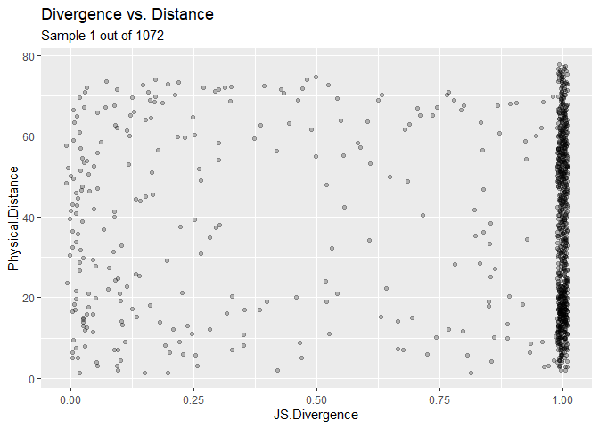
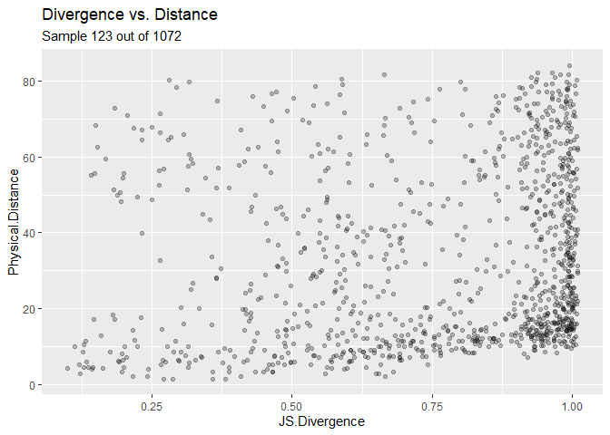
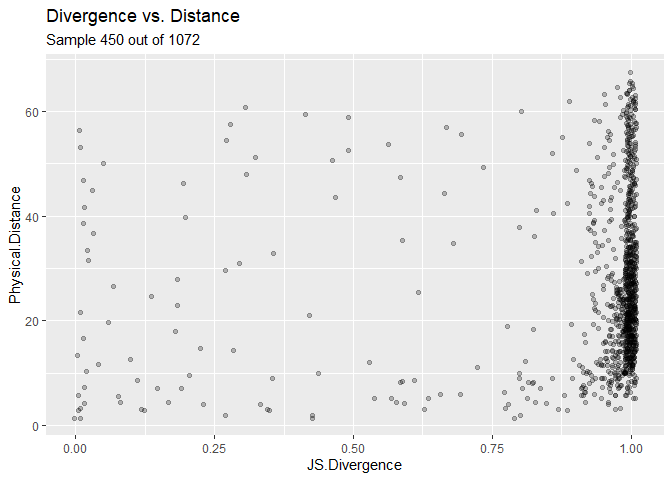
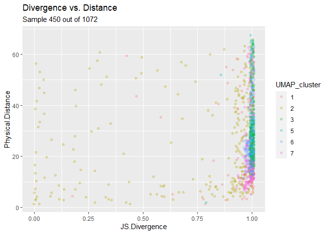
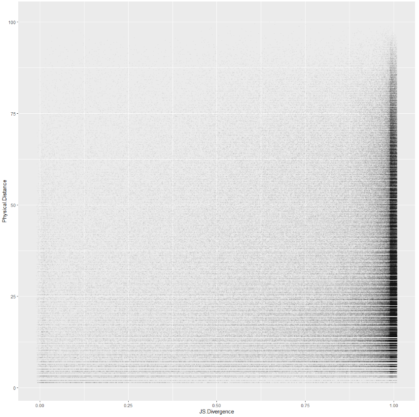

Plotting Relationship between Physical Distance and Divergence of Cell Type Distribution
========================================================================================

The spatial data to be analyzed is available publically from 10x
Genomics. 1,072 spatially tagged samples for 47,094 genes. Retreive
data:

    head(spatial.data[1:5,1:3])

    ##                      x   y          Vip
    ## AAACAGAGCGACTCCT-1  94 -14 0.000000e+00
    ## AAACCGGGTAGGTACC-1  28 -42 3.129354e-02
    ## AAACCGTTCGTCCAGG-1  42 -52 1.937322e-05
    ## AAACTCGTGATATAAG-1 113 -23 0.000000e+00
    ## AAAGGGATGTAGCAAG-1  62 -24 1.519495e-01

    head(dist.matrix[1:5,1:3])

    ##                    AAACAGAGCGACTCCT-1 AAACCGGGTAGGTACC-1 AAACCGTTCGTCCAGG-1
    ## AAACAGAGCGACTCCT-1            0.00000           71.69379           64.40497
    ## AAACCGGGTAGGTACC-1           71.69379            0.00000           17.20465
    ## AAACCGTTCGTCCAGG-1           64.40497           17.20465            0.00000
    ## AAACTCGTGATATAAG-1           21.02380           87.09765           76.69420
    ## AAAGGGATGTAGCAAG-1           33.52611           38.47077           34.40930

### Using Jensen-Shannon Divergence function from philentropy package

JS Divergence for 2nd and 3rd samples.
<https://cran.r-project.org/web/packages/philentropy/vignettes/Information_Theory.html>

    suppressMessages(test<-as.numeric(JSD(vals[c(2,3),])))
    test

    ## [1] 0.9998828

JS Divergence for identical distributions is zero:

    P <- 1:10
    Q <- 20:29
    JSD(rbind(P,Q))

    ## Metric: 'jensen-shannon' using unit: 'log2'; comparing: 2 vectors.

    ## jensen-shannon 
    ##       50.11323

Calculate Jensen-Shannon Divergence for every pair of samples' predicted
cell type distributions:

    n <- nrow(spatial.data)
    results <- matrix(data=NA,nrow=n,ncol=n)
    for (i in seq(n)){
      for (v in seq(n)){
        if (!is.na(results[v,i])) {
          results[i,v] <- results[v,i]
          next
        }
        current <- 0
        if (i != v) {suppressMessages(current <- as.numeric(JSD(vals[c(i,v),])))}
        results[i,v] <- current
      }
    }
    dim(results)

    ## [1] 1072 1072

    sum(is.na(results))

    ## [1] 0

    plot.single.js.vs.distance <- function(target, color.by.cluster=FALSE){
      data <- data.frame(cbind(results[-target,target], dist.matrix[-target,target]))
      colnames(data) <- c("JS.Divergence","Physical.Distance")
      UMAP_cluster <- if (color.by.cluster) {cortex_final$seurat_clusters[-target]}
      ggplot(data,aes(x=JS.Divergence,y=Physical.Distance,col=UMAP_cluster)) +
        ggtitle("Divergence vs. Distance",subtitle=paste("Sample",target,"out of",nrow(results))) +
               geom_point(shape=19, alpha=1/4
                          ,position=position_jitter(width=.01,height=.01)
                          )
    }

Plot JSD vs. phsyical distance for the first sample:

    plot.single.js.vs.distance(1)

    plot.single.js.vs.distance(123)

    plot.single.js.vs.distance(450)

    plot.single.js.vs.distance(450, color.by.cluster=TRUE)

    rws <- seq(nrow(results))
    jsd.vs.dist <- cbind(results[rws>1,1], dist.matrix[rws>1,1])
    typeof(jsd.vs.dist)

    ## [1] "double"

    dim(jsd.vs.dist)

    ## [1] 1071    2

    colnames(jsd.vs.dist) <- c("JS.Divergence","Physical.Distance")
    colnames(jsd.vs.dist)

    ## [1] "JS.Divergence"     "Physical.Distance"

    for (i in seq(2:nrow(results)-1)){
      #print (dim(cbind(results[rws>i,i], dist.matrix[rws>i,i])))
      jsd.vs.dist <- rbind(jsd.vs.dist,cbind(results[rws>i,i], dist.matrix[rws>i,i]))
    }
    typeof(jsd.vs.dist)

    ## [1] "double"

    dim(jsd.vs.dist)

    ## [1] 575127      2

    jsd.vs.dist <- data.frame(jsd.vs.dist)

    ggplot(data=jsd.vs.dist,aes(x=JS.Divergence, y=Physical.Distance)) +
               geom_point(shape=19, alpha=.01, size=.5
                          ,position=position_jitter(width=.01,height=.01)
                          )

