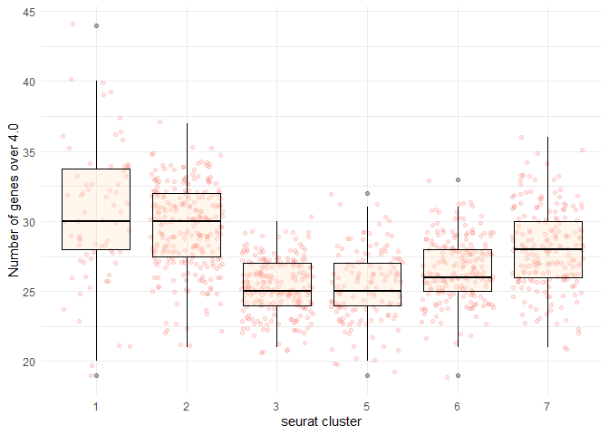

Compare scRNA with one spatial sample
=====================================

Dive into the data for a specific single cell and a single spatial
sample which was enriched for that cell's cell type.

    library(Seurat)
    library(tidyr)

    ## Warning: package 'tidyr' was built under R version 3.6.3

    library(ggplot2)

    ## Warning: package 'ggplot2' was built under R version 3.6.3

Identify a target spatial sample
--------------------------------

The spatial data is available publically from 10x Genomics. 1,072
spatially tagged samples for 47,094 genes.

    cortex_final <- readRDS('2/cortex_final.rds') #342MB

    cortex_final

    ## An object of class Seurat 
    ## 47094 features across 1072 samples within 3 assays 
    ## Active assay: predictions (24 features, 0 variable features)
    ##  2 other assays present: Spatial, SCT
    ##  2 dimensional reductions calculated: pca, umap

    #names(cortex_final) 
    #spatial is the base data, sct is the normalized data, predictions are the anchor-based integration results, pca & umap dim reduction results, anterior1 are the tissue image and mapping tables

There are 70 spatial samples that were placed in cluster 1 in an earlier
analysis. The Oligo celltype seems to be the dominant label for most,
but not all, of the cluster 1 samples. Median anchor-based integration
output for cluster 1 cells is .9933 (out of 1.0).

    cl <- 1
    target.celltype <- "Oligo"
    x <- as.data.frame(cortex_final[['predictions']]@data[-24,cortex_final$seurat_clusters==cl])
    #dim(x)
    summary(t(x[rownames(x)==target.celltype,]))

    ##      Oligo       
    ##  Min.   :0.2361  
    ##  1st Qu.:0.9477  
    ##  Median :0.9933  
    ##  Mean   :0.9428  
    ##  3rd Qu.:0.9969  
    ##  Max.   :0.9999

    #boxplot(x[rownames(x)==target.celltype,])

Our randomly selected cluster 1 sample is "TGGCAGCAGTAATAGT-1", which
was predicted to be componsed of .9949 Oligo celltype.

    set.seed(1989)
    target.sample <- sample(colnames(x),1)
    target.sample #"TGGCAGCAGTAATAGT-1"

    ## [1] "TGGCAGCAGTAATAGT-1"

    x[,colnames(x)==target.sample]

    ##  [1] 0.000000000 0.000000000 0.000000000 0.000000000 0.000000000 0.000000000
    ##  [7] 0.000000000 0.000000000 0.000000000 0.000000000 0.000000000 0.000000000
    ## [13] 0.000000000 0.000000000 0.000000000 0.000000000 0.000000000 0.994897235
    ## [19] 0.000000000 0.000000000 0.005102765 0.000000000 0.000000000

That spatial sample contains 16,017 normalized gene expression levels
between 0.0 and 7.35:

    m <- which(cortex_final[['SCT']]@data@Dimnames[[2]] == target.sample) #our target sample is the 974th out of 1,072 in the SCT & Spatial assays
    spatial.sample <- as.data.frame(cortex_final[['SCT']]@data[,m]) #to save space, could always set row.names = NULL and get gene names from the original seurat object
    dim(spatial.sample) #16,017 genes for this one transformed spot

    ## [1] 16017     1

    colnames(spatial.sample) <- 'SCT'
    #spatial.sample <- cbind(spatial.sample, as.data.frame(cortex_final[['Spatial']]@data[,m])) #would like to see how they normalized from Spatial assay to SCT assay. Cant do a simble cbind because the original Spatial data had 31053 genes but only 16017 are included in the cleaned SCT assay
    summary(spatial.sample)

    ##       SCT        
    ##  Min.   :0.0000  
    ##  1st Qu.:0.0000  
    ##  Median :0.0000  
    ##  Mean   :0.4183  
    ##  3rd Qu.:0.6931  
    ##  Max.   :7.3531

Identify highly expressed genes
-------------------------------

Out of 16,017 genes, 11,092 were zero \[69%\] and 4,925 were above zero
\[31%\].

    sum(spatial.sample == 0)

    ## [1] 11092

    sum(spatial.sample > 0)

    ## [1] 4925

    spatial.sample.nonzeros <- as.data.frame(spatial.sample[spatial.sample > 0,])
    colnames(spatial.sample.nonzeros) <- 'SCT'
    summary(spatial.sample.nonzeros)

    ##       SCT        
    ##  Min.   :0.6931  
    ##  1st Qu.:1.0986  
    ##  Median :1.0986  
    ##  Mean   :1.3602  
    ##  3rd Qu.:1.6094  
    ##  Max.   :7.3531

Majority of the SCT (normalized) expressions for this sample were below
3.

    ggplot(spatial.sample.nonzeros, aes("",SCT)) + 
      geom_violin() + #couldnt get seurat VlnPlot to cooperate
      scale_y_continuous('transformed expression level', seq(0,7,1)) +
      scale_x_discrete(paste("nonzero expressions for spatial sample:",target.sample))

Lets bin the data for the expressions from the spatial sample and see
how many genes are in each bin:

    breaks <- c(seq(0,3,.25), seq(4,8,1))
    spatial.sample.bins <- cut(as.numeric(spatial.sample[,1]), breaks, include.lowest = TRUE)
    table(spatial.sample.bins)

    ## spatial.sample.bins
    ##   [0,0.25] (0.25,0.5] (0.5,0.75]   (0.75,1]   (1,1.25] (1.25,1.5] (1.5,1.75] 
    ##      11092          0       1094          0       1849        509        427 
    ##   (1.75,2]   (2,2.25] (2.25,2.5] (2.5,2.75]   (2.75,3]      (3,4]      (4,5] 
    ##        407        181        138         68         75        143         22 
    ##      (5,6]      (6,7]      (7,8] 
    ##          6          5          1

There are only a 34 genes with expression over 4.

    target.high.expr.genes <- row.names(spatial.sample)[spatial.sample > 4]
    length(target.high.expr.genes)

    ## [1] 34

Is 34 genes over expression 4 a lot? Lets compare to the other spatial
samples... The median number of genes over normalized expression level 4
is 27 \[IQR 25,29\]

    x <- colSums(as.matrix(cortex_final[['SCT']]@data>4))
    length(x)

    ## [1] 1072

    summary(x)

    ##    Min. 1st Qu.  Median    Mean 3rd Qu.    Max. 
    ##    19.0    25.0    27.0    27.4    29.0    44.0

Is 34 genes over expression 4 a lot for this particular cluster \[1\]?
Not necessarily, as clusters 1 & 2 have a higher mean number of 4.0+
genes. *Not sure if the cell density of sample spots affects the gene
counts, or if that has been claculated out in the normalization
process.*

    #identical(names(x), names(cortex_final$seurat_clusters)) #samples are listed in the same order
    x <- cbind.data.frame(x,cortex_final$seurat_clusters)
    dim(x)

    ## [1] 1072    2

    names(x) <- c('Number of genes over 4.0','seurat cluster')
    ggplot(x, aes(x=`seurat cluster`,y=`Number of genes over 4.0`)) + 
      geom_jitter(aes(color='blue'),alpha=0.2) +
      geom_boxplot(fill="bisque",color="black",alpha=0.3) + 
      #labs(x='mean education per house') +
      guides(color=FALSE) +
      theme_minimal() 

So are there genes that are just high in all clusters? Or are some genes
only high in some clusters (can do chi squared test for enrichment?)

Looking at only the first 4 high-epxression genes from the target
sample, some are higher across the whole tissue, while others are more
localized in high expression:

    target.high.expr.genes

    ##  [1] "Cst3"    "Rps21"   "Plp1"    "Tmsb4x"  "Rpl21"   "Gapdh"   "Apoe"   
    ##  [8] "Hbb-bs"  "Bc1"     "Rpl41"   "Cox4i1"  "Rpl13"   "Rps24"   "Tpt1"   
    ## [15] "Rplp1"   "Eef1a1"  "Mobp"    "Hba-a1"  "Hba-a2"  "Rps29"   "Ckb"    
    ## [22] "Rpl37"   "Mbp"     "Cox8a"   "Fth1"    "mt-Nd1"  "mt-Nd2"  "mt-Co1" 
    ## [29] "mt-Co2"  "mt-Atp6" "mt-Co3"  "mt-Nd3"  "mt-Nd4"  "mt-Cytb"

    DefaultAssay(cortex_final) <- "SCT"
    SpatialPlot(cortex_final, images='anterior1', features=target.high.expr.genes[1:4], ncol=2)

For each of the 34 high expr genes... take one gene, compare its level to its level in the neighboring spots?
-------------------------------------------------------------------------------------------------------------

Can turn this one-gene-level data into a network graph, segmentation on
it? Look for areas with a steep drop off?? Could do the same with
celltype predictions too. Plp1 or Tmsb4x look like a good candidates
because they have a wide range of levels in the slide.

    d <- data.frame(cortex_final[['anterior1']]@coordinates[,c('col','row')])
    d['row'] <- d['row'] * -1
    colnames(d) <- c('x','y')
    d <- cbind(d,t(as.matrix((cortex_final[['predictions']]@data))))
    dim(d)

    ## [1] 1072   26

    d[1:10,1:5]

    ##                      x   y          Vip        Lamp5         Sst
    ## AAACAGAGCGACTCCT-1  94 -14 0.000000e+00 0.000000e+00 0.000000000
    ## AAACCGGGTAGGTACC-1  28 -42 3.129354e-02 0.000000e+00 0.212139871
    ## AAACCGTTCGTCCAGG-1  42 -52 1.937322e-05 1.452998e-05 0.000000000
    ## AAACTCGTGATATAAG-1 113 -23 0.000000e+00 0.000000e+00 0.000000000
    ## AAAGGGATGTAGCAAG-1  62 -24 1.519495e-01 2.589553e-03 0.213093447
    ## AAATAACCATACGGGA-1  88 -14 3.022401e-01 8.213392e-02 0.000000000
    ## AAATCGTGTACCACAA-1  56 -44 0.000000e+00 0.000000e+00 0.006155876
    ## AAATGATTCGATCAGC-1 111 -21 0.000000e+00 0.000000e+00 0.245649222
    ## AAATGGTCAATGTGCC-1  51 -33 1.301697e-02 0.000000e+00 0.000000000
    ## AAATTAACGGGTAGCT-1  58 -34 0.000000e+00 0.000000e+00 0.000000000

Convert spatial samples into a network graph
--------------------------------------------

Manually set a cutoff Euclidean distance of 2.1

    test <- as.matrix(dist(data.frame(d[,1:2])))
    typeof(test)

    ## [1] "double"

    dim(test)

    ## [1] 1072 1072

    test[1:10,1:5]

    ##                    AAACAGAGCGACTCCT-1 AAACCGGGTAGGTACC-1 AAACCGTTCGTCCAGG-1
    ## AAACAGAGCGACTCCT-1            0.00000           71.69379           64.40497
    ## AAACCGGGTAGGTACC-1           71.69379            0.00000           17.20465
    ## AAACCGTTCGTCCAGG-1           64.40497           17.20465            0.00000
    ## AAACTCGTGATATAAG-1           21.02380           87.09765           76.69420
    ## AAAGGGATGTAGCAAG-1           33.52611           38.47077           34.40930
    ## AAATAACCATACGGGA-1            6.00000           66.21178           59.66574
    ## AAATCGTGTACCACAA-1           48.41487           28.07134           16.12452
    ## AAATGATTCGATCAGC-1           18.38478           85.61542           75.64390
    ## AAATGGTCAATGTGCC-1           47.01064           24.69818           21.02380
    ## AAATTAACGGGTAGCT-1           41.18252           31.04835           24.08319
    ##                    AAACTCGTGATATAAG-1 AAAGGGATGTAGCAAG-1
    ## AAACAGAGCGACTCCT-1          21.023796           33.52611
    ## AAACCGGGTAGGTACC-1          87.097646           38.47077
    ## AAACCGTTCGTCCAGG-1          76.694198           34.40930
    ## AAACTCGTGATATAAG-1           0.000000           51.00980
    ## AAAGGGATGTAGCAAG-1          51.009803            0.00000
    ## AAATAACCATACGGGA-1          26.570661           27.85678
    ## AAATCGTGTACCACAA-1          60.745370           20.88061
    ## AAATGATTCGATCAGC-1           2.828427           49.09175
    ## AAATGGTCAATGTGCC-1          62.801274           14.21267
    ## AAATTAACGGGTAGCT-1          56.089215           10.77033

    hist(colSums((test)<2.1))

    #count(which(as.numeric(test[,1]) <= 20))
    #hist(colSums(test>0 & test<6))

    test <- test>0 & test<2.1 #close neighbors only
    hist(colSums(test))

    library(igraph)

    ## Warning: package 'igraph' was built under R version 3.6.3

    ## 
    ## Attaching package: 'igraph'

    ## The following object is masked from 'package:tidyr':
    ## 
    ##     crossing

    ## The following objects are masked from 'package:stats':
    ## 
    ##     decompose, spectrum

    ## The following object is masked from 'package:base':
    ## 
    ##     union

    g <- graph_from_adjacency_matrix(test, mode="undirected")
    g

    ## IGRAPH 555d321 UN-- 1072 4024 -- 
    ## + attr: name (v/c)
    ## + edges from 555d321 (vertex names):
    ##  [1] AAACAGAGCGACTCCT-1--CAGCCTCTCCTCAAGA-1
    ##  [2] AAACAGAGCGACTCCT-1--GCAACCACCAGACCGG-1
    ##  [3] AAACAGAGCGACTCCT-1--GCTCATTACTGCATGT-1
    ##  [4] AAACAGAGCGACTCCT-1--TCACTACGACCAATGC-1
    ##  [5] AAACAGAGCGACTCCT-1--TCACTCGTGCAACGGC-1
    ##  [6] AAACAGAGCGACTCCT-1--TCTCGAACGAGGTCAC-1
    ##  [7] AAACAGAGCGACTCCT-1--TGAGATTAGGCCCTAA-1
    ##  [8] AAACAGAGCGACTCCT-1--TTGCGTGAACGCTTAG-1
    ## + ... omitted several edges

*Need to have a better way to plot the iGraph back onto the tissue
slide. So can verify neighbors and can also visualize our segmentation
results better.* For now, "layout\_with\_kk" seems to work best at
recreating the structure of the slide (by modeling each edge as a spring
that repels its neighboring nodes).

    plot(g, vertex.label=NA, vertex.size=1, layout = layout_with_kk)

### Verify that our target sample's neighbors are properly accounted for in the conversion to an adjaceny matrix and then to a network graph...

our target sample is at 61,-39

    d[target.sample,c('x','y')] #our target sample is at 61,-39

    ##                     x   y
    ## TGGCAGCAGTAATAGT-1 61 -39

Neighbors:

    d[58 < d$x & d$x < 64 & -42 < d$y & d$y < -36,c('x','y')]

    ##                     x   y
    ## ATCATCCAATATTTGT-1 59 -39
    ## CAATTTCGTATAAGGG-1 63 -37
    ## CGCTATTCTTAGGCTC-1 60 -38
    ## GCAGATTAGGGATATC-1 61 -37
    ## GCATAGAGCACTCAGG-1 59 -37
    ## GCCGGGTTAGGGTCGC-1 59 -41
    ## TACATAGGCATACACC-1 60 -40
    ## TCACGTGCCCGATTCA-1 62 -38
    ## TGGCAGCAGTAATAGT-1 61 -39

    d$color <- as.numeric(58 < d$x & d$x < 64 & -42 < d$y & d$y < -36) #the neighbors
    d[target.sample,'color'] <- 9 #our target
    table(d$color)

    ## 
    ##    0    1    9 
    ## 1063    8    1

    ggplot(d,aes(x,y,color = as.factor(color)))+
      geom_point()

Verify the 8 manually identified neighbors were all included in the
automatically identified neighbors from the distance matrix:

    which(test[,target.sample]) #the adjacency matrix identified 5 neighbors that met the maximum distance threshold

    ## ATCATCCAATATTTGT-1 CGCTATTCTTAGGCTC-1 GCAGATTAGGGATATC-1 TACATAGGCATACACC-1 
    ##                206                424                599                795 
    ## TCACGTGCCCGATTCA-1 
    ##                858

    names(which(test[,target.sample])) %in% rownames(d[58 < d$x & d$x < 64 & -42 < d$y & d$y < -36,c('x','y')]) #all 5 were in the group of 8 manually identified neighbors

    ## [1] TRUE TRUE TRUE TRUE TRUE

    rm(cortex_final) #remove spatial cortex object from memory

Compare spatial expression from the target sample with single cell references of the same cell type
---------------------------------------------------------------------------------------------------

Our target spatial sample (and almost all other "cluster 1" samples) was
composed mainly of Oligo cells. Lets look at some Oligo cells from an
scRNA-seq reference set: *Come up with a measure of similarity? Then use
that same measure to measure similarities to spatial neighbors too.*

Find reference single cells of the target celltype
--------------------------------------------------

    allen_reference_final <- readRDS('2/allen_reference_final.rds') #6GB!
    allen_reference_final[['SCT']] #SCT assay is the normalized data, which was done using the same method, sctransform(), used to normalize the spatial dataset

    ## Assay data with 34608 features for 14249 cells
    ## Top 10 variable features:
    ##  Vip, Sst, Npy, Tac2, Crh, Calb2, Tac1, Cxcl14, Penk, Gad1

The allen scRNA-seq reference contains 14,249 cells belonging to 23
labeled cell types:

    x <- as.data.frame(t(as.matrix(table(allen_reference_final$subclass))))
    x <- pivot_longer(x, colnames(x),names_to="celltype",values_to="cellcount")
    ggplot(x, aes(fill=celltype, y = cellcount, x = celltype))+
      geom_bar(position="stack", stat="identity")+
      theme(axis.text.x=element_blank())

    table(allen_reference_final$subclass)

    ## 
    ##      Astro         CR       Endo    L2/3 IT         L4      L5 IT      L5 PT 
    ##        368          7         94        982       1401        880        544 
    ##      L6 CT      L6 IT        L6b      Lamp5 Macrophage      Meis2         NP 
    ##        960       1872        358       1122         51         45        362 
    ##      Oligo       Peri      Pvalb   Serpinf1        SMC       Sncg        Sst 
    ##         91         32       1337         27         55        125       1741 
    ##        Vip       VLMC 
    ##       1728         67

We only have 91 Oligo cells in the reference set. Choosing the 80th one
at random (cell \#11,728 in the reference set). In transforming the
reference set, only the 3,000 most variable genes were used to make SCT.

    #names(allen_reference_final) #rna is base data, sct is transformed and normalized, pca & umap are the dimension reduction results
    r <- which(allen_reference_final$subclass == "Oligo")[80] #cell 3551 in the dataset
    dim(allen_reference_final[['RNA']]@data)

    ## [1] 34617 14249

    rownames(allen_reference_final[['SCT']]@meta.features)[1:5] #gene names...

    ## [1] "0610005C13Rik" "0610006L08Rik" "0610007P14Rik" "0610009B22Rik"
    ## [5] "0610009E02Rik"

    x <- allen_reference_final[['RNA']]@data[,r]
    names(x) <- allen_reference_final[['SCT']]@data@Dimnames[[2]]
    allen_reference_final[['SCT']]@data@Dimnames[[2]][1:5]

    ## [1] "F1S4_160108_001_A01" "F1S4_160108_001_B01" "F1S4_160108_001_C01"
    ## [4] "F1S4_160108_001_D01" "F1S4_160108_001_E01"

    summary(x)

    ##      Min.   1st Qu.    Median      Mean   3rd Qu.      Max. 
    ##      0.00      0.00      0.00     44.69      0.00 101216.00

25 out of 34 high expression genes are in the reference set:

    length(target.high.expr.genes)

    ## [1] 34

    sum(rownames(allen_reference_final[['SCT']]@meta.features) %in% target.high.expr.genes)

    ## [1] 25

    sum(rownames(allen_reference_final[['RNA']]@meta.features) %in% target.high.expr.genes)

    ## [1] 25

    length(x)

    ## [1] 34617

    length(x[x<100000])

    ## [1] 34616

    hist(x[x>0 & x<1000])

Perform the same analysis on this Oligo cell that was done on the
spatial sample. The distribution is extremely wide for this single cell.

    ggplot(as.data.frame(x[x>0 & x < 1000]), aes("",x[x>0 & x < 1000])) + 
      geom_violin() +
      scale_y_continuous('transformed expression level', seq(0,1000,100)) +
      scale_x_discrete(paste("nonzero expressions for spatial sample:",target.sample))

There are 84 genes above 2,000 expression value. Only 1 of them was one
of the 25 (/34) high expression genes in our sample. Is that just noise
from our one cell? From our target spatial sample?

    sum(rownames(allen_reference_final[['SCT']]@meta.features[which(x>2000),]) %in% target.high.expr.genes)

    ## [1] 1

    length(x[x>2000])

    ## [1] 84

    rm(allen_reference_final)
