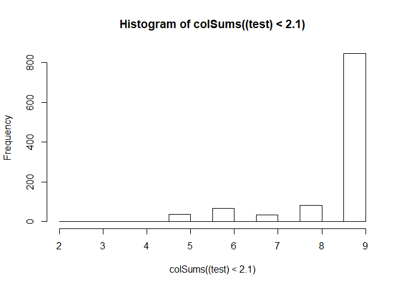
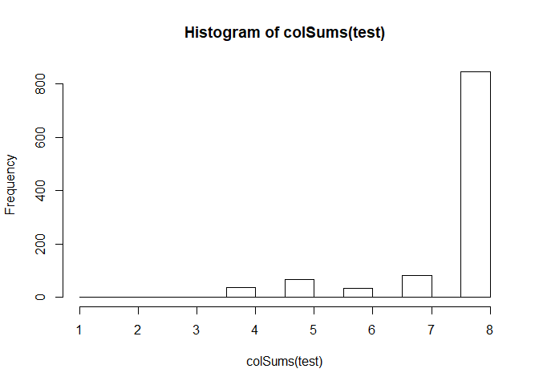
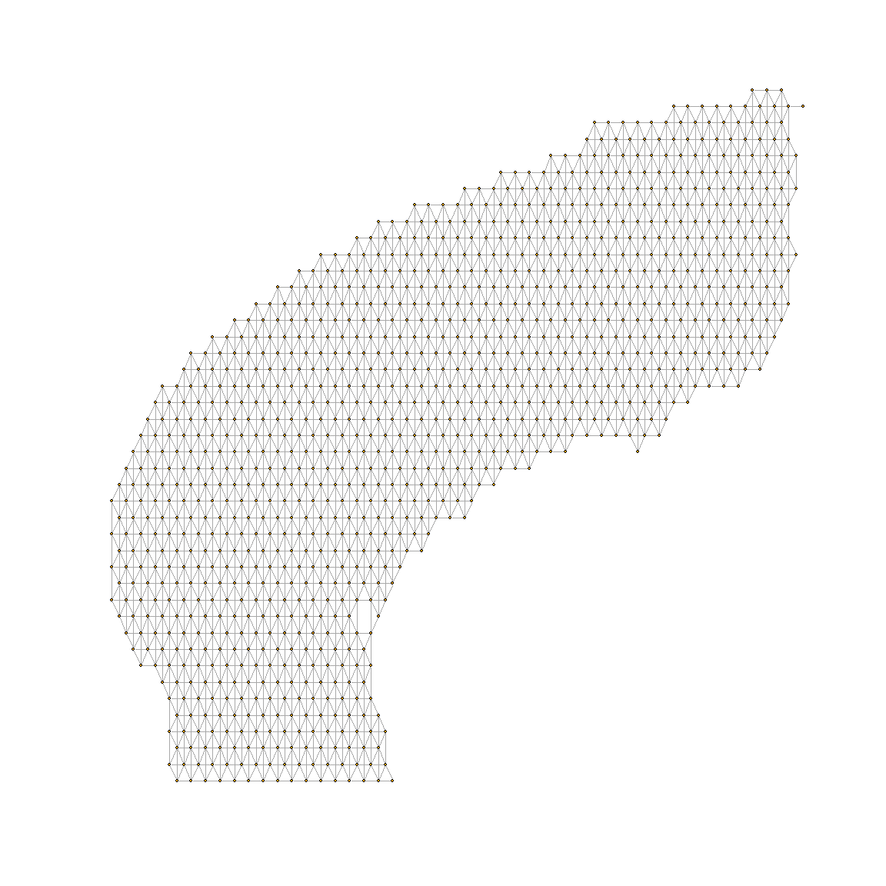
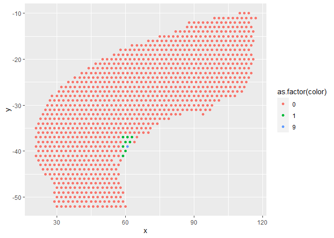
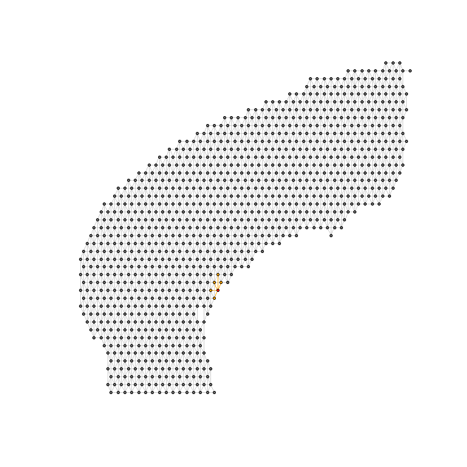

Code Spatial Tx as a Network Graph
==================================

May 25th, 2020

The spatial data is available publically from 10x Genomics. 1,072
spatially tagged samples for 47,094 genes.

    cortex_final <- readRDS('../2/cortex_final.rds') #342MB

Retrieve spatial sample coordinates and the cell type prediction results
from an earlier anchor-based label transfer:

    d <- data.frame(cortex_final[['anterior1']]@coordinates[,c('col','row')])
    d['row'] <- d['row'] * -1
    colnames(d) <- c('x','y')
    d <- cbind(d,t(as.matrix((cortex_final[['predictions']]@data))))
    dim(d)

    ## [1] 1072   26

    d[1:10,1:5]

    ##                      x   y          Vip        Lamp5         Sst
    ## AAACAGAGCGACTCCT-1  94 -14 0.000000e+00 0.000000e+00 0.000000000
    ## AAACCGGGTAGGTACC-1  28 -42 3.129354e-02 0.000000e+00 0.212139871
    ## AAACCGTTCGTCCAGG-1  42 -52 1.937322e-05 1.452998e-05 0.000000000
    ## AAACTCGTGATATAAG-1 113 -23 0.000000e+00 0.000000e+00 0.000000000
    ## AAAGGGATGTAGCAAG-1  62 -24 1.519495e-01 2.589553e-03 0.213093447
    ## AAATAACCATACGGGA-1  88 -14 3.022401e-01 8.213392e-02 0.000000000
    ## AAATCGTGTACCACAA-1  56 -44 0.000000e+00 0.000000e+00 0.006155876
    ## AAATGATTCGATCAGC-1 111 -21 0.000000e+00 0.000000e+00 0.245649222
    ## AAATGGTCAATGTGCC-1  51 -33 1.301697e-02 0.000000e+00 0.000000000
    ## AAATTAACGGGTAGCT-1  58 -34 0.000000e+00 0.000000e+00 0.000000000

Convert spatial samples into a network graph
--------------------------------------------

Manually set a cutoff Euclidean distance of 2.1

    test <- as.matrix(dist(data.frame(d[,1:2])))
    typeof(test)

    ## [1] "double"

    dim(test)

    ## [1] 1072 1072

    test[1:10,1:5]

    ##                    AAACAGAGCGACTCCT-1 AAACCGGGTAGGTACC-1 AAACCGTTCGTCCAGG-1
    ## AAACAGAGCGACTCCT-1            0.00000           71.69379           64.40497
    ## AAACCGGGTAGGTACC-1           71.69379            0.00000           17.20465
    ## AAACCGTTCGTCCAGG-1           64.40497           17.20465            0.00000
    ## AAACTCGTGATATAAG-1           21.02380           87.09765           76.69420
    ## AAAGGGATGTAGCAAG-1           33.52611           38.47077           34.40930
    ## AAATAACCATACGGGA-1            6.00000           66.21178           59.66574
    ## AAATCGTGTACCACAA-1           48.41487           28.07134           16.12452
    ## AAATGATTCGATCAGC-1           18.38478           85.61542           75.64390
    ## AAATGGTCAATGTGCC-1           47.01064           24.69818           21.02380
    ## AAATTAACGGGTAGCT-1           41.18252           31.04835           24.08319
    ##                    AAACTCGTGATATAAG-1 AAAGGGATGTAGCAAG-1
    ## AAACAGAGCGACTCCT-1          21.023796           33.52611
    ## AAACCGGGTAGGTACC-1          87.097646           38.47077
    ## AAACCGTTCGTCCAGG-1          76.694198           34.40930
    ## AAACTCGTGATATAAG-1           0.000000           51.00980
    ## AAAGGGATGTAGCAAG-1          51.009803            0.00000
    ## AAATAACCATACGGGA-1          26.570661           27.85678
    ## AAATCGTGTACCACAA-1          60.745370           20.88061
    ## AAATGATTCGATCAGC-1           2.828427           49.09175
    ## AAATGGTCAATGTGCC-1          62.801274           14.21267
    ## AAATTAACGGGTAGCT-1          56.089215           10.77033

    hist(colSums((test)<2.1))

    #count(which(as.numeric(test[,1]) <= 20))
    #hist(colSums(test>0 & test<6))

    test <- test>0 & test<2.1 #close neighbors only
    hist(colSums(test))

    g <- graph_from_adjacency_matrix(test, mode="undirected")
     #iGraph plotting help: https://kateto.net/netscix2016.html
    l <- as.matrix(d[,1:2])
    plot(g, vertex.label=NA, vertex.size=1, layout = l) #layout_with_kk is pretty good too

### Verify that our target sample's neighbors are properly accounted for in the conversion to an adjaceny matrix and then to a network graph...

our target sample is at 61,-39

    target.sample <- "TGGCAGCAGTAATAGT-1"
    d[target.sample,c('x','y')] #our target sample is at 61,-39

    ##                     x   y
    ## TGGCAGCAGTAATAGT-1 61 -39

Quick identification of neighbors with approximately close locations:

    d[58 < d$x & d$x < 64 & -42 < d$y & d$y < -36,c('x','y')]

    ##                     x   y
    ## ATCATCCAATATTTGT-1 59 -39
    ## CAATTTCGTATAAGGG-1 63 -37
    ## CGCTATTCTTAGGCTC-1 60 -38
    ## GCAGATTAGGGATATC-1 61 -37
    ## GCATAGAGCACTCAGG-1 59 -37
    ## GCCGGGTTAGGGTCGC-1 59 -41
    ## TACATAGGCATACACC-1 60 -40
    ## TCACGTGCCCGATTCA-1 62 -38
    ## TGGCAGCAGTAATAGT-1 61 -39

    d$color <- as.numeric(58 < d$x & d$x < 64 & -42 < d$y & d$y < -36) #the neighbors
    d[target.sample,'color'] <- 9 #our target
    table(d$color)

    ## 
    ##    0    1    9 
    ## 1063    8    1

    ggplot(d,aes(x,y,color = as.factor(color)))+
      geom_point()

Verify the 8 manually identified neighbors were all included in the
automatically identified neighbors from the distance matrix:

    which(test[,target.sample]) #the adjacency matrix identified 5 neighbors that met the maximum distance threshold

    ## ATCATCCAATATTTGT-1 CGCTATTCTTAGGCTC-1 GCAGATTAGGGATATC-1 TACATAGGCATACACC-1 
    ##                206                424                599                795 
    ## TCACGTGCCCGATTCA-1 
    ##                858

    names(which(test[,target.sample])) %in% rownames(d[58 < d$x & d$x < 64 & -42 < d$y & d$y < -36,c('x','y')]) #all 5 were in the group of 8 manually identified neighbors

    ## [1] TRUE TRUE TRUE TRUE TRUE

Via <https://kateto.net/netscix2016.html>

    inc.edges <- incident(g,  V(g)[target.sample], mode="all")
    ecol <- rep("gray80", ecount(g))
    ecol[inc.edges] <- "orange"

    vcol <- rep("grey40", vcount(g)) #color vertices, default is grey40
    vcol[V(g)==target.sample] <- "gold" #neighbors of target are gold
    neigh.nodes <- neighbors(g, V(g)[target.sample], mode="out")
    vcol[neigh.nodes] <- "#ff9d00"
    #grep("red", colors(), value=T)
    vcol[sum(V(g)[target.sample])] <- "red2"

    plot(g, vertex.label=NA, vertex.size=2, layout = l
         ,vertex.color=vcol, edge.color=ecol) #layout_with_kk is pretty good too

### Maybe apply Community detection?

See <https://kateto.net/netscix2016.html> "High-betweenness edges are
removed sequentially (recalculating at each step) and the best
partitioning of the network is selected.""

    rm(cortex_final) #remove spatial cortex object from memory
