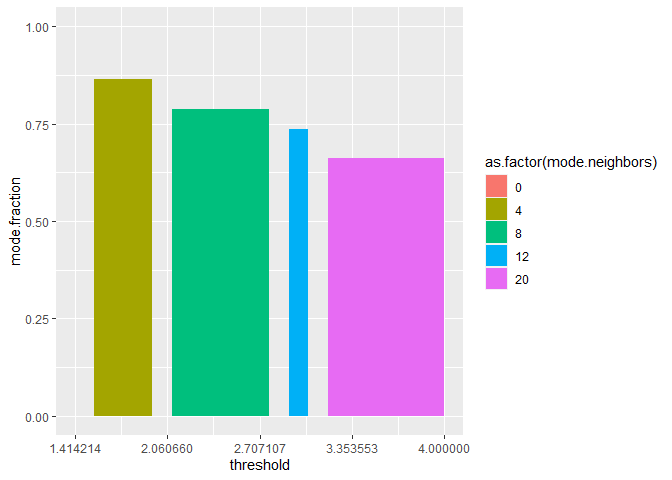
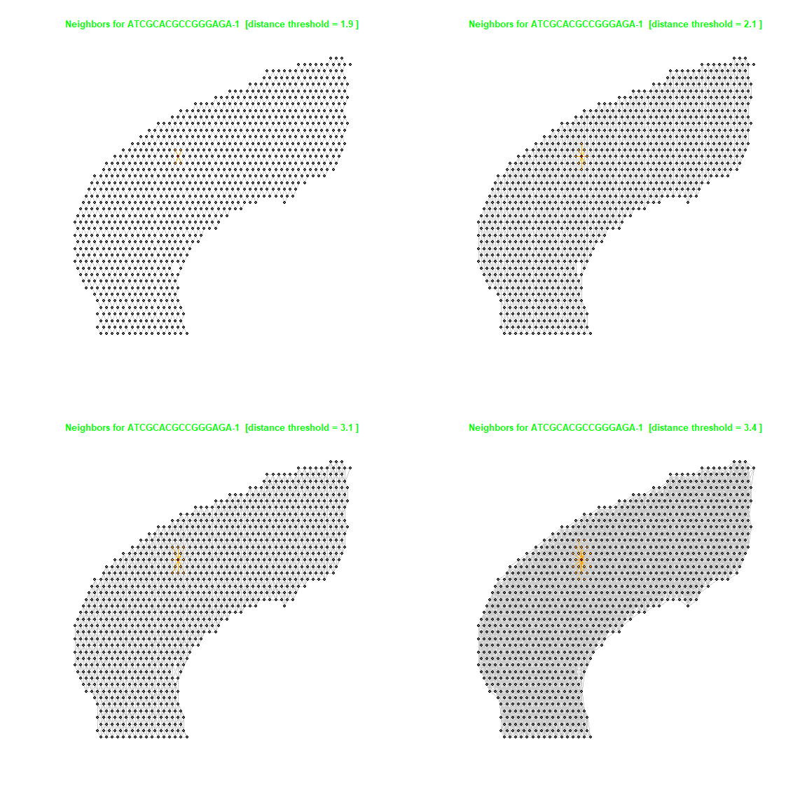

Setting a distance threshold for conversion from Spatial Tx into a Network Graph
================================================================================

May 26th, 2020

The spatial data is available publically from 10x Genomics. 1,072
spatially tagged samples for 47,094 genes.

    cortex_final

    ## An object of class Seurat 
    ## 47094 features across 1072 samples within 3 assays 
    ## Active assay: predictions (24 features, 0 variable features)
    ##  2 other assays present: Spatial, SCT
    ##  2 dimensional reductions calculated: pca, umap

    spatial.data <- data.frame(cortex_final[['anterior1']]@coordinates[,c('col','row')])
    spatial.data['row'] <- spatial.data['row'] * -1 #final row of cell type predictions is a "max" that can be removed
    colnames(spatial.data) <- c('x','y')
    spatial.data <- cbind(spatial.data,t(as.matrix((cortex_final[['predictions']]@data))))
    dim(spatial.data)

    ## [1] 1072   26

    spatial.data[1:10,1:4]

    ##                      x   y          Vip        Lamp5
    ## AAACAGAGCGACTCCT-1  94 -14 0.000000e+00 0.000000e+00
    ## AAACCGGGTAGGTACC-1  28 -42 3.129354e-02 0.000000e+00
    ## AAACCGTTCGTCCAGG-1  42 -52 1.937322e-05 1.452998e-05
    ## AAACTCGTGATATAAG-1 113 -23 0.000000e+00 0.000000e+00
    ## AAAGGGATGTAGCAAG-1  62 -24 1.519495e-01 2.589553e-03
    ## AAATAACCATACGGGA-1  88 -14 3.022401e-01 8.213392e-02
    ## AAATCGTGTACCACAA-1  56 -44 0.000000e+00 0.000000e+00
    ## AAATGATTCGATCAGC-1 111 -21 0.000000e+00 0.000000e+00
    ## AAATGGTCAATGTGCC-1  51 -33 1.301697e-02 0.000000e+00
    ## AAATTAACGGGTAGCT-1  58 -34 0.000000e+00 0.000000e+00

    dist.matrix <- as.matrix(dist(data.frame(spatial.data[,1:2])))
    n <- dim(dist.matrix)[1]
    dim(dist.matrix)

    ## [1] 1072 1072

    dist.matrix[1:10,1:3]

    ##                    AAACAGAGCGACTCCT-1 AAACCGGGTAGGTACC-1 AAACCGTTCGTCCAGG-1
    ## AAACAGAGCGACTCCT-1            0.00000           71.69379           64.40497
    ## AAACCGGGTAGGTACC-1           71.69379            0.00000           17.20465
    ## AAACCGTTCGTCCAGG-1           64.40497           17.20465            0.00000
    ## AAACTCGTGATATAAG-1           21.02380           87.09765           76.69420
    ## AAAGGGATGTAGCAAG-1           33.52611           38.47077           34.40930
    ## AAATAACCATACGGGA-1            6.00000           66.21178           59.66574
    ## AAATCGTGTACCACAA-1           48.41487           28.07134           16.12452
    ## AAATGATTCGATCAGC-1           18.38478           85.61542           75.64390
    ## AAATGGTCAATGTGCC-1           47.01064           24.69818           21.02380
    ## AAATTAACGGGTAGCT-1           41.18252           31.04835           24.08319

Median distance is 29.15, mean is 33.58, the minimum distance between
two samples is 1.4, while the 2nd percentile distance is 4.0

    dist.matrix.no.diag <- dist.matrix
    for (i in seq(n)) {
      dist.matrix.no.diag[i,i] <- NA
    }
    summary(as.numeric(dist.matrix.no.diag))

    ##    Min. 1st Qu.  Median    Mean 3rd Qu.    Max.    NA's 
    ##   1.414  16.492  29.155  33.581  48.270 100.578    1072

    search.space <- quantile(dist.matrix.no.diag, probs = c(0,.02), na.rm = TRUE)
    search.space

    ##       0%       2% 
    ## 1.414214 4.000000

By testing different threholds, we can see that 86% of samples will have
four neighbors when using a 1.9 distance threshold, while 79% will have
eight neighbors when using a 2.1 distance threshold.

    cutoffs <- seq(search.space[1], search.space[2], length.out = 20) #50 bins between the minimum and the 2nd percentile distances
    getmode <- function(v) {
       uniqv <- unique(v)
       max(uniqv[which.max(tabulate(match(v, uniqv)))])
    }
    final.results <- data.frame(threshold=double()
                                ,median.neighbors=double()
                                ,mode.neighbors=double()
                                ,mode.fraction=double()
                                ,neighborless=integer()
                                )
    for (threshold in cutoffs){
      x <- as.numeric(colSums(dist.matrix > 0 & dist.matrix < threshold))
      median.neighbors <- median(x)
      mode.neighbors <- getmode(x)
      mode.fraction <- sum(x==mode.neighbors) / length(x)
      neighborless <- sum(x==0)
      final.results <- rbind(final.results,data.frame(threshold,median.neighbors,mode.neighbors,mode.fraction,neighborless))
    }
    rm(cutoffs,x,threshold,median.neighbors,mode.neighbors,mode.fraction,neighborless)
    final.results[1:20,]

    ##    threshold median.neighbors mode.neighbors mode.fraction neighborless
    ## 1   1.414214                0              0     1.0000000         1072
    ## 2   1.550308                4              4     0.8638060            1
    ## 3   1.686402                4              4     0.8638060            1
    ## 4   1.822496                4              4     0.8638060            1
    ## 5   1.958590                4              4     0.8638060            1
    ## 6   2.094684                8              8     0.7882463            0
    ## 7   2.230778                8              8     0.7882463            0
    ## 8   2.366872                8              8     0.7882463            0
    ## 9   2.502966                8              8     0.7882463            0
    ## 10  2.639060                8              8     0.7882463            0
    ## 11  2.775154                8              8     0.7882463            0
    ## 12  2.911248               12             12     0.7360075            0
    ## 13  3.047342               12             12     0.7360075            0
    ## 14  3.183436               20             20     0.6613806            0
    ## 15  3.319530               20             20     0.6613806            0
    ## 16  3.455624               20             20     0.6613806            0
    ## 17  3.591718               20             20     0.6613806            0
    ## 18  3.727812               20             20     0.6613806            0
    ## 19  3.863906               20             20     0.6613806            0
    ## 20  4.000000               20             20     0.6613806            0

We have a range of thresholds to choose an output network where the
majority of nodes have either 4, 8, 12, or 20 neighbors:

    ggplot(final.results, aes(x=threshold, y=mode.fraction, fill=as.factor(mode.neighbors))) + 
      geom_area() + 
      scale_x_continuous('threshold',breaks=seq(search.space[1], search.space[2], length.out = 5))

Make a function that uses a distance threshold to create an undirected
graph. Can later work on an extension that would weight and/or direct
the edges in the output network too.

    make_graph <- function(threshold) {
       g <- graph_from_adjacency_matrix(as.matrix(dist.matrix > 0 & dist.matrix < threshold), mode="undirected")
       graph_attr(g,"threshold") <- threshold
       graph_attr(g,"layout") <- l
       g
    }
    l <- as.matrix(spatial.data[,1:2]) #use layout coordinates from original data

Select a random target sample to plot:

    plot_random_node <- function(g, seed=1989) {
      set.seed(seed)
      target.sample <- sample(rownames(dist.matrix),1)
      inc.edges <- incident(g,  V(g)[target.sample], mode="all")
      ecol <- rep("gray80", ecount(g))
      ecol[inc.edges] <- "orange"
      
      vcol <- rep("grey40", vcount(g)) #color vertices, default is grey40
      vcol[V(g)==target.sample] <- "gold" #neighbors of target are gold
      neigh.nodes <- neighbors(g, V(g)[target.sample], mode="out")
      vcol[neigh.nodes] <- "#ff9d00"
      #grep("red", colors(), value=T)
      vcol[sum(V(g)[target.sample])] <- "red2"
      
      plot(g, vertex.label=NA, vertex.size=2#, layout = g$layout #setting a "layout" attribute in graph will make it the default
           ,vertex.color=vcol, edge.color=ecol) #layout_with_kk is pretty good too
      title(paste("Neighbors for", target.sample," [distance threshold =",g$threshold,"]"),cex.main=1,col.main="green")
    }

Here we can see the effect the maxmium neighbor distance threhold has on
the final output graph:

    par(mfrow=c(2,2))
    plot_random_node(make_graph(1.9))
    plot_random_node(make_graph(2.1))
    plot_random_node(make_graph(3.1))
    plot_random_node(make_graph(3.4))

