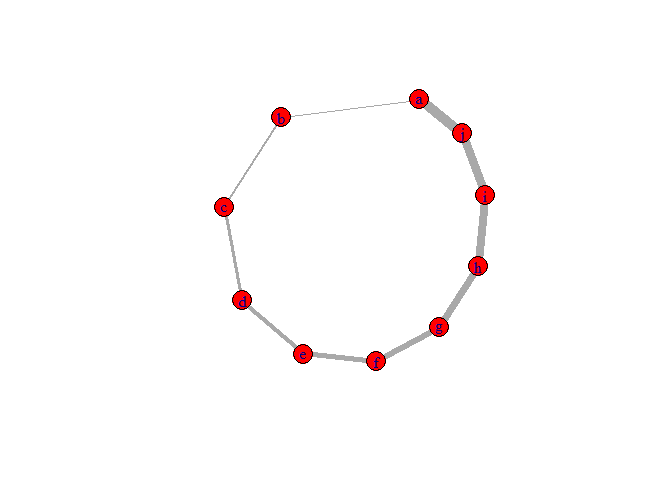
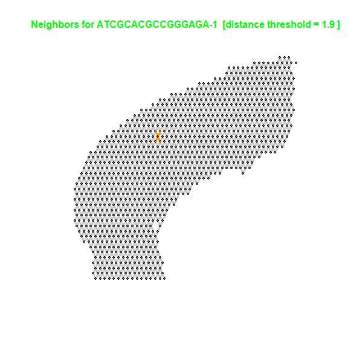
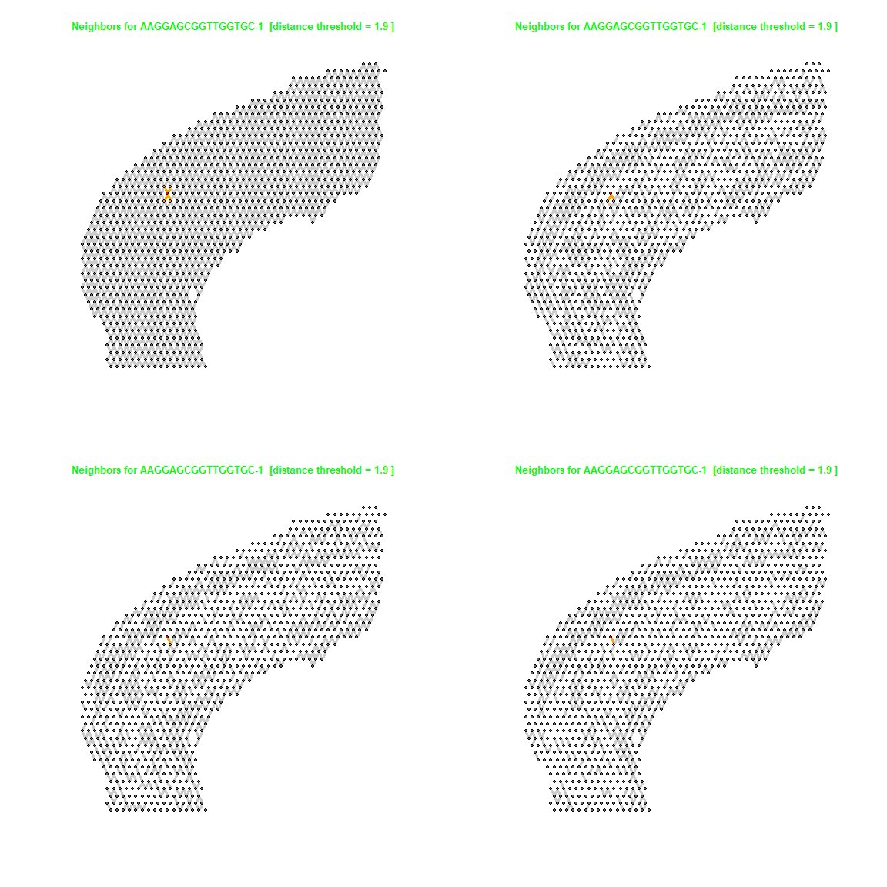
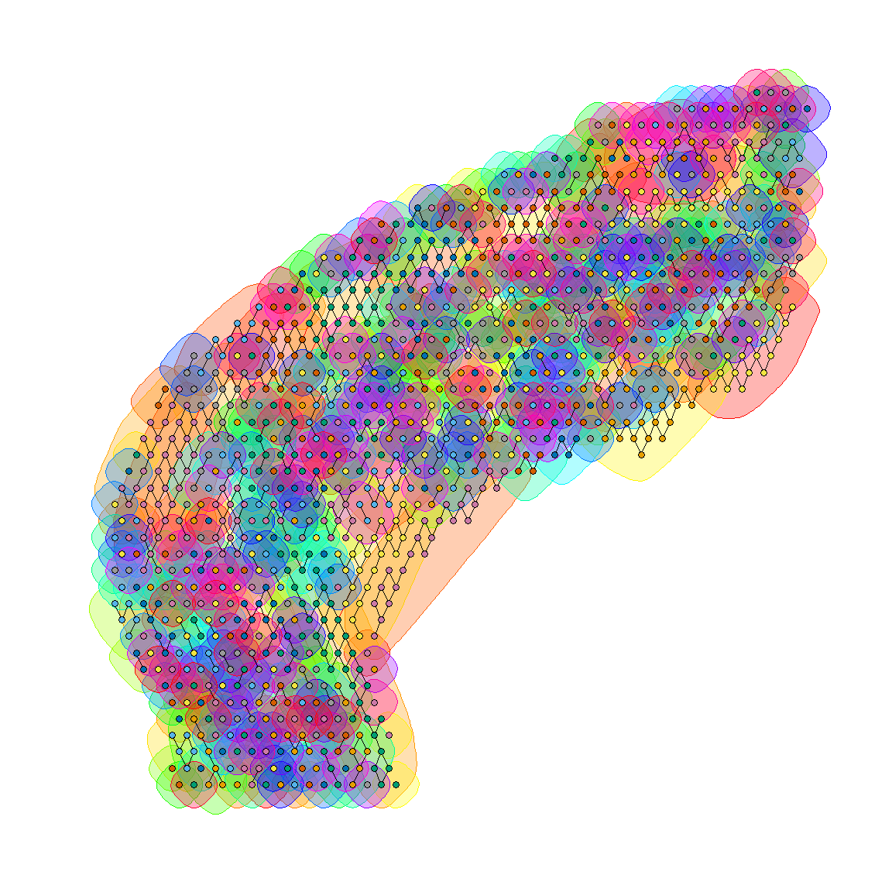
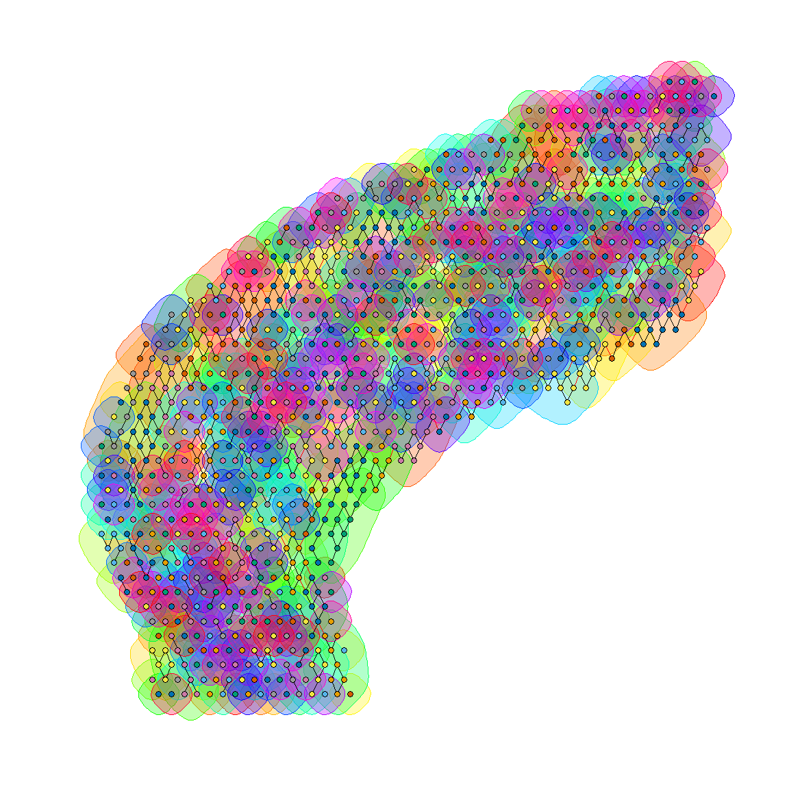
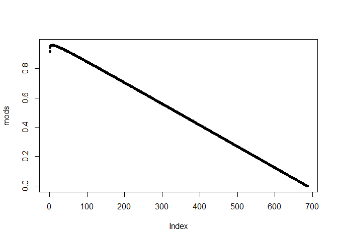

Spatial Tx Graph Weighted by Correlation of Cell Type Compositions
==================================================================

Graph edges can be weighted, see:
<https://stackoverflow.com/questions/54232821/how-igraph-handle-weights>

    g <- make_ring(10) %>%
      set_vertex_attr("color", value = "red") %>%
      set_vertex_attr("label", value = letters[1:10])
    #g
    #V(g)
    #vertex_attr(g)
    E(g)$weight <- seq(1,10,1)
    #E(g)
    #edge_attr(g)
    #strength(g) #total of outgoing weights
    plot(g, edge.width=(E(g)$weight))

The spatial data to be analyzed is available publically from 10x
Genomics. 1,072 spatially tagged samples for 47,094 genes. Retreive
data:

Make a function that uses a distance threshold to create an undirected
graph. Can later work on an extension that would weight and/or direct
the edges in the output network too.

    make_graph <- function(threshold) {
       g <- graph_from_adjacency_matrix(as.matrix(dist.matrix > 0 & dist.matrix < threshold), mode="undirected")
       graph_attr(g,"threshold") <- threshold
       graph_attr(g,"layout") <- as.matrix(spatial.data[,1:2])
       g
    }

Select a random target sample to plot:

    plot_random_node <- function(g, seed=1989) {
      set.seed(seed)
      target.sample <- sample(rownames(dist.matrix),1)
      inc.edges <- incident(g,  V(g)[target.sample], mode="all")
      ecol <- rep("gray80", ecount(g))
      ecol[inc.edges] <- "orange"
      
      vcol <- rep("grey40", vcount(g)) #color vertices, default is grey40
      vcol[V(g)==target.sample] <- "gold" #neighbors of target are gold
      neigh.nodes <- neighbors(g, V(g)[target.sample], mode="out")
      vcol[neigh.nodes] <- "#ff9d00"
      #grep("red", colors(), value=T)
      vcol[sum(V(g)[target.sample])] <- "red2"
      
      plot(g, vertex.label=NA, vertex.size=2#, layout = g$layout #setting a "layout" attribute in graph will make it the default
           ,vertex.color=vcol, edge.color=ecol, edge.width=3) #layout_with_kk is pretty good too
      title(paste("Neighbors for", target.sample," [distance threshold =",g$threshold,"]"),cex.main=1,col.main="green")
    }

Make graph by linking nodes within "1.9" distance of one another:

    g <- make_graph(1.9)
    plot_random_node(g)

Loop over all edges and delete edges where nodes do not have a high
correlation:
<https://stackoverflow.com/questions/49834827/louvain-community-detection-in-r-using-igraph-format-of-edges-and-vertices>

    apply_correlation_filter <- function(g, cor.cutoff){
      neighbor.cors <- c()
      for (i in seq(length(E(g)))){
        neighbor.cors <- c(neighbor.cors,cor(vals[names(tail_of(g,E(g))[i]),], vals[names(head_of(g,E(g))[i]),]))
      }
      neighbor.cors[1:5]
      length(neighbor.cors)
      targets <- which(neighbor.cors < cor.cutoff)
      delete_edges(g, targets)
    }

    g7 <- apply_correlation_filter(g, .7)
    g8 <- apply_correlation_filter(g, .8)
    g9 <- apply_correlation_filter(g, .9)

### Note the effect of keeping only edges where neighbor nodes correlate &gt; .7, &gt; .8 and &gt; .9

    par(mfrow=c(2,2))
    seed = 11
    plot_random_node(g, seed)
    plot_random_node(g7, seed)
    plot_random_node(g8, seed)
    plot_random_node(g9, seed)

Should try community detection. Can't do cliques (complete connected
componets). See: <https://kateto.net/networks-r-igraph> or
<https://igraph.org/c/doc/igraph-Community.html>

    ceb <- cluster_edge_betweenness(g9)  #makes 500 communities
    #hist(membership(ceb))
    plot(ceb, g9, vertex.label=NA, vertex.size=2)#, layout = g$layout #setting a "layout" attribute in graph will make it the default

    clp <- cluster_label_prop(g9)
    plot(clp, g9, vertex.label=NA, vertex.size=2)

    cfg <- cluster_fast_greedy(as.undirected(g9))
    #plot(cfg, g9, vertex.label=NA, vertex.size=2, vertex.col = cut_at(cfg, step=100))

    cfg

    ## IGRAPH clustering fast greedy, groups: 499, mod: 0.96
    ## + groups:
    ##   $`1`
    ##    [1] "AATTAAAGGTCGGCGT-1" "ACCCGGTTACACTTCC-1" "AGTCAACACCACCATC-1"
    ##    [4] "AGTGACCTACTTTACG-1" "ATCCAGGATTCGTGAA-1" "ATGATGCAATGGTACA-1"
    ##    [7] "CAAATGTCCTTCCGTG-1" "CACAATGAGCTGCTAT-1" "CAGAGACGGTCACCCA-1"
    ##   [10] "CCACACTGAGATATTA-1" "CTGTTACCCAATCTAG-1" "CTTCGTAGATAGGTGA-1"
    ##   [13] "CTTGCCCAGGCTCTAC-1" "GAAACCGAATTACCTT-1" "GAAATTGTCTCTATAA-1"
    ##   [16] "GAAGTCAGTTGCACTA-1" "GAATTCACCCGGGTGT-1" "GCGACGATAGTTGTAC-1"
    ##   [19] "GGGCCCGTCTTAAACA-1" "GGGTGACACCTTAACT-1" "GTTACTTTGGGCCTAG-1"
    ##   [22] "GTTATATTATCTCCCT-1" "TAACTCATCCGCGCGG-1" "TACAACGCACAACTCA-1"
    ##   [25] "TACGACGCTTGCTGCG-1" "TACGCAGTTCTTTCCT-1" "TAGCTCGCCTGATAAC-1"
    ##   + ... omitted several groups/vertices

    length(sizes(cfg)) #499

    ## [1] 499

    sizes(cfg)

    ## Community sizes
    ##   1   2   3   4   5   6   7   8   9  10  11  12  13  14  15  16  17  18  19  20 
    ##  30  23  40  24  24  20  18  14  14  13  11   9   9   9  12   9   9   9   7   8 
    ##  21  22  23  24  25  26  27  28  29  30  31  32  33  34  35  36  37  38  39  40 
    ##   8  26   7   6  17  20  12   6   6   6   6   6  15  16   5   5   5   4   4   4 
    ##  41  42  43  44  45  46  47  48  49  50  51  52  53  54  55  56  57  58  59  60 
    ##   4   4   4   4   5   5   4   4   4   3   3   3   3   3   3   3   3   3   3   3 
    ##  61  62  63  64  65  66  67  68  69  70  71  72  73  74  75  76  77  78  79  80 
    ##   3   3   3   3   2   2   2   2   2   2   2   2   2   2   2   2   2   2   2   2 
    ##  81  82  83  84  85  86  87  88  89  90  91  92  93  94  95  96  97  98  99 100 
    ##   2   2   2   2   2   2   2   2   2   2   2   2   2   2   2   2   2   2   2   2 
    ## 101 102 103 104 105 106 107 108 109 110 111 112 113 114 115 116 117 118 119 120 
    ##   2   2   2   2   2   2   2   2   2   2   2   2   2   2   2   2   2   2   2   2 
    ## 121 122 123 124 125 126 127 128 129 130 131 132 133 134 135 136 137 138 139 140 
    ##   2   2   1   1   1   1   1   1   1   1   1   1   1   1   1   1   1   1   1   1 
    ## 141 142 143 144 145 146 147 148 149 150 151 152 153 154 155 156 157 158 159 160 
    ##   1   1   1   1   1   1   1   1   1   1   1   1   1   1   1   1   1   1   1   1 
    ## 161 162 163 164 165 166 167 168 169 170 171 172 173 174 175 176 177 178 179 180 
    ##   1   1   1   1   1   1   1   1   1   1   1   1   1   1   1   1   1   1   1   1 
    ## 181 182 183 184 185 186 187 188 189 190 191 192 193 194 195 196 197 198 199 200 
    ##   1   1   1   1   1   1   1   1   1   1   1   1   1   1   1   1   1   1   1   1 
    ## 201 202 203 204 205 206 207 208 209 210 211 212 213 214 215 216 217 218 219 220 
    ##   1   1   1   1   1   1   1   1   1   1   1   1   1   1   1   1   1   1   1   1 
    ## 221 222 223 224 225 226 227 228 229 230 231 232 233 234 235 236 237 238 239 240 
    ##   1   1   1   1   1   1   1   1   1   1   1   1   1   1   1   1   1   1   1   1 
    ## 241 242 243 244 245 246 247 248 249 250 251 252 253 254 255 256 257 258 259 260 
    ##   1   1   1   1   1   1   1   1   1   1   1   1   1   1   1   1   1   1   1   1 
    ## 261 262 263 264 265 266 267 268 269 270 271 272 273 274 275 276 277 278 279 280 
    ##   1   1   1   1   1   1   1   1   1   1   1   1   1   1   1   1   1   1   1   1 
    ## 281 282 283 284 285 286 287 288 289 290 291 292 293 294 295 296 297 298 299 300 
    ##   1   1   1   1   1   1   1   1   1   1   1   1   1   1   1   1   1   1   1   1 
    ## 301 302 303 304 305 306 307 308 309 310 311 312 313 314 315 316 317 318 319 320 
    ##   1   1   1   1   1   1   1   1   1   1   1   1   1   1   1   1   1   1   1   1 
    ## 321 322 323 324 325 326 327 328 329 330 331 332 333 334 335 336 337 338 339 340 
    ##   1   1   1   1   1   1   1   1   1   1   1   1   1   1   1   1   1   1   1   1 
    ## 341 342 343 344 345 346 347 348 349 350 351 352 353 354 355 356 357 358 359 360 
    ##   1   1   1   1   1   1   1   1   1   1   1   1   1   1   1   1   1   1   1   1 
    ## 361 362 363 364 365 366 367 368 369 370 371 372 373 374 375 376 377 378 379 380 
    ##   1   1   1   1   1   1   1   1   1   1   1   1   1   1   1   1   1   1   1   1 
    ## 381 382 383 384 385 386 387 388 389 390 391 392 393 394 395 396 397 398 399 400 
    ##   1   1   1   1   1   1   1   1   1   1   1   1   1   1   1   1   1   1   1   1 
    ## 401 402 403 404 405 406 407 408 409 410 411 412 413 414 415 416 417 418 419 420 
    ##   1   1   1   1   1   1   1   1   1   1   1   1   1   1   1   1   1   1   1   1 
    ## 421 422 423 424 425 426 427 428 429 430 431 432 433 434 435 436 437 438 439 440 
    ##   1   1   1   1   1   1   1   1   1   1   1   1   1   1   1   1   1   1   1   1 
    ## 441 442 443 444 445 446 447 448 449 450 451 452 453 454 455 456 457 458 459 460 
    ##   1   1   1   1   1   1   1   1   1   1   1   1   1   1   1   1   1   1   1   1 
    ## 461 462 463 464 465 466 467 468 469 470 471 472 473 474 475 476 477 478 479 480 
    ##   1   1   1   1   1   1   1   1   1   1   1   1   1   1   1   1   1   1   1   1 
    ## 481 482 483 484 485 486 487 488 489 490 491 492 493 494 495 496 497 498 499 
    ##   1   1   1   1   1   1   1   1   1   1   1   1   1   1   1   1   1   1   1

    merges(cfg)

    ##        [,1] [,2]
    ##   [1,]  700   30
    ##   [2,]  873   55
    ##   [3,]   22  398
    ##   [4,]  405  798
    ##   [5,]  815  209
    ##   [6,]  261  403
    ##   [7,]  434  110
    ##   [8,]  743  808
    ##   [9,]  840  812
    ##  [10,]  865  213
    ##  [11,]    9  826
    ##  [12,]  755  218
    ##  [13,] 1066  836
    ##  [14,]  433  848
    ##  [15,]  637  222
    ##  [16,]  329   60
    ##  [17,]  251  118
    ##  [18,] 1065  438
    ##  [19,]  572  891
    ##  [20,]  748  449
    ##  [21,]  596  898
    ##  [22,]  270  899
    ##  [23,]  140  901
    ##  [24,]  331  451
    ##  [25,]  580  235
    ##  [26,]  718  920
    ##  [27,]  197  938
    ##  [28,]  334  939
    ##  [29,]  138  244
    ##  [30,]  629  471
    ##  [31,]  351  948
    ##  [32,]  986   63
    ##  [33,]  193  473
    ##  [34,]  152  474
    ##  [35,]  371  958
    ##  [36,]  695  250
    ##  [37,] 1068  487
    ##  [38,]  549  997
    ##  [39,]  148  256
    ##  [40,]  181  497
    ##  [41,] 1025  258
    ##  [42,]  677 1028
    ##  [43,]  168 1034
    ##  [44,]  336 1053
    ##  [45,]  601  267
    ##  [46,]  365 1071
    ##  [47,]  635  565
    ##  [48,]  330  593
    ##  [49,]  171  301
    ##  [50,]  636  303
    ##  [51,]  649  610
    ##  [52,]   53  169
    ##  [53,]  623  309
    ##  [54,]  754   24
    ##  [55,]  364   43
    ##  [56,]  750   11
    ##  [57,]  756  350
    ##  [58,]  764  190
    ##  [59,]  737  784
    ##  [60,]  681  785
    ##  [61,]  249  400
    ##  [62,]  830  401
    ##  [63,]  515  210
    ##  [64,]  909  528
    ##  [65,]  290  817
    ##  [66,]  265  111
    ##  [67,]  119  413
    ##  [68,] 1013  216
    ##  [69,]  968  825
    ##  [70,]  539  423
    ##  [71,]  910  220
    ##  [72,]  687  841
    ##  [73,]  199  843
    ##  [74,] 1007  427
    ##  [75,]  708  428
    ##  [76,]  744  429
    ##  [77,]  454   59
    ##  [78,]  946  863
    ##  [79,] 1048  864
    ##  [80,]  779  871
    ##  [81,]  247  875
    ##  [82,]  101  882
    ##  [83,]  296  883
    ##  [84,]  555  440
    ##  [85,]   37  896
    ##  [86,]  925  907
    ##  [87,]  541  455
    ##  [88,]  940  913
    ##  [89,]  585  915
    ##  [90,] 1062  125
    ##  [91,]  697  929
    ##  [92,] 1016  466
    ##  [93,]  183  931
    ##  [94,]  724  942
    ##  [95,]  717  945
    ##  [96,]  269  949
    ##  [97,]  771  128
    ##  [98,]  607  952
    ##  [99,]   16  478
    ## [100,]  264   35
    ## [101,]  581 1004
    ## [102,]  544  491
    ## [103,]  155  495
    ## [104,]  691 1021
    ## [105,]  387 1055
    ## [106,]  547 1030
    ## [107,]  280  509
    ## [108,]  609 1037
    ## [109,]  198   76
    ## [110,]  153  149
    ## [111,]  500  543
    ## [112,]  765  548
    ## [113,]  576  551
    ## [114,]  189   38
    ## [115,]  595  566
    ## [116,]   44  156
    ## [117,]  103  598
    ## [118,]  774   82
    ## [119,]  728  605
    ## [120,]  673  313
    ## [121,]  654  324
    ## [122,]  664  655
    ## [123,]   26  658
    ## [124,]  367  660
    ## [125,]  381  669
    ## [126,]  348  679
    ## [127,]   98  683
    ## [128,]  382   93
    ## [129,]   89 1070
    ## [130,]  624  393
    ## [131,]  272  787
    ## [132,]   61  794
    ## [133,]  640    1
    ## [134,]   84  799
    ## [135,]  550  404
    ## [136,]  335   57
    ## [137,]  112  823
    ## [138,]  133  416
    ## [139,]   54  828
    ## [140,]  510  842
    ## [141,]  205 1134
    ## [142,]  928  849
    ## [143,]   34  114
    ## [144,]  482 1038
    ## [145,]  768  870
    ## [146,]  304   33
    ## [147,] 1006 1010
    ## [148,]  345  905
    ## [149,]  594 1149
    ## [150,]  977  914
    ## [151,]  204  967
    ## [152,] 1142  953
    ## [153,]  772  486
    ## [154,]  615  993
    ## [155,] 1168  489
    ## [156,] 1040 1146
    ## [157,]   48 1171
    ## [158,]  314 1049
    ## [159,]  645 1138
    ## [160,]  363  472
    ## [161,] 1163  545
    ## [162,]  327 1137
    ## [163,] 1184  159
    ## [164,]  339  926
    ## [165,] 1188  308
    ## [166,]  104  646
    ## [167,] 1131  657
    ## [168,] 1148  688
    ## [169,]  736  343
    ## [170,] 1154  346
    ## [171,]  770 1197
    ## [172,]  470  874
    ## [173,]  480  392
    ## [174,]  278  394
    ## [175,]   36  207
    ## [176,]  446  212
    ## [177,]   31  822
    ## [178,]  670 1060
    ## [179,]  160  829
    ## [180,]  827  417
    ## [181,]  504  418
    ## [182,]   97  219
    ## [183,]  176  856
    ## [184,]  260  425
    ## [185,]  488  872
    ## [186,]  262  113
    ## [187,]  468  855
    ## [188,]  974  858
    ## [189,]  326  868
    ## [190,]  719  224
    ## [191,]  317  380
    ## [192,]  144  117
    ## [193,]  538 1069
    ## [194,]  450  435
    ## [195,]   58  436
    ## [196,]  231  881
    ## [197,]  582  851
    ## [198,]  353 1018
    ## [199,]  951 1022
    ## [200,]  187  122
    ## [201,]  347  919
    ## [202,]  134  932
    ## [203,]  325  831
    ## [204,]  622  248
    ## [205,]  612  927
    ## [206,] 1267 1277
    ## [207,]  621  546
    ## [208,]  463  557
    ## [209,]  776  286
    ## [210,]  661  943
    ## [211,]  460  289
    ## [212,] 1255 1283
    ## [213,]  161   81
    ## [214,]  180   87
    ## [215,]  699  631
    ## [216,]  236  642
    ## [217,]   96   92
    ## [218,]  741  589
    ## [219,]  186  344
    ## [220,]  735  705
    ## [221,]  749  357
    ## [222,] 1205  860
    ## [223,]  200 1214
    ## [224,]  284 1216
    ## [225,] 1211  490
    ## [226,]   41 1210
    ## [227,] 1201    5
    ## [228,]  662 1226
    ## [229,] 1225  590
    ## [230,] 1220  323
    ## [231,] 1236  709
    ## [232,]  904 1258
    ## [233,]  777 1248
    ## [234,]  760 1273
    ## [235,]  734 1299
    ## [236,] 1187  208
    ## [237,] 1179  819
    ## [238,]  292 1132
    ## [239,] 1145 1042
    ## [240,] 1141  492
    ## [241,] 1180  241
    ## [242,]  143 1160
    ## [243,] 1161  477
    ## [244,]  906 1178
    ## [245,] 1181  579
    ## [246,] 1195  163
    ## [247,]  337 1200
    ## [248,]  402  568
    ## [249,]  889  780
    ## [250,]  965   14
    ## [251,]  203  237
    ## [252,]  467 1033
    ## [253,]  531  781
    ## [254,]  453  109
    ## [255,]  810  246
    ## [256,]  984    4
    ## [257,]  173    6
    ## [258,]  233  341
    ## [259,]  196  514
    ## [260,]  297 1054
    ## [261,]  835   15
    ## [262,]  606  524
    ## [263,]  485  185
    ## [264,]  158  384
    ## [265,]  954  878
    ## [266,] 1336 1337
    ## [267,]  536  432
    ## [268,]  298  684
    ## [269,]  431  680
    ## [270,]  534  328
    ## [271,]  457   91
    ## [272,]  897 1017
    ## [273,]  388  850
    ## [274,]  276  228
    ## [275,]  498 1031
    ## [276,]  663  439
    ## [277,]  507  887
    ## [278,]  599  424
    ## [279,]  106  232
    ## [280,]  464  625
    ## [281,]  411  226
    ## [282,]  525  225
    ## [283,]  944  422
    ## [284,]  588  838
    ## [285,]  651  444
    ## [286,]  964 1001
    ## [287,] 1245 1358
    ## [288,]  561  832
    ## [289,]  349  476
    ## [290,]  674  512
    ## [291,] 1272 1362
    ## [292,]  479  626
    ## [293,] 1351 1364
    ## [294,]  722  730
    ## [295,]  703  519
    ## [296,]  279  496
    ## [297,]  287  985
    ## [298,]  886  245
    ## [299,]  127  359
    ## [300,]  291  818
    ## [301,] 1265 1372
    ## [302,] 1050 1015
    ## [303,]  131  243
    ## [304,]  628 1029
    ## [305,]  266  271
    ## [306,]  385  803
    ## [307,]  162   20
    ## [308,]  194  805
    ## [309,] 1304  975
    ## [310,]  172  729
    ## [311,]  603  170
    ## [312,]  686  584
    ## [313,] 1281 1384
    ## [314,]  792  911
    ## [315,] 1346 1386
    ## [316,]  959  316
    ## [317,]  206  795
    ## [318,]  704  665
    ## [319,]  989  294
    ## [320,] 1257 1391
    ## [321,]  358 1253
    ## [322,] 1222 1393
    ## [323,]  481 1271
    ## [324,] 1057 1244
    ## [325,]   10 1396
    ## [326,]  305 1263
    ## [327,]  727 1269
    ## [328,] 1206 1399
    ## [329,]  379 1286
    ## [330,]  377 1000
    ## [331,]  983   65
    ## [332,] 1207  861
    ## [333,] 1320 1404
    ## [334,]   29  321
    ## [335,]  970  955
    ## [336,]  126  820
    ## [337,]  188  778
    ## [338,]  410  715
    ## [339,] 1212  769
    ## [340,]  608  941
    ## [341,] 1324 1412
    ## [342,]  533  355
    ## [343,]  847  426
    ## [344,]  147  763
    ## [345,] 1326 1416
    ## [346,]  242  234
    ## [347,] 1026 1027
    ## [348,]  130  430
    ## [349,]  586  802
    ## [350,]  732  821
    ## [351,]  783  268
    ## [352,]  459 1203
    ## [353,] 1379 1424
    ## [354,]  693  559
    ## [355,] 1238  569
    ## [356,] 1370 1427
    ## [357,] 1241  307
    ## [358,] 1355 1429
    ## [359,] 1165 1182
    ## [360,] 1158 1196
    ## [361,] 1147 1194
    ## [362,] 1139 1166
    ## [363,] 1150 1198
    ## [364,] 1199 1159
    ## [365,] 1176 1193
    ## [366,]  257 1008
    ## [367,]  890   78
    ## [368,] 1290 1439
    ## [369,] 1174  105
    ## [370,]  885  676
    ## [371,]  990   40
    ## [372,]  725  672
    ## [373,]  300  879
    ## [374,]  299  574
    ## [375,] 1321 1446
    ## [376,]  796   77
    ## [377,] 1344 1448
    ## [378,]  573 1012
    ## [379,]  369  971
    ## [380,] 1347 1451
    ## [381,]  721 1330
    ## [382,] 1377 1453
    ## [383,] 1371  361
    ## [384,] 1332 1455
    ## [385,]  912 1327
    ## [386,]  775 1383
    ## [387,] 1458 1325
    ## [388,] 1268 1167
    ## [389,] 1264 1185
    ## [390,]  542  560
    ## [391,] 1322 1462
    ## [392,] 1293 1156
    ## [393,]  996  811
    ## [394,] 1352 1465
    ## [395,] 1341 1466
    ## [396,]  532  689
    ## [397,]   72  788
    ## [398,] 1342 1469
    ## [399,] 1335 1470
    ## [400,] 1252 1136
    ## [401,]  900   85
    ## [402,]  739 1402
    ## [403,] 1418 1474
    ## [404,] 1191 1259
    ## [405,] 1262 1151
    ## [406,] 1192 1266
    ## [407,] 1005  182
    ## [408,] 1276 1140
    ## [409,]   67 1189
    ## [410,] 1285 1135
    ## [411,]  742   50
    ## [412,] 1360 1483
    ## [413,] 1292 1144
    ## [414,]  253 1246
    ## [415,]  617 1230
    ## [416,] 1380 1487
    ## [417,] 1389 1488
    ## [418,]  793 1208
    ## [419,] 1217  412
    ## [420,] 1328 1491
    ## [421,] 1484 1492
    ## [422,] 1153 1215
    ## [423,] 1254  918
    ## [424,] 1219  288
    ## [425,] 1376 1496
    ## [426,] 1329 1497
    ## [427,] 1152 1317
    ## [428,] 1291 1186
    ## [429,] 1067 1288
    ## [430,] 1275  773
    ## [431,] 1261  537
    ## [432,] 1420 1503
    ## [433,] 1289 1175
    ## [434,] 1279  801
    ## [435,] 1367 1506
    ## [436,] 1438 1507
    ## [437,] 1314 1170
    ## [438,] 1353  293
    ## [439,] 1300 1133
    ## [440,]  930 1323
    ## [441,] 1406 1512
    ## [442,] 1407 1513
    ## [443,] 1345 1003
    ## [444,] 1282 1251
    ## [445,]  505  415
    ## [446,] 1382 1517
    ## [447,] 1348 1518
    ## [448,] 1519 1250
    ## [449,] 1475 1520
    ## [450,] 1471 1514
    ## [451,]   80 1280
    ## [452,] 1523  461
    ## [453,] 1204 1232
    ## [454,]  166  767
    ## [455,] 1354 1526
    ## [456,] 1423 1527
    ## [457,] 1468 1528
    ## [458,]  804 1529
    ## [459,] 1490 1530
    ## [460,] 1531 1508
    ## [461,] 1398 1173
    ## [462,] 1306 1169
    ## [463,] 1410 1164
    ## [464,] 1256 1361
    ## [465,] 1318 1247
    ## [466,]  647 1333
    ## [467,] 1422 1538
    ## [468,] 1539 1442
    ## [469,] 1473 1540
    ## [470,] 1443 1541
    ## [471,]  281 1542
    ## [472,] 1445 1543
    ## [473,] 1479 1544
    ## [474,] 1450 1545
    ## [475,] 1444 1546
    ## [476,] 1457 1547
    ## [477,] 1305 1548
    ## [478,] 1504 1549
    ## [479,] 1366  511
    ## [480,] 1501 1551
    ## [481,] 1374 1552
    ## [482,] 1403 1553
    ## [483,] 1408 1554
    ## [484,] 1426 1555
    ## [485,] 1375 1556
    ## [486,]  604 1350
    ## [487,] 1331 1558
    ## [488,] 1202 1559
    ## [489,] 1378  602
    ## [490,] 1536 1561
    ## [491,] 1421 1562
    ## [492,] 1524 1563
    ## [493,] 1287 1564
    ## [494,] 1390 1209
    ## [495,] 1449 1566
    ## [496,] 1143 1381
    ## [497,] 1190 1480
    ## [498,]   66 1414
    ## [499,] 1502 1570
    ## [500,] 1409 1571
    ## [501,] 1515 1572
    ## [502,] 1415 1573
    ## [503,] 1419  221
    ## [504,] 1481 1575
    ## [505,] 1510 1576
    ## [506,] 1463 1577
    ## [507,] 1311 1303
    ## [508,] 1298 1308
    ## [509,] 1309 1302
    ## [510,] 1340 1339
    ## [511,] 1505 1582
    ## [512,] 1583 1397
    ## [513,] 1357 1349
    ## [514,] 1495 1585
    ## [515,] 1467 1586
    ## [516,] 1388 1368
    ## [517,] 1486 1588
    ## [518,] 1522 1589
    ## [519,] 1356 1369
    ## [520,] 1560 1591
    ## [521,] 1334 1343
    ## [522,] 1413 1593
    ## [523,] 1493 1594
    ## [524,] 1363 1157
    ## [525,]   62 1535
    ## [526,] 1417 1597
    ## [527,] 1223 1461
    ## [528,] 1296 1395
    ## [529,] 1441 1310
    ## [530,] 1338 1177
    ## [531,] 1218 1500
    ## [532,] 1447 1603
    ## [533,] 1516 1274
    ## [534,] 1162 1405
    ## [535,] 1574 1578
    ## [536,] 1155 1602
    ## [537,] 1316 1525
    ## [538,] 1365 1249
    ## [539,] 1297 1533
    ## [540,] 1359 1295
    ## [541,] 1454 1260
    ## [542,] 1301 1440
    ## [543,] 1498 1183
    ## [544,] 1411 1373
    ## [545,] 1313 1452
    ## [546,] 1315 1601
    ## [547,] 1294 1456
    ## [548,] 1477 1537
    ## [549,] 1604 1172
    ## [550,] 1387 1472
    ## [551,] 1494 1430
    ## [552,] 1460 1428
    ## [553,] 1617 1312
    ## [554,] 1534 1385
    ## [555,] 1464 1609
    ## [556,] 1610 1485
    ## [557,] 1425 1459
    ## [558,] 1521 1270
    ## [559,] 1599 1614
    ## [560,] 1600 1619
    ## [561,] 1625 1392
    ## [562,] 1592 1478
    ## [563,] 1319 1630
    ## [564,] 1401 1587
    ## [565,] 1605 1622
    ## [566,] 1489 1613
    ## [567,] 1636 1476
    ## [568,] 1482 1532
    ## [569,] 1637 1629
    ## [570,] 1628 1638
    ## [571,] 1550 1598
    ## [572,] 1567 1634
    ## [573,] 1616 1640
    ## [574,] 1557 1607
    ## [575,] 1639 1595
    ## [576,] 1635 1590
    ## [577,] 1644 1645
    ## [578,] 1648 1646
    ## [579,] 1643 1650

    cfg[1]

    ## $`1`
    ##  [1] "AATTAAAGGTCGGCGT-1" "ACCCGGTTACACTTCC-1" "AGTCAACACCACCATC-1"
    ##  [4] "AGTGACCTACTTTACG-1" "ATCCAGGATTCGTGAA-1" "ATGATGCAATGGTACA-1"
    ##  [7] "CAAATGTCCTTCCGTG-1" "CACAATGAGCTGCTAT-1" "CAGAGACGGTCACCCA-1"
    ## [10] "CCACACTGAGATATTA-1" "CTGTTACCCAATCTAG-1" "CTTCGTAGATAGGTGA-1"
    ## [13] "CTTGCCCAGGCTCTAC-1" "GAAACCGAATTACCTT-1" "GAAATTGTCTCTATAA-1"
    ## [16] "GAAGTCAGTTGCACTA-1" "GAATTCACCCGGGTGT-1" "GCGACGATAGTTGTAC-1"
    ## [19] "GGGCCCGTCTTAAACA-1" "GGGTGACACCTTAACT-1" "GTTACTTTGGGCCTAG-1"
    ## [22] "GTTATATTATCTCCCT-1" "TAACTCATCCGCGCGG-1" "TACAACGCACAACTCA-1"
    ## [25] "TACGACGCTTGCTGCG-1" "TACGCAGTTCTTTCCT-1" "TAGCTCGCCTGATAAC-1"
    ## [28] "TATTCCACTCAGCTCG-1" "TTACTGGGATATTTCA-1" "TTGTGTTTCCCGAAAG-1"

    cfg[400]

    ## $`400`
    ## [1] "TACGAACACGACTTCA-1"

    sapply(cfg,length)

    ##     merges modularity membership      names  algorithm     vcount 
    ##         30         23         40         24         24         20

    cut_at(cfg, step=250)

    ##    [1]  28 206 207 208  16 209 210 211 195 212 150 213 214   1 215  85 216 217
    ##   [19] 218 219 220 203 221 152 222   5 223 224 225 205  67 226  93  95 123  68
    ##   [37] 133 114 227 228  24 229 151  78 230 231 232  85 233 234 235 236 154  25
    ##   [55] 204 237  99  43  91 190 102 238 174 239 240 241 242 243 244 245 246 247
    ##   [73] 248 249 250   6 251 252 253 254  37 112 255 101 256 257  36 258  16 259
    ##   [91] 260  33   4 261 262  33  62 105 263 264  73 265 113  77 266 267 268 269
    ##  [109] 270 199  83  98  19  95 271 272  54 189 144 273 274  47 275 276 130 277
    ##  [127] 278 125 279 280 281 282  24  46 283 284 285 177 286 183 287 288   9  54
    ##  [145] 289 290 291 167 117 292 293 172 117 294 120  78 295 296  79  65  37 297
    ##  [163]   5 298 299 300 301 163 154 302 157 303 304 305 306  38 307 308 309  36
    ##  [181] 166 310 128 311 312  31  47 313 114 148 314 315 173 316 317 318 179   6
    ##  [199]  12  27 319 320 321  89  96 322  68  15 201 146 323  18 196 324 325 143
    ##  [217] 326 194  62 142 327 191 328  56 329 330 331 332 333 334  51 335 336 337
    ##  [235] 181  34 338 339 340 341  10 342 343 177 344 345 136  44 147 170 189 346
    ##  [253] 347 348 349 167 350 165 351  61 200  19 352 123  83 353 161 354  87 184
    ##  [271] 355 103 356 357 358 359 360  69 361  14 362 363 364  26 365  40 366 367
    ##  [289]  38  80 368  13 369 370 371 135 372 373 374 375 157 376 156  93 377 378
    ##  [307] 379  78 153 380 381 382 110  84 383 384  55 385 386 387 388 389  21 109
    ##  [325]  45  57  80 390 190 158 182 391 392 178  99 162   4 393  20 394 395 396
    ##  [343]  74  31  21  73  17 106 397 149 175 398  49 399 400 401  29 402 403 404
    ##  [361] 405 406  82 151 160 407 107 408 409 410 171 411 412 413 414 415 416 417
    ##  [379] 418  55  72   4 419 420 421 422 118 423 424 425 426  70 104  69 427 428
    ##  [397] 429 203 430 147  96   3 200 100 202 431 432 433 434 435 436 437 144 438
    ##  [415] 439  24  64  63 440 441 442 443  88 444  61 445  86 140  75 446 447 448
    ##  [433] 192 199  52  43 449 188 450 134 451 452 453 454 455  18 456 457 186  52
    ##  [451] 182 458 459  91 131 460 461 462 463  38 464 465  41 466 467 129 468  59
    ##  [469] 469  71 176  82 173 172 470 471   8  85 472  70 473  26 474 475 476  22
    ##  [487] 169  60  87  25 121  11 477 478 120 479 166 480 481 116 482 483 484  63
    ##  [505] 485 486 487 488  14  97 489 490 491 492 146 493 494 495 496 497 498 499
    ##  [523] 500 501 502 503 504 145 505 506 507 508 509 510 511 512 513  53  88 514
    ##  [541] 131 515 116 121  81  42   7  79 168 100 115 516 517 518 134 519  41 520
    ##  [559] 521 522 523 524 525 526 159  15 527   3 528 529 530 187 531 532 533 115
    ##  [577] 534 535   6 181 122  50 536 537   8 538 539 540  32  22 541 542 158  91
    ##  [595]  15 185 543 113 544 545 161 546 547 548 111 549 124 550  10 155 551  43
    ##  [613] 552 553  23 554 555 556 557 558  42  44 153 104 559 560 561 562 176 563
    ##  [631]  35 564 565 566 159 156 191 567 568  28 569  34 570 571  83  77 572 573
    ##  [649] 155 574 575 576 577 109 108 578  76   5 579 107  39  23 580 108 581 582
    ##  [667] 583 584  72  66 585 586 110 587 588 589 164 590 106 591  13 592 105 593
    ##  [685] 594 595 141  75 596 597 119 598 599 600 170 601  81 602  35 205 603 604
    ##  [703] 605 606  30 607 608 140  20 609 610 611 612 613 614 615 126 180  56 616
    ##  [721] 617 618 619 127 620 621 622 111 623 624 625 626 627  16  30  74  76 628
    ##  [739] 629 630  32 631 198  75 632 633 634 186  29 150 635 636 637 152 194 149
    ##  [757] 638 639 640  17 641 642 643 148  79 644 645  94 646  72 125  22 647 112
    ##  [775] 648  40  18 649 137   2 650 651 652  76  13 653 103 654 655 656 657 658
    ##  [793] 659 102 660 661 662 202 101 663 664 665 666 667 668 669 670 198 671 672
    ##  [811] 673 197 674 675 201 676  80 677  14 678 679  67  98 680  11 195  64  25
    ##  [829]  65  96  45 681 682 683 684 193 685 686 687 197 141  97  12 688 689 690
    ##  [847] 691 192  27 692  50 693 694 695  59  38 696  58 697  28 698 699 139 138
    ##  [865] 196 700 701  57 702  94 137  60 204  71 136 703 704 705 706 707  51  73
    ##  [883] 135 708 709 710 711 712   2 713 187 714 715 716 717 133 718 185 184 719
    ##  [901] 183 720 721  19  21   7 132 722 145 142 723 724   9  90   8 725 726 727
    ##  [919]  17 180 728 729 730 731 132  20  43  27  81 732 128  46 733 734 735 736
    ##  [937] 737 179 178   9 738 127  39 739 126 139 740 175  87 741  48 124  88 742
    ##  [955] 743 744 745 171 746 747 748 749 750 751   1 752  89  11 753 754 755 756
    ##  [973] 757  58 758 759  90 760 761 762 763 764 765 766 767 174 768 769 770 771
    ##  [991] 772 773  23 774 775 776 168 777 778 779 780 781 782 122 783  92  86 784
    ## [1009] 785  92 786 787 143 788 789 129 790  49 791 792 119  48 793 794 165 795
    ## [1027] 796 164 797   7 798 799 800 163 801 802  10  26 803  86 804  12 805 806
    ## [1045] 807 808 809 138  84 810 811 812 162 813 118 814 815 816 817  66 818 130
    ## [1063] 819 820 188 193 821 169  53  16 160 822

    #igraph_community_to_membership(cfg)

from source:
<https://www.sixhat.net/finding-communities-in-networks-with-r-and-igraph.html>

    # let's see if we have communities here using the 
    # Grivan-Newman algorithm
    # 1st we calculate the edge betweenness, merges, etc...
    ebc <- edge.betweenness.community(g9, directed=F)
    5+5

    ## [1] 10

    # Now we have the merges/splits and we need to calculate the modularity
    # for each merge for this we'll use a function that for each edge
    # removed will create a second graph, check for its membership and use
    # that membership to calculate the modularity
    mods <- sapply(0:ecount(g9), function(i){
      g2 <- delete.edges(g9, ebc$removed.edges[seq(length=i)])
      cl <- clusters(g2)$membership
    # March 13, 2014 - compute modularity on the original graph g 
    # (Thank you to Augustin Luna for detecting this typo) and not on the induced one g2. 
      modularity(g9,cl)
    })
     
    # we can now plot all modularities
    plot(mods, pch=20)

    ebc$removed.edges

    ##   [1] 462 683 594 287 107 443 622 437 214 531 511 652 262  87 539 161 597 643
    ##  [19]  98 680 118  56  55 638  27 320 155 601  92 641 332 274 265 193 104  47
    ##  [37] 342  69 420 165 393 190 517 251  81 261 506 269 631 247 254  82 114 337
    ##  [55] 271 406 469 378  38  40 141 259 373 644 578 227 678 125 465 568 510 435
    ##  [73]  44 335 344 615 651 367 648 151 537 198  31 404 496 632 675  77 383 633
    ##  [91]  95 468 581 149 422 628  62 302 126 142 163 283 371 386 486 674  85 361
    ## [109] 442 159  35 338  41 136 182 298 611 649 646 663 582  18 599 206 314 547
    ## [127] 187 518 321 580 350 218  15 526 196 427  10  11 237 239 113 156 169 222
    ## [145] 249 285 294 449 640 186 213 268  24  29  34  96 102 106 583 108 119 124
    ## [163] 140 146 152 172 177 184 210 243 245 421 252 301 264 289 310 307 315 341
    ## [181] 359 370 377 381 400 414 418 429 436 454 425 459 504 471 477 514 558 586
    ## [199] 589 590 593 609 612 623 630 657  75 667 673 684   1   6  58 137 279 358
    ## [217] 528   2   4 424   7 322  12 662  17  19  20 466  26 270  32  45 584  48
    ## [235]  50  53 464  60  63 573  65  70 522  73 507  76 410  79 525  83 209  88
    ## [253] 669  90 626  93 470  99 101 554 109 112 116 121 127 128 484 130 461 133
    ## [271] 138 143 147 508 153 390 158 160 538 170 171 179 664 181 188 192 635 200
    ## [289] 324 204 217 219 509 223 225 229 230 576 233 236 241 250 256 639 272 273
    ## [307] 625 277 545 280 290 513 296 369 300 607 304 311 316 317 603 325 326 647
    ## [325] 328 329 655 331 661 336 339 637 345 346 433 349 352 498 355 356 368 374
    ## [343] 385 387 431 391 396 500 401 405 411 679 416 543 434 439 441 445 473 453
    ## [361] 596 457 585 475 676 481 559 483 487 489 495 519 527 529 532 540 548 666
    ## [379] 551 560 566 574 579 588 618 685   3   5   8   9  13  14  16  21  22  23
    ## [397]  25  28  30  33  36  37  39  42  43  46  49  51  52  54  57  59  61  64
    ## [415]  66  67  68  71  72  74  78  80  84  86  89  91  94  97 100 103 105 110
    ## [433] 111 115 117 120 122 123 129 131 132 134 135 139 144 145 148 150 154 157
    ## [451] 162 164 166 167 168 173 174 175 176 178 180 183 185 189 191 194 195 197
    ## [469] 199 201 202 203 205 207 208 211 212 215 216 220 221 224 226 228 231 232
    ## [487] 234 235 238 240 242 244 246 248 253 255 257 258 260 263 266 267 275 276
    ## [505] 278 281 282 284 286 288 291 292 293 295 297 299 303 305 306 308 309 312
    ## [523] 313 318 319 323 327 330 333 334 340 343 347 348 351 353 354 357 360 362
    ## [541] 363 364 365 366 372 375 376 379 380 382 384 388 389 392 394 395 397 398
    ## [559] 399 402 403 407 408 409 412 413 415 417 419 423 426 428 430 432 438 440
    ## [577] 444 446 447 448 450 451 452 455 456 458 460 463 467 472 474 476 478 479
    ## [595] 480 482 485 488 490 491 492 493 494 497 499 501 502 503 505 512 515 516
    ## [613] 520 521 523 524 530 533 534 535 536 541 542 544 546 549 550 552 553 555
    ## [631] 556 557 561 562 563 564 565 567 569 570 571 572 575 577 587 591 592 595
    ## [649] 598 600 602 604 605 606 608 610 613 614 616 617 619 620 621 624 627 629
    ## [667] 634 636 642 645 650 653 654 656 658 659 660 665 668 670 671 672 677 681
    ## [685] 682

    # Now, let's color the nodes according to their membership
    #g2<-delete.edges(g9, ebc$removed.edges[seq(length=which.max(mods)-1)])
    g2<-delete.edges(g9, ebc$removed.edges[seq(length=4)])
    V(g9)$color <- clusters(g2)$membership
     
    table(V(g9)$color)

    ## 
    ##   1   2   3   4   5   6   7   8   9  10  11  12  13  14  15  16  17  18  19  20 
    ##  14   1   1  37   4   9   1   1   2  12   2   1   1  41  40   3   1   1   1  24 
    ##  21  22  23  24  25  26  27  28  29  30  31  32  33  34  35  36  37  38  39  40 
    ##   1   2   1   2   1   9   1   1  19   2  24   1  12   9   6   1   6   1   2   3 
    ##  41  42  43  44  45  46  47  48  49  50  51  52  53  54  55  56  57  58  59  60 
    ##   1   1   1   1   1   1   2   8   2   1  30   4   3   2  11   2   1   1   1   1 
    ##  61  62  63  64  65  66  67  68  69  70  71  72  73  74  75  76  77  78  79  80 
    ##   1   1   1   1   5  23  13   1  15   6   1   5   1   1   1  20   1   1   4   1 
    ##  81  82  83  84  85  86  87  88  89  90  91  92  93  94  95  96  97  98  99 100 
    ##   1   3   1   9   9   1   1   2   3   6   1   1   2   4   1   1   1   1   7   9 
    ## 101 102 103 104 105 106 107 108 109 110 111 112 113 114 115 116 117 118 119 120 
    ##   1   1   1   1   1   2   1   2   1   1   5   1   1   2   4   1   1   2   1   1 
    ## 121 122 123 124 125 126 127 128 129 130 131 132 133 134 135 136 137 138 139 140 
    ##   8   3   1   1   1   2   2   1   1   4   1   1   1   2   1   2   1   1   2   1 
    ## 141 142 143 144 145 146 147 148 149 150 151 152 153 154 155 156 157 158 159 160 
    ##   2   6   7   1   1   3   2   1   2   1   1   1   2   2   1   1   1   1   2   1 
    ## 161 162 163 164 165 166 167 168 169 170 171 172 173 174 175 176 177 178 179 180 
    ##   1   1  14   5   2   1   1   1   2   1   2   1   2   3   2   1   1   1   1   6 
    ## 181 182 183 184 185 186 187 188 189 190 191 192 193 194 195 196 197 198 199 200 
    ##   1   1   1   3   1   1   2   1   2   1   1   1   1   1   1   1   1   4   2   2 
    ## 201 202 203 204 205 206 207 208 209 210 211 212 213 214 215 216 217 218 219 220 
    ##   1   1   2   2   1   1   1   4   2   2   1   1   1   5   1   1   2   1   4   1 
    ## 221 222 223 224 225 226 227 228 229 230 231 232 233 234 235 236 237 238 239 240 
    ##   1   2   1   1   1   1   1   1   3   1   1   1   1   1   1   1   1   1   2   1 
    ## 241 242 243 244 245 246 247 248 249 250 251 252 253 254 255 256 257 258 259 260 
    ##   1   1   1   1   1   1   1   3   3   4   3   2   1   2   1   1   1   1   1   1 
    ## 261 262 263 264 265 266 267 268 269 270 271 272 273 274 275 276 277 278 279 280 
    ##   2   1   1   1   1   1   1   2   1   1   1   2   1   1   1   1   1   1   1   1 
    ## 281 282 283 284 285 286 287 288 289 290 291 292 293 294 295 296 297 298 299 300 
    ##   1   1   1   1   1   1   1   1   1   1   1   1   1   1   3   2   1   1   1   1 
    ## 301 302 303 304 305 306 307 308 309 310 311 312 313 314 315 316 317 318 319 320 
    ##   1   1   1   1   2   1   1   1   2   1   1   1   1   1   1   1   2   1   1   2 
    ## 321 322 323 324 325 326 327 328 329 330 331 332 333 334 335 336 337 338 339 340 
    ##   1   1   1   1   1   1   1   1   1   1   1   1   1   1   1   1   1   1   1   1 
    ## 341 342 343 344 345 346 347 348 349 350 351 352 353 354 355 356 357 358 359 360 
    ##   1   1   3   1   1   1   1   1   1   2   1   1   1   1   1   1   1   1   1   1 
    ## 361 362 363 364 365 366 367 368 369 370 371 372 373 374 375 376 377 378 379 380 
    ##   1   1   1   1   1   1   1   1   2   1   1   1   1   1   1   1   2   1   1   1 
    ## 381 382 383 384 385 386 387 388 389 390 391 392 393 394 395 396 397 398 399 400 
    ##   1   1   1   1   1   1   1   1   1   1   1   1   1   1   1   1   1   1   1   2 
    ## 401 402 403 404 405 406 407 408 409 410 411 412 413 414 415 416 417 418 419 420 
    ##   1   1   1   1   1   1   2   1   1   1   1   1   1   1   1   1   1   1   1   1 
    ## 421 422 423 424 425 426 427 428 429 430 431 432 433 434 435 436 437 438 439 440 
    ##   1   1   1   1   1   1   1   1   1   1   1   1   1   1   1   1   1   1   1   1 
    ## 441 442 443 444 445 446 447 448 449 450 451 452 453 454 455 456 457 458 459 460 
    ##   1   1   1   1   1   1   1   1   1   1   1   1   1   1   1   1   1   1   1   1 
    ## 461 462 463 464 465 466 467 468 469 470 471 472 473 474 475 476 477 478 479 480 
    ##   1   1   1   1   1   1   1   1   1   1   1   1   1   1   1   1   1   1   1   1 
    ## 481 482 483 484 485 486 487 488 489 490 491 492 493 494 495 496 497 
    ##   1   1   1   1   1   1   1   1   1   1   1   1   1   1   1   1   1

    as.factor(clusters(g2)$membership)

    ## AAACAGAGCGACTCCT-1 AAACCGGGTAGGTACC-1 AAACCGTTCGTCCAGG-1 AAACTCGTGATATAAG-1 
    ##                  1                  2                  3                  4 
    ## AAAGGGATGTAGCAAG-1 AAATAACCATACGGGA-1 AAATCGTGTACCACAA-1 AAATGATTCGATCAGC-1 
    ##                  5                  6                  7                  8 
    ## AAATGGTCAATGTGCC-1 AAATTAACGGGTAGCT-1 AAATTACACGACTCTG-1 AAATTACCTATCGATG-1 
    ##                  9                 10                 11                 12 
    ## AAATTTGCGGGTGTGG-1 AACAACTGGTAGTTGC-1 AACAGGATGGGCCGCG-1 AACATATCAACTGGTG-1 
    ##                 13                 14                 15                 16 
    ## AACATCGATACGTCTA-1 AACCAAGACTTCTCTG-1 AACCGAGCTTGGTCAT-1 AACCTTTACGACGTCT-1 
    ##                 17                 18                 19                 20 
    ## AACGATATGTCAACTG-1 AACGCATGATCTGGGT-1 AACGCGGTCTCCAGCC-1 AACGGCCATCTCCGGT-1 
    ##                 21                 22                 23                 24 
    ## AACGTACTGTGGGTAC-1 AACGTCAGACTAGTGG-1 AACTCAAGTTAATTGC-1 AACTCCTAATCCCATG-1 
    ##                 25                 26                 27                 28 
    ## AACTGGGTCCCGACGT-1 AACTTGCCCGTATGCA-1 AAGACTGCAAGCTACT-1 AAGAGGATGTACGCGA-1 
    ##                 29                 30                 31                 32 
    ## AAGATTGGCGGAACGT-1 AAGGAGCGGTTGGTGC-1 AAGGATGAGGGACCTC-1 AAGGCGCGTAAAGCTT-1 
    ##                 33                 34                 33                 26 
    ## AAGGCTGTGCTCATCG-1 AAGGGACAGATTCTGT-1 AAGGTATCCTAATATA-1 AAGTAGTGACGCGAGG-1 
    ##                 35                 33                 36                 15 
    ## AAGTGACGACCGAATT-1 AAGTTCAGTCTGCGTA-1 AAGTTCGGCCAACAGG-1 AATAACAACGCTCGGC-1 
    ##                 37                 38                 39                 40 
    ## AATAACACTAGAACAA-1 AATAGAACAGAGTGGC-1 AATAGCTACCGCGTGC-1 AATATCGAGGGTTCTC-1 
    ##                 41                 42                 43                 16 
    ## AATATTGGAGTATTGA-1 AATCTATGCCGGAGCC-1 AATGACAGCAATGTCT-1 AATGACTGTCAGCCGG-1 
    ##                 44                  4                 45                 46 
    ## AATGATGATACGCTAT-1 AATGATGCGACTCCTG-1 AATGCAACCGGGTACC-1 AATGCACCAAGCAATG-1 
    ##                 47                 48                 49                 50 
    ## AATTAAAGGTCGGCGT-1 AATTCATAAGGGATCT-1 AATTTGGGACATAGTA-1 ACAACAGCATGAGCTA-1 
    ##                 51                 52                 53                 54 
    ## ACAAGCAGTGCCTAGC-1 ACAAGGACAAGAGGTT-1 ACAATCCATTTAAACC-1 ACAATTTGAGCAGTGG-1 
    ##                 55                 15                 56                 57 
    ## ACACAAAGACGGGTGG-1 ACACCCAGCATGCAGC-1 ACACCTTAAGTAGGGC-1 ACACGAGACTCCTTCT-1 
    ##                 14                 14                 14                 58 
    ## ACACGGGAACTTAGGG-1 ACACTGATCAAGGTGT-1 ACAGGTGGAGGTGAGG-1 ACATAATAAGGCGGTG-1 
    ##                 59                 60                 61                 29 
    ## ACATCGGTCAGCCGCG-1 ACCAAACACCCAGCGA-1 ACCAACACCACACACT-1 ACCACAAGTTTCTATC-1 
    ##                 62                 63                 64                 65 
    ## ACCATATCCGCAATAA-1 ACCATCGTATATGGTA-1 ACCCAACGCCCGTGGC-1 ACCCATCTTGAGGGTA-1 
    ##                 66                 67                 68                 69 
    ## ACCCGGTTACACTTCC-1 ACCCTGGTAACGCCCT-1 ACCGACTGAGTCCCAC-1 ACCTAAGTACCTTTCA-1 
    ##                 51                 70                 71                 72 
    ## ACCTAATCGACTTCCT-1 ACGAAATGGGCGGCAC-1 ACGAGTACGGATGCCC-1 ACGATACATAGAACTA-1 
    ##                 15                 73                  4                 74 
    ## ACGATCATACATAGAG-1 ACGATGCATATGTTAT-1 ACGCAATCACTACAGC-1 ACGCATTCGTGAGTAC-1 
    ##                  5                 75                  4                 10 
    ## ACGCCAGATGATTTCT-1 ACGCGAAGTCAGACGA-1 ACGCGCTACACAGGGT-1 ACGCGGGCCAAGGACA-1 
    ##                 76                 77                 78                 10 
    ## ACGCTAGTGATACACT-1 ACGGAGCGCAAATTAC-1 ACGGCACTTGCTTGGG-1 ACGTAGATTGCTGATG-1 
    ##                  4                 79                 80                 81 
    ## ACGTGCGCCTCGTGCA-1 ACGTTAGATTTGCCCG-1 ACTACCAGCTCTCTGG-1 ACTATATGCTGTGTTC-1 
    ##                 82                 83                 14                 84 
    ## ACTCAATAAAGGCACG-1 ACTCTTGTATAGTAAC-1 ACTGCCGTCGTAACTC-1 ACTGTACGATACACAT-1 
    ##                 85                 31                 86                 87 
    ## ACTGTAGCACTTTGGA-1 ACTGTCCAGGATTATA-1 ACTGTCTTCTTTAGAA-1 ACTTATTAGGATCGGT-1 
    ##                 15                 88                 89                 66 
    ## ACTTCGCCATACGCAC-1 ACTTGGGACCCGGTGG-1 ACTTTCCTATAGCTTC-1 AGAACGTGGTACATTC-1 
    ##                 90                 34                 91                 92 
    ## AGAAGGTTGCCGAATT-1 AGAATGCGGGTTCGGA-1 AGACCCGCCCTCCTCG-1 AGACTAGCCTTCCAGA-1 
    ##                 67                 93                 94                 95 
    ## AGAGAACCGTCTAGGA-1 AGATAACTTCAGGGCC-1 AGATACCGGTGTTCAC-1 AGATCGTGCATAAGAT-1 
    ##                 96                 35                 97                 98 
    ## AGATCTCAGGTGTGAT-1 AGATGACTCGCCCACG-1 AGATGAGGGTTGCGAT-1 AGATTATAGGACGTTT-1 
    ##                 99                 14                  1                100 
    ## AGCACCAGTACTCACG-1 AGCACTTAAGGACGCC-1 AGCATCGTCGATAATT-1 AGCCACTCCCGTGCTT-1 
    ##                101                 15                 14                102 
    ## AGCCCATACATGTAAG-1 AGCCCTTCTAATCCGA-1 AGCGACAGGAACGGTC-1 AGCGACCAACGATATT-1 
    ##                 37                 20                103                104 
    ## AGCGCGGGTGCCAATG-1 AGCTAGAAGCAGAAGT-1 AGCTATTTAATCCAAC-1 AGCTCTTCCCAGTGCA-1 
    ##                105                106                107                108 
    ## AGCTCTTTACTCAGTT-1 AGCTGAAGTAAACCAA-1 AGCTTGATCTTAACTT-1 AGGACGACCCATTAGA-1 
    ##                109                110                111                 67 
    ## AGGACGCTCGATGTTG-1 AGGCAGATGCGTAAAC-1 AGGCCACCCGTTATGA-1 AGGCCCTAGAACGCCA-1 
    ##                112                113                 15                114 
    ## AGGCGTCTATGGACGG-1 AGGCTTCCCGAAGAAG-1 AGGGAAACGAGGTACT-1 AGGGCTGCAGTTACAG-1 
    ##                115                116                117                118 
    ## AGGGTCAGTAACCCTA-1 AGGGTTCCCTTTGGTT-1 AGGGTTTAGTTCGGGA-1 AGGTAGGTACAAAGCT-1 
    ##                115                119                 10                 40 
    ## AGGTCGCGGAGTTACT-1 AGGTTGAGGCACGCTT-1 AGTACGGGCACCTGGC-1 AGTAGGAAGGAAGTTG-1 
    ##                120                121                122                 20 
    ## AGTCAACACCACCATC-1 AGTCCCGCCTTTAATT-1 AGTCGGCCCAAACGAC-1 AGTCGTGGGCATTACG-1 
    ##                 51                 20                 26                123 
    ## AGTCTTCTCCTCAAAT-1 AGTGACCTACTTTACG-1 AGTGATATGAGTAGTT-1 AGTGCGTAGCTCGTAA-1 
    ##                124                 51                125                126 
    ## AGTGGCGGCAATTTGA-1 AGTGTATTGCGCATTG-1 AGTTAAACACTTGCGA-1 AGTTAAGCGGTCCCGG-1 
    ##                 47                 20                127                 76 
    ## AGTTACTCTATCGTGG-1 AGTTCCTACAGAATTA-1 AGTTTGGCCAGACCTA-1 ATAAAGGCTCGGTCGT-1 
    ##                  6                128                129                130 
    ## ATAAATATTAGCAGCT-1 ATAACGGAGTCCAACG-1 ATAACGTTACCTCCAC-1 ATAAGTAGGATTCAGA-1 
    ##                131                132                133                  4 
    ## ATAAGTTACCGCGACG-1 ATACCACGGGCAACTT-1 ATACCGTCATCCATAA-1 ATACGGGTTTCGATTG-1 
    ##                134                 15                115                135 
    ## ATACTAGCATGACCCT-1 ATAGACAACGGGACCT-1 ATAGACGAAGAGAAAG-1 ATAGAGTACTGGGACA-1 
    ##                 29                 33                 35                 14 
    ## ATAGAGTTATCAACTT-1 ATAGGCGGCTATAGAA-1 ATAGGCTAGCTTCGCA-1 ATAGGGATATCCTTGA-1 
    ##                 33                136                137                138 
    ## ATAGGTTGGGCAGATG-1 ATAGTGAAGCGTTCTC-1 ATATCTCCCTCGTTAA-1 ATATCTTAGGGCCTTC-1 
    ##                139                 31                140                 66 
    ## ATATTCAGTTAAACCT-1 ATATTTAACCCTCAAG-1 ATCAAACGAAGGTTTG-1 ATCAATCTGGGCTGCA-1 
    ##                141                 65                142                143 
    ## ATCACATTAGAATATC-1 ATCACGTGCTAATTAA-1 ATCACTTCATCCTCGC-1 ATCAGACGGCACGCCG-1 
    ##                144                145                 29                 67 
    ## ATCAGTAGGCAGGGAT-1 ATCATCCAATATTTGT-1 ATCCAACGCAGTCATA-1 ATCCAATGGAGGGTCC-1 
    ##                146                 31                 26                 37 
    ## ATCCAGAGCAACAACC-1 ATCCAGGATTCGTGAA-1 ATCCTACCTAAGCTCT-1 ATCCTGAATCGCTGCG-1 
    ##                147                 51                148                 15 
    ## ATCCTGCGTGGAATGG-1 ATCGACTCTTTCCGTT-1 ATCGCACGCCGGGAGA-1 ATCGCTGCGTGCAGCA-1 
    ##                149                150                151                 70 
    ## ATCGGCAAGCAGTCCA-1 ATCTCCCTGCAATCTA-1 ATCTGCACCTCTGCGA-1 ATCTGGTTAAGACTGT-1 
    ##                152                153                  4                 90 
    ## ATCTTGACCTGCAACG-1 ATGAAGCCAAGGAGCC-1 ATGACGCGTTCTATCC-1 ATGAGGAGTGTTAATC-1 
    ##                 14                154                155                 26 
    ## ATGATGCAATGGTACA-1 ATGCACTACCGCATTG-1 ATGCATGATCCAGGAT-1 ATGCCAATCGCTCTGC-1 
    ##                 51                 14                156                 20 
    ## ATGCCGGTCTTGCATA-1 ATGCCGGTTGATGGGA-1 ATGCGACAATTGGTCC-1 ATGCGACAGTCCCATT-1 
    ##                157                158                 84                 31 
    ## ATGGAGCAGGCCGTGA-1 ATGGATCCGGCGTCCG-1 ATGGATTGACCAAACG-1 ATGTGCATCCGACGCA-1 
    ##                 31                 76                159                 14 
    ## ATTAATACTACGCGGG-1 ATTAATGAACCAGTCG-1 ATTACGCGCTGGCAGG-1 ATTACTTACTGGGCAT-1 
    ##                 29                160                161                162 
    ## ATTAGATTCCTCAGCA-1 ATTATACTTTGCTCGT-1 ATTATGCCATAGGGAG-1 ATTCAGGACCTATTTC-1 
    ##                163                 76                 14                106 
    ## ATTCCTAAGACGTGGA-1 ATTCGACGCCGGGCCT-1 ATTGAAGATCTTAGTG-1 ATTGACCGGCGATGAC-1 
    ##                 84                 15                 34                 70 
    ## ATTGCTGCTCCTCCAT-1 ATTGTCGCAATACCTT-1 ATTGTGACTTCGCTGC-1 ATTTACAGTTTACTGG-1 
    ##                164                165                 93                166 
    ## ATTTGTTCCAGGGCTC-1 CAAACGAGTATCGCAG-1 CAAACGGTCGCACTTT-1 CAAATCTCTCACAAGG-1 
    ##                 29                167                168                114 
    ## CAAATGTCCTTCCGTG-1 CAACGACCCGTTTACA-1 CAACTATATCGAATGC-1 CAAGCAACGTCGGAGT-1 
    ##                 51                169                170                 69 
    ## CAAGCACCAAATGCCT-1 CAATAAACCTTGGCCC-1 CAATCCCTATACCAGC-1 CAATGGATCTCTACCA-1 
    ##                171                 90                172                 33 
    ## CAATTAAGGGTGATGA-1 CAATTTCGTATAAGGG-1 CACAAGAAAGATATTA-1 CACAATGAGCTGCTAT-1 
    ##                 89                 31                173                 51 
    ## CACAGCACCCACGGCA-1 CACAGCTAGGGAGTGA-1 CACATGATTCAGCAAC-1 CACATTCTTTCGATGG-1 
    ##                174                175                 31                 20 
    ## CACCATGATCGCAAAG-1 CACCCACGAGGCAATT-1 CACCGCCAGAAGGTTT-1 CACCGCGTCCACTCTA-1 
    ##                176                177                178                 20 
    ## CACCGTTGCGCGATAT-1 CACCTAATCAGTTTAC-1 CACCTCGATGGTGGAC-1 CACCTTGCGAAACTCG-1 
    ##                179                 76                 29                180 
    ## CACGAAAGTTAGTCCC-1 CACGCACAGCGCAGCT-1 CACGCAGCGAGGCTTT-1 CACGGCGCGCCAAAGG-1 
    ##                 15                181                182                  1 
    ## CACGTCGGCAACCTCT-1 CACTAAAGTTGCCTAT-1 CACTCAAGAGCTATGG-1 CACTCCTCTCGGTCGG-1 
    ##                183                100                 66                  6 
    ## CACTTAATCAGACGGA-1 CAGACGAACCTGATAC-1 CAGAGACGGTCACCCA-1 CAGAGCATGAGCTTGC-1 
    ##                130                184                 51                 85 
    ## CAGATACTAACATAGT-1 CAGATCATTTAAAGTC-1 CAGCAGCCCGTTCCTT-1 CAGCCTCCTGCAGAGG-1 
    ##                 14                163                185                121 
    ## CAGCCTCTCCTCAAGA-1 CAGCTCACTGAGACAT-1 CAGCTCGACAAGTTAA-1 CAGCTTAGTAGGTAGC-1 
    ##                  1                 10                 33                 15 
    ## CAGGCCGTTTGGGTGT-1 CAGTAACTATTTATTG-1 CAGTACATTCTCTAAA-1 CAGTAGCCCACGCGGT-1 
    ##                127                186                187                 33 
    ## CAGTCGAGGATGCAAT-1 CAGTGAATAAATGACT-1 CAGTTCAAATTGACAC-1 CATACCCGTACCCAGT-1 
    ##                 48                188                 34                 40 
    ## CATACTATGTAATTGT-1 CATAGTACATTGAGAG-1 CATAGTCCACAAGAAC-1 CATATACTACTGATAA-1 
    ##                189                190                191                192 
    ## CATATAGGTACAGTCA-1 CATCGGACGGGTTAAT-1 CATCTATCCCGTGTCT-1 CATGATGCACAATTCT-1 
    ##                 66                 31                193                 29 
    ## CATGCGACCAGTTTAA-1 CATGGGTCGGGTGTGG-1 CATGGTCTAGATACCG-1 CATGTAGGAGCGCCAA-1 
    ##                 48                194                195                196 
    ## CATTACGTCGGCCCGT-1 CATTATGCTTGTTGTG-1 CATTTAGCGGACCATG-1 CATTTGAGTGGTACGT-1 
    ##                 29                197                180                198 
    ## CCAAACAGAACCCTCG-1 CCAACGATGCACTGAT-1 CCAAGAAAGTGGGCGA-1 CCAAGACTTCTGCGAA-1 
    ##                 14                 15                184                 29 
    ## CCAAGCGTAACTCGTA-1 CCAATAGTGCCGTCGA-1 CCAATCGGTAGATCGA-1 CCAATGTCACAGCAAG-1 
    ##                 54                199                200                201 
    ## CCAATTACGGGTCGAG-1 CCACAATGTACGTCTT-1 CCACACTGAGATATTA-1 CCACCAACTTTACTGT-1 
    ##                202                203                 51                204 
    ## CCACGAGAAGAGAATC-1 CCACTGGTGGCTGGTT-1 CCAGAAAGCAACTCAT-1 CCAGATAGTTGAGTGA-1 
    ##                 76                205                142                206 
    ## CCAGCCTGGACCAATA-1 CCAGCTGATGGTACTT-1 CCAGGGACGTGGCCTC-1 CCAGTAGTCTGATCCA-1 
    ##                 31                207                 34                 33 
    ## CCAGTCTAGACGGCGC-1 CCATAGGTTGGCGTGG-1 CCATGCCTGTTTAGTA-1 CCATTAGCGATAATCC-1 
    ##                180                 82                100                208 
    ## CCATTCCCTGCCCACA-1 CCCAACATACGTCGCG-1 CCCAATTTCACAACTT-1 CCCAGAGGAGGGCGTA-1 
    ##                 69                209                210                211 
    ## CCCGACCATAGTCCGC-1 CCCGTAAGTCTAGGCC-1 CCCGTCAGCGTCTGAC-1 CCCTGAAATGAGTTGA-1 
    ##                 76                212                 14                213 
    ## CCCTGCGCTACGCATA-1 CCCTTTGACAGGTCTT-1 CCGACGTAAACACAAC-1 CCGAGCTGTGCTTGTC-1 
    ##                 55                214                  1                215 
    ## CCGCCTGCGAATTGGT-1 CCGCGGAATGCGTCAC-1 CCGCGGGTACGAAGAA-1 CCGCTTACCTCACTCT-1 
    ##                  1                216                 55                 39 
    ## CCGGGCGGTCTCGTCA-1 CCGGGTTCGAGGTTAC-1 CCGTAAGTTGGTCCCA-1 CCGTATTAGCGCAGTT-1 
    ##                217                218                219                220 
    ## CCGTGGAACGATCCAA-1 CCGTGTTAAATTCCAT-1 CCGTTACGTTAGAACA-1 CCGTTCCGAATCTCGG-1 
    ##                163                221                222                223 
    ## CCTAAAGGCTGACGCT-1 CCTAACTAAGGCTCTA-1 CCTACATTCACAGACG-1 CCTACTGCTTACACTT-1 
    ##                224                225                226                227 
    ## CCTATCTATATCGGAA-1 CCTATGGGTTACCGTC-1 CCTCACCTGAGGGAGC-1 CCTCACCTTAGCATCG-1 
    ##                 76                228                  4                 48 
    ## CCTCCGACAATTCAAG-1 CCTCGCCAGCAAATTA-1 CCTCGCGCGATATAGG-1 CCTCTAATCTGCCAAG-1 
    ##                229                 76                230                121 
    ## CCTCTCTCCCATCTAG-1 CCTCTGGCCTAGACGG-1 CCTGAATATTTACATA-1 CCTGCTATTTGAGAAG-1 
    ##                 69                231                121                 14 
    ## CCTGGCTAGACCCGCC-1 CCTGTAAGACATGATA-1 CCTGTACTCACGCCCA-1 CCTGTCACCCGGGCTC-1 
    ##                232                233                234                143 
    ## CCTGTCGCCCGTAAAT-1 CCTTCTTGATCCAGTG-1 CCTTTCAATGAAGAAA-1 CGAAACGCAATTCATG-1 
    ##                 66                 76                235                236 
    ## CGAACCCGCATGCGTC-1 CGAAGCTATAAATTCA-1 CGAAGTTGCTCTGTGT-1 CGACAGTTCGCGTTAT-1 
    ##                237                 22                238                164 
    ## CGACTCAGGATGTTAT-1 CGAGAGATGTGAACCT-1 CGAGCTGGGCTTTAGG-1 CGAGGCTAAATATGGC-1 
    ##                146                 99                171                 99 
    ## CGAGTACTAAAGAGGA-1 CGAGTTCTGTCCCACC-1 CGATACCTCGCGGACA-1 CGATCCGACCCAGTGC-1 
    ##                239                240                241                242 
    ## CGATGGACCCTACGCC-1 CGCAAACACGAGTTAC-1 CGCAATTAGGGTAATA-1 CGCAGATCTTCACCCG-1 
    ##                243                 15                 14                  4 
    ## CGCATTAGCTAATAGG-1 CGCCATCCGATTATGA-1 CGCCCGCTTCCGTACA-1 CGCCTGGCCTACGTAA-1 
    ##                 94                244                 76                 37 
    ## CGCGAGAGGGACTTGT-1 CGCGCATGTTTGATTG-1 CGCGCCCGACTTAATA-1 CGCGGGAATTAGGCAG-1 
    ##                 20                214                245                246 
    ## CGCGGTCACAAACCAA-1 CGCGTTCATGAAATAC-1 CGCTACGGGACATTTA-1 CGCTATTCTTAGGCTC-1 
    ##                247                 34                248                 66 
    ## CGCTCTCCGTAGATTA-1 CGCTGTGACGCCGCAC-1 CGCTTATTCCCGGTCG-1 CGCTTTCTTGCATTCG-1 
    ##                 69                 14                249                250 
    ## CGGAACGTAAACATAG-1 CGGAGTTTGAGAGACA-1 CGGCAGGGTCGGGTTG-1 CGGCCACGCACAAAGT-1 
    ##                251                 15                  4                 10 
    ## CGGGATCAATGTAAGA-1 CGGGCAGCTAAACCGC-1 CGGGCCTTCTTTGTAA-1 CGGTAGAGGTGCAGGT-1 
    ##                252                 88                 66                 52 
    ## CGGTATAGGTATTAGC-1 CGGTCAAGTGGGAACC-1 CGGTCTATCAACCCGT-1 CGGTGAAGACTAAAGT-1 
    ##                253                254                 76                 55 
    ## CGGTGCAGATAGAACG-1 CGGTGCGCGTTGGTCC-1 CGGTGGGCTCCAGCCT-1 CGGTTATCCAACAGTG-1 
    ##                255                256                257                  4 
    ## CGGTTCAAGTAGGTGT-1 CGGTTGACCTGGCATA-1 CGTACCTGATAGGCCT-1 CGTATTAAGAGATCTA-1 
    ##                258                 15                259                260 
    ## CGTCACGTCCATTGGT-1 CGTGAAGTTAATTCAC-1 CGTGACATTGGGTCGT-1 CGTGCATTGTCGACGC-1 
    ##                261                 66                200                262 
    ## CGTGTCCCATTCGCGA-1 CGTTAGCTCACAACTG-1 CGTTCTTCGCACACCT-1 CGTTGAGTAATTGCGT-1 
    ##                 15                 53                 79                263 
    ## CGTTGTAAGATTGATT-1 CGTTGTTTCAATTCCC-1 CGTTTCACTTCGGGCG-1 CGTTTCGCTCATTACA-1 
    ##                  4                264                 20                130 
    ## CTAAAGAATGCCTACT-1 CTAAATCCTATTCCGG-1 CTAACCGCGCGCCCGT-1 CTAACGAAACTTGCTG-1 
    ##                 69                265                 69                  4 
    ## CTAACTGGTCCGGTTC-1 CTAATTCGCACGCGCT-1 CTAATTCTCAGATATT-1 CTACCCTAAGGTCATA-1 
    ##                266                 15                  4                  4 
    ## CTACGACTAGCTATAA-1 CTACGCACGGAGTACC-1 CTACTATCTTTCAGAG-1 CTACTCTAGGCCCGGC-1 
    ##                267                 10                268                 55 
    ## CTACTGCCACCTGACC-1 CTAGCATAGTATAATG-1 CTAGCCGATGTTATGA-1 CTAGTGAAGGACAGGA-1 
    ##                139                118                269                 69 
    ## CTAGTTGGGCCCGGTA-1 CTATAAGAGCCAATCG-1 CTATCGGGTCTCAACA-1 CTATGTCACTAGCCCA-1 
    ##                 85                 16                 31                143 
    ## CTATTGTGTTTGGTCA-1 CTCAAGACATTAGCGC-1 CTCACTTGGCTGGTAA-1 CTCAGTCACGACAAAT-1 
    ##                  1                  1                270                271 
    ## CTCATTTGATGGGCGG-1 CTCCGCCCACATGAGG-1 CTCCGGCCTAATATGC-1 CTCCTTTACGCAAGTC-1 
    ##                 29                 67                272                163 
    ## CTCGAGGTCGAACAGT-1 CTCGATATTTGCGAGC-1 CTCGCACCTATATAGT-1 CTCGTTTCTAATGTTT-1 
    ##                174                 48                 85                163 
    ## CTCTAATGCATTGATC-1 CTCTCACAATCGATGA-1 CTCTGGACGCCTGGTG-1 CTGAAAGAGATCCGAC-1 
    ##                273                274                 10                 29 
    ## CTGAATCCGAGACCTC-1 CTGAATTTATTGCCAG-1 CTGCCAAGGTTGGAAG-1 CTGCGTTACGATATAA-1 
    ##                134                163                275                  6 
    ## CTGCTGAGGCCACGAA-1 CTGCTTTATGTCCGCG-1 CTGGAAATGGATGCTT-1 CTGGATTTACACTTGA-1 
    ##                276                277                278                214 
    ## CTGGCGACATAAGTCC-1 CTGGGCCTGCTATATC-1 CTGGTAACGAGCTCTT-1 CTGTACTTCTTAGCAT-1 
    ##                 76                279                  4                280 
    ## CTGTCAAATGGCTCGG-1 CTGTTACCCAATCTAG-1 CTGTTCACTGCCTGTG-1 CTTACACGGTATTCCA-1 
    ##                180                 51                 14                 35 
    ## CTTAGCCTTCCACATG-1 CTTCATTGTCAGTGGA-1 CTTCGTAGATAGGTGA-1 CTTCTATGTTGAAGTA-1 
    ##                281                 66                 51                282 
    ## CTTCTATTAATGCTAG-1 CTTGCAACCGCCTCCT-1 CTTGCCCAGGCTCTAC-1 CTTGTACTTGTTGACT-1 
    ##                283                284                 51                285 
    ## CTTGTGCTCACCGATT-1 CTTTAACTTTCAAAGG-1 CTTTGGCTTTAGTAAA-1 GAAACCATGGTGCGCT-1 
    ##                286                287                288                  4 
    ## GAAACCGAATTACCTT-1 GAAAGCCCTTTGGACC-1 GAAATATCACCATCAG-1 GAAATATGCTTGAATG-1 
    ##                 51                289                290                 20 
    ## GAAATCGCGCGCAACT-1 GAAATGGCGGTGTTAG-1 GAAATTAGCACGGATA-1 GAAATTGTCTCTATAA-1 
    ##                291                292                 20                 51 
    ## GAACACACATCAACCA-1 GAACGACCGAATGATA-1 GAACGTCTCATGGTCG-1 GAAGCGTGAGGAATTT-1 
    ##                 14                 29                293                 10 
    ## GAAGCTTGCTGACCGC-1 GAAGTCAGTTGCACTA-1 GAAGTGATTTATCGTG-1 GAAGTTTCCACTCAAT-1 
    ##                 15                 51                248                294 
    ## GAATAGCCCTGCGGTC-1 GAATCGACATGGTCAC-1 GAATGTATGGCAGGTC-1 GAATGTTGGGTAATCT-1 
    ##                 79                 14                  6                 85 
    ## GAATTATAGTGAAAGG-1 GAATTCACCCGGGTGT-1 GAATTTCTCGCTGCAG-1 GACAACGACCATTGAA-1 
    ##                295                 51                 55                122 
    ## GACAACGCAGCTTACG-1 GACACAAGGGAAGAAA-1 GACACTGAGTTCAGTG-1 GACAGGCACACACTAT-1 
    ##                296                 99                 67                297 
    ## GACATCGATTTATAAC-1 GACCAGAGCCCTGTAG-1 GACCGACTGAAGCGTC-1 GACCGTGCTGACGGTG-1 
    ##                298                299                 55                300 
    ## GACGCTTGCTTCTAAA-1 GACGTGTAGGGATTAT-1 GACTAAGATCATGCAC-1 GACTAAGTAGGCTCAC-1 
    ##                 69                301                 14                 14 
    ## GACTCCCAGAATAAGG-1 GACTCGCGGGAATGAC-1 GAGACCCTGCAACGCC-1 GAGACTGATGGGTAGA-1 
    ##                  4                302                303                304 
    ## GAGAGGGCGCGAGGTT-1 GAGAGGTGCATTCTGG-1 GAGATCTGCTTGGCAT-1 GAGATCTGTCACTCCG-1 
    ##                305                 37                306                 99 
    ## GAGCCGAGCGTTTATT-1 GAGCTAAGGGCATATC-1 GAGCTGTCGTCTCGGA-1 GAGGAATGGAGAGGTT-1 
    ##                 84                307                308                309 
    ## GAGGCTATCAAAGTCG-1 GAGGGCGCAGCTCTGC-1 GAGTATGCCCGCCTTG-1 GATACGATGGGAGTCA-1 
    ##                 15                 33                310                 67 
    ## GATATGCGGTAGCCAA-1 GATATTTCCTACATGG-1 GATCATTCCAAACATT-1 GATCCCTTTATACTGC-1 
    ##                311                312                 65                159 
    ## GATCCTAAATCGGGAC-1 GATCCTCGACACTGGC-1 GATCGACACTATCTGA-1 GATCGCGGGCTCTCCA-1 
    ##                 48                 72                313                100 
    ## GATCGGTGGCCATAAC-1 GATCTTTGCAGGGTAT-1 GATGACGATGATCGCG-1 GATGCGTCCTGCATTC-1 
    ##                 85                 69                314                 66 
    ## GATGTTCAATCCACGA-1 GATTACTGAATTTGGG-1 GATTCCCTTGTCGCAG-1 GATTCCGCGTTTCCGT-1 
    ##                 67                 67                315                316 
    ## GCAAATATTACGCTTT-1 GCAACCACCAGACCGG-1 GCAACCACGGCCGCGT-1 GCAAGAATTCCTTGGC-1 
    ##                199                 53                 37                317 
    ## GCAAGATGTGTTCGCG-1 GCAAGTGCACAGAGAA-1 GCAGATTAGGGATATC-1 GCAGCACACAGCCCAG-1 
    ##                318                 14                 66                319 
    ## GCAGCTATGGACAGGT-1 GCAGGACTATAGAATA-1 GCAGGTAGAGTATGGT-1 GCATAGAGCACTCAGG-1 
    ##                173                 69                 20                 66 
    ## GCATGAGGGACGCGGC-1 GCATTCAAGGCAACGC-1 GCATTGTAATTCATAT-1 GCCAACCATTTCCGGA-1 
    ##                  4                  4                111                  4 
    ## GCCAATAGGGCATCTC-1 GCCACAATTTAAGGAC-1 GCCAGGAGTAACCGAT-1 GCCATATTGCACACAG-1 
    ##                163                320                321                 52 
    ## GCCCGCGCGTAAACGG-1 GCCCGTAATACCTTCT-1 GCCGAAATTCCTACGT-1 GCCGCTTGTGAGAAAC-1 
    ##                322                323                164                324 
    ## GCCGGGTTAGGGTCGC-1 GCCTATAGTGTCAGGG-1 GCCTATGCTGGGCCTT-1 GCGAAGCCATACCCGT-1 
    ##                 31                325                326                327 
    ## GCGACGATAGTTGTAC-1 GCGAGAGGCCATGTAA-1 GCGAGGCCCGAGCAGA-1 GCGAGTTCTGCAAAGA-1 
    ##                 51                 70                189                 66 
    ## GCGCATCCAGTCAGCA-1 GCGCTAATTGAATAGA-1 GCGCTATGCCGAGGCA-1 GCGCTGATCCAGACTC-1 
    ##                  4                 31                328                  6 
    ## GCGCTGCTTTGCATTT-1 GCGGACCGCGTTGTGG-1 GCGGCTCTGACGTACC-1 GCGGTGAACTGCGCTC-1 
    ##                268                329                 69                330 
    ## GCGGTTCCCTATCATG-1 GCGTCGAAATGTCGGT-1 GCGTCTCTGCATTGGG-1 GCGTTCGGAGACCGGG-1 
    ##                331                332                305                187 
    ## GCTAATACCGAATGCC-1 GCTAGCAGGGAGTGGG-1 GCTAGCTTGAATAGCT-1 GCTCATTACTGCATGT-1 
    ##                154                333                334                  1 
    ## GCTCGGAATTTAAAGC-1 GCTCTAAACCCTGACG-1 GCTCTATGTTACGTGC-1 GCTCTCGGGTACCGAA-1 
    ##                335                 14                336                337 
    ## GCTGCTCTCCGGACAC-1 GCTGGACCCAAAGTGG-1 GCTGGCATATTCACCT-1 GCTGGTGACTCGTAGT-1 
    ##                 89                 84                 15                338 
    ## GCTGTATTACTGGCCC-1 GCTTCCGTCCCTAGAC-1 GCTTGGATCGATTAGG-1 GGAAACCTTGTTGAAT-1 
    ##                320                339                  4                340 
    ## GGAAAGTGCCCATGCC-1 GGAACCGTGTAAATTG-1 GGAATGCGCTAGCGTG-1 GGACCTACGGTAACGT-1 
    ##                341                198                250                342 
    ## GGACGTCCATAGTTGG-1 GGAGAAGTCATTGGCA-1 GGAGCACCAAGAACTA-1 GGAGGGCTTGGTTGGC-1 
    ##                343                 26                344                219 
    ## GGATCATCCCGTACGC-1 GGATGACGCGAGTTTA-1 GGATTCCGCTATACCC-1 GGATTTCACTTCTATA-1 
    ##                 20                164                 76                250 
    ## GGCAAATTACTTTACT-1 GGCAATAGTCAATGAG-1 GGCACTCCACTGGGCA-1 GGCAGCGGTAATCCTA-1 
    ##                 66                345                346                347 
    ## GGCATACAGGTAGCGG-1 GGCATATCGGTTCTGC-1 GGCCCTCACCCACTTA-1 GGCGCAGGACATCTTC-1 
    ##                229                 76                348                 15 
    ## GGCGCATGAATTGATG-1 GGCGGAGTAATATTAG-1 GGCGGTAGGATCATTG-1 GGCGTCCTATCCGCTG-1 
    ##                 66                 35                349                 15 
    ## GGCTAAAGGGCGGGTC-1 GGCTAATGATTGAAAT-1 GGCTATTAAGTTGTAT-1 GGCTCGCGTTGAGGTA-1 
    ##                350                351                208                  4 
    ## GGCTCTGCTCCAACGC-1 GGGAACGGGAGGTTAG-1 GGGAATGAGCCCTCAC-1 GGGACTGCATAGATAG-1 
    ##                 85                352                 79                 10 
    ## GGGAGAACTCACAGTA-1 GGGAGGATGCCCGAAA-1 GGGAGTTAATGAGGCG-1 GGGATGGTCGTAACCG-1 
    ##                353                100                 31                251 
    ## GGGCCCGTCTTAAACA-1 GGGCGATATGTGTGAA-1 GGGCGGCAAATGAATT-1 GGGCGGGTTCCCTACG-1 
    ##                 51                354                198                355 
    ## GGGCGTACATTTATAT-1 GGGCGTCACCACGTAA-1 GGGCGTCCACTGGCTC-1 GGGCTCATCGAACCCA-1 
    ##                 14                356                165                357 
    ## GGGCTGCCTAGGGCGA-1 GGGCTGGTTAGTCGCG-1 GGGTACTTCATGAACT-1 GGGTATGTATGCACTT-1 
    ##                295                358                 69                 30 
    ## GGGTCACCGTGACGGT-1 GGGTCGTGGCAAGTGT-1 GGGTGACACCTTAACT-1 GGTACAAACATGCTAT-1 
    ##                359                360                 51                 66 
    ## GGTAGTGCTCGCACCA-1 GGTATTGCCGAGTTTA-1 GGTCGGATAAACGGCG-1 GGTCGGCCAGGAGCTT-1 
    ##                 31                361                362                250 
    ## GGTCTCTGAATGGACT-1 GGTCTGAGAATCTGGA-1 GGTGAAGTACAGGGAT-1 GGTGCAGAGCCTATCG-1 
    ##                142                363                364                365 
    ## GGTGCTGGTACACATT-1 GGTTACCACCCTCGGG-1 GGTTAGGCTTGGAGAA-1 GGTTTACAATCTCAAT-1 
    ##                366                367                 15                368 
    ## GGTTTGACAAGAAGCT-1 GTAAGCGGGCAGTCAG-1 GTAAGTAGGGTATACC-1 GTAATCTGATTCTTCG-1 
    ##                 84                369                 26                370 
    ## GTACACTTACCTGAAG-1 GTACGAGATTGCGACA-1 GTACGTCACGTATTAA-1 GTACTAAGATTTGGAG-1 
    ##                 31                 14                371                 94 
    ## GTACTCCCTTATCGCT-1 GTACTCCTGGGTATGC-1 GTAGAGGGAGACAAGT-1 GTAGCTTCCTCTTGTT-1 
    ##                 15                372                 72                  4 
    ## GTAGGTGATCCGTGTA-1 GTATAGGACTCAGTAG-1 GTATTCTGAGAAACGA-1 GTCAGAATAGTCTATG-1 
    ##                 76                 14                373                 15 
    ## GTCATGCACCTCCGTT-1 GTCATGGACATGACTA-1 GTCCCAACGTAAAGTA-1 GTCCGGCTGAATTGCG-1 
    ##                374                  5                 31                 34 
    ## GTCGGAAGGATACCAG-1 GTCGGATATCTCAGAC-1 GTCGGATGTAGCGCGC-1 GTCGTATTGGCGTACA-1 
    ##                343                375                 76                376 
    ## GTCTATCTGAGTTTCT-1 GTCTCGACTAAGTTTG-1 GTCTCGATCTGCTTTC-1 GTCTGGGCGGTCGAGA-1 
    ##                 67                  4                377                251 
    ## GTGAAACGGCGCCACC-1 GTGAAGATTTCAAGTG-1 GTGAAGCCGTATAGTC-1 GTGACTTCAGTAGTGC-1 
    ##                378                379                380                261 
    ## GTGAGCGTGCTGCACT-1 GTGAGGAGCGGTTGAG-1 GTGAGTGGTACAACGC-1 GTGATCATAGATCTGC-1 
    ##                 55                 11                381                382 
    ## GTGATGCACAACATCT-1 GTGATTCGCCGCTCAA-1 GTGCACGAAAGTGACT-1 GTGCCATCACACGGTG-1 
    ##                383                 24                153                209 
    ## GTGCCGCTTCAAAGGT-1 GTGCGAAATCGAACAC-1 GTGCGGGTCTCCAAAT-1 GTGCTCAAGTACTGTC-1 
    ##                384                385                386                100 
    ## GTGGAACCTACATGCG-1 GTGGACCAACCCGATT-1 GTGGGCTTAGACACAC-1 GTGGTTTCCGCCTTTC-1 
    ##                387                388                 15                136 
    ## GTGTACCTTGGCTACG-1 GTTACAATTGGTGACG-1 GTTACTTTGGGCCTAG-1 GTTATATCAGGAGCCA-1 
    ##                122                389                 51                  4 
    ## GTTATATTATCTCCCT-1 GTTCACAGGAGTCTAG-1 GTTCGCCATAAGTGCC-1 GTTGAACCGGTTCCAT-1 
    ##                 51                229                100                 67 
    ## GTTGCACGGAGTTTCG-1 GTTGGACCGCATCAGG-1 GTTGGATTCAGTGGCT-1 GTTGGATTTGCGTTGG-1 
    ##                 14                 70                 20                100 
    ## GTTTCATATCGTCGCT-1 GTTTCCTGGAGGGTGA-1 GTTTGACCAAATCCTA-1 TAAAGCGTTAGGAGAA-1 
    ##                 15                 14                 65                 33 
    ## TAAAGCTGCAATAGGG-1 TAAATGCCGTCTCATG-1 TAACTCATCCGCGCGG-1 TAAGCCCTTACGACCA-1 
    ##                 20                390                 51                343 
    ## TAAGGCAACATAAGAT-1 TAAGTAACATCTTGAC-1 TAATAAACAAGGAGAT-1 TAATACACAGTAGTAT-1 
    ##                 85                391                 20                 29 
    ## TAATAGAACAGAGTTA-1 TAATAGTGACGACCAG-1 TAATCGATCCGTACGT-1 TAATTGGAATCGGGAA-1 
    ##                392                393                394                 20 
    ## TACAACGCACAACTCA-1 TACAAGTCTCGTGCAT-1 TACATAGGCATACACC-1 TACATTTCTAACGTGC-1 
    ##                 51                 55                 31                 66 
    ## TACCAGAAGTAGGTTC-1 TACCGGTCGTTTCCAT-1 TACCTTAAGATTTCCC-1 TACGAACACGACTTCA-1 
    ##                395                239                 72                396 
    ## TACGACGCTTGCTGCG-1 TACGAGAACTTCACGT-1 TACGATGTTGATCATC-1 TACGCAGTTCTTTCCT-1 
    ##                 51                 69                 69                 51 
    ## TACGCCATATTCTAAT-1 TACGGGATGCTAGCAG-1 TACGTTTACCGGCAAT-1 TACTCTCCGAACAAAT-1 
    ##                 31                397                398                377 
    ## TACTGCAATCAATTAC-1 TACTGGACAGCTCGGC-1 TACTTTACTGAGCCGG-1 TAGAAAGGTGGCGCTA-1 
    ##                399                 15                  4                400 
    ## TAGAGATCATGCAACT-1 TAGAGTCTAAGCGAAC-1 TAGATATGGACTGGAA-1 TAGCTAAGTCCGGGAG-1 
    ##                401                402                147                403 
    ## TAGCTAGAAGGCATGA-1 TAGCTCGCCTGATAAC-1 TAGGCATGTTACGCCA-1 TAGGGTGTTTCAAGAG-1 
    ##                184                 51                180                 14 
    ## TAGGTGAGCCCTACTC-1 TAGGTTCGAGTTCGTC-1 TAGTCCGCAGAGAATG-1 TAGTCTAACAACGAGA-1 
    ##                 15                 31                 66                404 
    ## TAGTCTGTGACGTTGC-1 TAGTGCCCTCCAGAGT-1 TATATTACAAATGTCG-1 TATCACCCAACCGACC-1 
    ##                163                  9                 20                 48 
    ## TATCACTTCGAGTAAC-1 TATCGATCTATGCATA-1 TATCGATGATTAAACG-1 TATGATCCGGCACGCC-1 
    ##                 20                146                 14                  4 
    ## TATGCTCCCTACTTAC-1 TATGGATGTGCTACGC-1 TATGGCCCGGCCTCGC-1 TATGGGACCGAGCAGG-1 
    ##                405                406                 15                407 
    ## TATGGGTACGTATCGT-1 TATGGTCTGAGTAACA-1 TATGTCAAGACCGACT-1 TATGTCTCATTGTGCC-1 
    ##                408                 66                409                400 
    ## TATTCAATTCTAATCC-1 TATTCCACTCAGCTCG-1 TATTCCTCCGCCCACT-1 TATTCGTGCCAGAATA-1 
    ##                 31                 51                142                410 
    ## TATTTAGTCTAGATCG-1 TATTTATACCGAGTAG-1 TATTTGTTACCCTTTA-1 TCAAACAACCGCGTCG-1 
    ##                411                412                 14                252 
    ## TCAAACTTAGATTGTT-1 TCAACCATGTTCGGGC-1 TCAACGCAGGAAATAA-1 TCAACGCGACCGGCAG-1 
    ##                143                 14                 72                413 
    ## TCACAGCAAACTCGAA-1 TCACAGGTTATTGGGC-1 TCACCGCTCGGCACTC-1 TCACGCATTGTAGATC-1 
    ##                414                415                  4                130 
    ## TCACGGTCATCGCACA-1 TCACGTGCCCGATTCA-1 TCACTACGACCAATGC-1 TCACTCGTGCAACGGC-1 
    ##                416                 31                417                  1 
    ## TCAGCAAATGCATCTC-1 TCAGGGTGTAACGTAA-1 TCAGGTTCTTTGAGAA-1 TCAGTACTGACCCGCG-1 
    ##                 99                418                208                 26 
    ## TCAGTAGGGACTATAA-1 TCATGCAGGTTCTCAT-1 TCCAACTTTAAATTCT-1 TCCACAATGGTTTACG-1 
    ##                149                419                420                 15 
    ## TCCACTTTATCTAGGT-1 TCCAGATGTACGCCAA-1 TCCAGGCGAGTACGGT-1 TCCCAAACAGACAACG-1 
    ##                421                  4                 65                163 
    ## TCCCAAAGACGAAGGA-1 TCCCAGCTTTAGTCTG-1 TCCCAGGCTTAGCTAA-1 TCCCGCGTACTCCTGG-1 
    ##                 49                 10                 34                422 
    ## TCCCGGGTGTGCTGCT-1 TCCCGTCAGTCCCGCA-1 TCCCTGGCTCGCTGGA-1 TCCCTTAGATTACTCG-1 
    ##                423                121                 15                424 
    ## TCCGAAGTAGTCACCA-1 TCCGATAATTGCCATA-1 TCCGATGACTGAGCTC-1 TCCGATGGTGCGACAT-1 
    ##                 84                 82                121                425 
    ## TCCGATTACATTGCCG-1 TCCGGAGGAAGGGCTG-1 TCCGGCCTAGCGTACA-1 TCCGGTTCGTCCGGTC-1 
    ##                 15                 84                  4                426 
    ## TCCGTTTAGCCTTGAA-1 TCCTAGCAAAGAAGCT-1 TCCTCTACGAGATGGC-1 TCCTGCCAACTGGAGA-1 
    ##                 33                 67                309                427 
    ## TCCTGCGTTGATACTC-1 TCCTGGCGCTGCCTGG-1 TCCTTTCTTACGCTTA-1 TCGAAATTTAGGACCA-1 
    ##                428                429                430                 35 
    ## TCGAGACCAACACCGT-1 TCGCCGAAGTTGCGTC-1 TCGCCGGTCGATCCGT-1 TCGCGTCCAGAAGGTC-1 
    ##                 66                317                175                 15 
    ## TCGCTAAACCGCTATC-1 TCGCTCGATATATTCC-1 TCGCTCGGCACCAGCG-1 TCGCTGGGCGGATTGT-1 
    ##                108                431                432                 90 
    ## TCGCTTTAAACGTTTG-1 TCGGAATGCGCTCTGA-1 TCGGACGCCCAGCCCA-1 TCGGAGTACATGAGTA-1 
    ##                180                 55                219                433 
    ## TCGGTGACCGCTCCGG-1 TCGTAAGACGACATTG-1 TCGTAAGCTCCGAGGA-1 TCGTATTACCCATTGC-1 
    ##                 20                 90                 20                 15 
    ## TCGTGTCACGCTGACA-1 TCGTTAGGAGTCCCTA-1 TCTACCGTCCACAAGC-1 TCTAGCAATCTCCGCC-1 
    ##                111                214                 85                434 
    ## TCTAGCATCTTCGATG-1 TCTAGGTGGCGACGCT-1 TCTAGTTATCAGAAGA-1 TCTATCGGTCGCAACA-1 
    ##                435                  4                100                369 
    ## TCTCCAACGTAGGTTA-1 TCTCGAACGAGGTCAC-1 TCTCTAATAGCTGGTA-1 TCTGGGTAGCGCTCAT-1 
    ##                436                437                438                439 
    ## TCTGTGCCATCATAGT-1 TCTGTTACCCAGCATA-1 TCTTACCGGAACTCGT-1 TCTTCGATACCAATAA-1 
    ##                219                142                 52                143 
    ## TCTTGATGCGTAGCGA-1 TCTTGGTAACACCAAA-1 TGAATATGCTATAAAC-1 TGACACTTCTCTTTGC-1 
    ##                295                 29                115                 20 
    ## TGACCCACGTTAGACA-1 TGAGATTAGGCCCTAA-1 TGAGCCATACAGTCTC-1 TGAGCTTTAATGACGC-1 
    ##                440                441                442                443 
    ## TGAGTAAATTAGCGTA-1 TGAGTGCCTCTTAAAT-1 TGAGTGGTCCGTGACG-1 TGATCAGGGAACTGCT-1 
    ##                444                141                203                111 
    ## TGATCCCAGCATTAGT-1 TGATCGGTTTGACCCT-1 TGATCTACGCTGATCT-1 TGATCTCCGGCGCCAG-1 
    ##                  4                 94                 20                 34 
    ## TGATTATGGCACGCAG-1 TGATTCGTCTATCACT-1 TGATTCTGTCGCCGGT-1 TGATTTATTAGCTGTG-1 
    ##                 84                208                445                210 
    ## TGCAAGAATGACGTAA-1 TGCAATTTGGGCACGG-1 TGCACAGTGAAGTTAT-1 TGCAGAACTATATCGT-1 
    ##                174                446                  1                111 
    ## TGCAGAGTACCGAGCA-1 TGCAGGATCGGCAAAG-1 TGCATGGATCGGATCT-1 TGCATGTGGTAATCTA-1 
    ##                248                121                 29                447 
    ## TGCCACCTGGCGAAAC-1 TGCCATTACTAAAGAA-1 TGCCTGATCAAACGAT-1 TGCGACACCCTAGTGC-1 
    ##                448                222                 29                449 
    ## TGCGAGAATATTACCC-1 TGCGAGATGGCGGCCA-1 TGCGAGCCCTTCCGCG-1 TGCGCAAAGCATTTGG-1 
    ##                450                451                452                143 
    ## TGCGCGATTAACGGAG-1 TGCGGAGTAAAGGTGC-1 TGCGTAAGAACCTGAT-1 TGGAACCACTGACACA-1 
    ##                 14                453                 67                163 
    ## TGGAAGAAGGGAACGT-1 TGGAAGGATAAAGATG-1 TGGAATATCCTTGACC-1 TGGAGTGATGCGATGA-1 
    ##                454                 29                163                455 
    ## TGGCAACTCGCGCGCC-1 TGGCAGCAGTAATAGT-1 TGGCCAAACTGAAGTA-1 TGGCCGTATATTGACC-1 
    ##                456                 31                 90                457 
    ## TGGCGATCAAGTTATG-1 TGGCTTGTACAAGCTT-1 TGGGATGCACTCATTC-1 TGGGCCACAAGAGCGC-1 
    ##                214                458                459                460 
    ## TGGGTGGGATGTCATT-1 TGGTCTGTTGGGCGTA-1 TGGTTCGTAGCAAAGG-1 TGGTTTAAACGTGGGT-1 
    ##                461                462                 14                  4 
    ## TGTACGAACAAATCCG-1 TGTAGTGATCTATAAT-1 TGTATAACAGATCCTG-1 TGTATCAGACTGAAGC-1 
    ##                 66                 56                463                464 
    ## TGTCATTTGTTGGGAA-1 TGTCCTAAGTCACCGC-1 TGTGACTACGCCAGTC-1 TGTGGCAAAGCGTATG-1 
    ##                163                 15                465                466 
    ## TGTTCCGCTTCCATGA-1 TGTTCTTCCATTGACT-1 TGTTGTCAAGAAGTCT-1 TTAAACTCGAATTCAT-1 
    ##                164                467                468                  4 
    ## TTAACCAACCCTCCCT-1 TTAACGAACAAGCAGT-1 TTAAGCGCCTGACCCA-1 TTAATCAGTACGTCAG-1 
    ##                296                469                470                 76 
    ## TTAATGTAGACCAGGT-1 TTAATTTCAGACGCGG-1 TTACAACTACGCATCC-1 TTACAGACCTAAATGA-1 
    ##                143                471                 14                 48 
    ## TTACCATTGATTACCC-1 TTACCCATTGCCGGGT-1 TTACTCTGGTACGTAC-1 TTACTGGGATATTTCA-1 
    ##                 15                  6                249                 51 
    ## TTACTGTCTAGAGCTC-1 TTAGACACGATCGTTG-1 TTAGCTAATACGATCT-1 TTAGTAGGGCGGCGGG-1 
    ##                472                  6                473                 15 
    ## TTAGTTCAAGTGTTCG-1 TTATATTTGGCAATCC-1 TTATCTGTATCATAAC-1 TTATGACAAACTGGAT-1 
    ##                 70                474                 29                 15 
    ## TTCACGAAAGGATCAC-1 TTCATGGCGCAACAGG-1 TTCCAATCAGAGCTAG-1 TTCCAATCTGGCTATC-1 
    ##                 66                 76                475                476 
    ## TTCCACACAGATTTGA-1 TTCCATCATGCGGTGA-1 TTCCGCAGAGAAATAT-1 TTCCGGCTCGACTTCT-1 
    ##                198                  1                477                478 
    ## TTCCTCGAGGGTGTCT-1 TTCGACGGGAAGGGCG-1 TTCGCACTCGCGTGCT-1 TTCGCTATCTGACGTG-1 
    ##                169                 14                 14                350 
    ## TTCGGCAACCCGCTGA-1 TTCGTACTCCAGAACG-1 TTCGTTCAACGAAGTT-1 TTCTAGGCCAATTGTG-1 
    ##                  6                 55                163                479 
    ## TTCTGCTAGACTCCAA-1 TTCTTGAGCCGCGCTA-1 TTCTTGGACGATCTGC-1 TTCTTGGAGTAATGAG-1 
    ##                  4                126                480                481 
    ## TTCTTTGGTCGCGACG-1 TTGAAAGGTGTAAAGG-1 TTGAAGAATTCCCAGG-1 TTGACATGAACGTGGA-1 
    ##                163                  1                482                249 
    ## TTGACCATGTTCTCCG-1 TTGACCGTGTTAATGA-1 TTGACTACCATATGGT-1 TTGAGAGTACTGCTAA-1 
    ##                483                142                484                485 
    ## TTGATCTAACTTTGTC-1 TTGATGTGTAGTCCCG-1 TTGATTAGCTGTTTCT-1 TTGATTATGCAGATGA-1 
    ##                486                487                488                 26 
    ## TTGCACAATTCAGAAA-1 TTGCACGGAGCAGCAC-1 TTGCATGCTGATCACG-1 TTGCCCTGATCACGGG-1 
    ##                 31                 14                489                490 
    ## TTGCGTCGGCCAACCG-1 TTGCGTGAACGCTTAG-1 TTGCTCCCATACCGGA-1 TTGCTGAAGGAACCAC-1 
    ##                204                  1                121                491 
    ## TTGCTGATCATGTTCG-1 TTGGACATGTGGCTTA-1 TTGGATATCGTCTACG-1 TTGGCCTAGAATTTCG-1 
    ##                 10                492                493                 76 
    ## TTGGGACACTGCCCGC-1 TTGGGCGGCGGTTGCC-1 TTGGTCACACTCGTAA-1 TTGTAAGGACCTAAGT-1 
    ##                494                 99                495                496 
    ## TTGTAAGGCCAGTTGG-1 TTGTAATCCGTACTCG-1 TTGTCGTTCAGTTACC-1 TTGTGGCCCTGACAGT-1 
    ##                254                407                 14                272 
    ## TTGTGTTTCCCGAAAG-1 TTGTTCAGTGTGCTAC-1 TTGTTGTGTGTCAAGA-1 TTGTTTCCATACAACT-1 
    ##                 51                  5                217                497 
    ## 497 Levels: 1 2 3 4 5 6 7 8 9 10 11 12 13 14 15 16 17 18 19 20 21 22 23 ... 497

    # plot it
    plot(g9, vertex.label=NA, vertex.label=NA, vertex.size=2, vertex.col=as.factor(clusters(g2)$membership))

