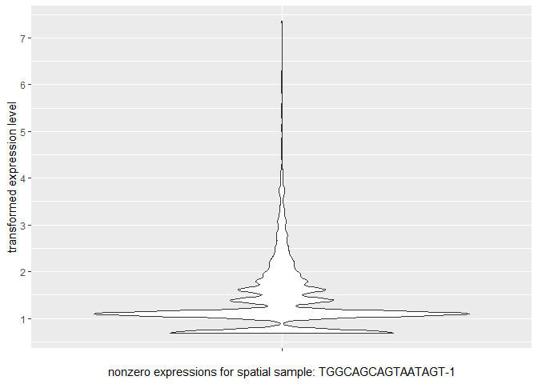
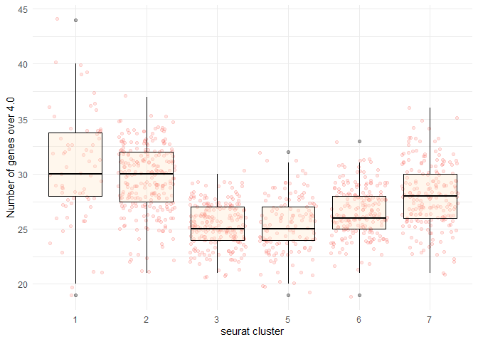
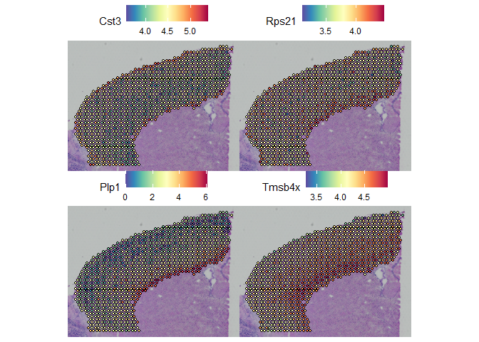
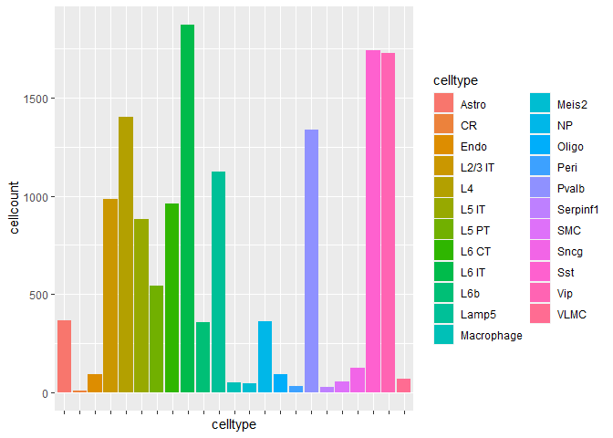
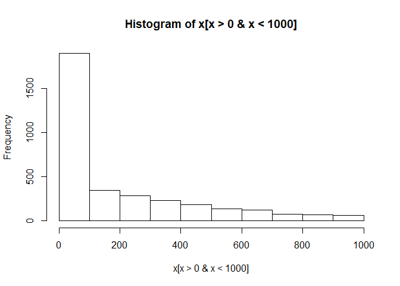
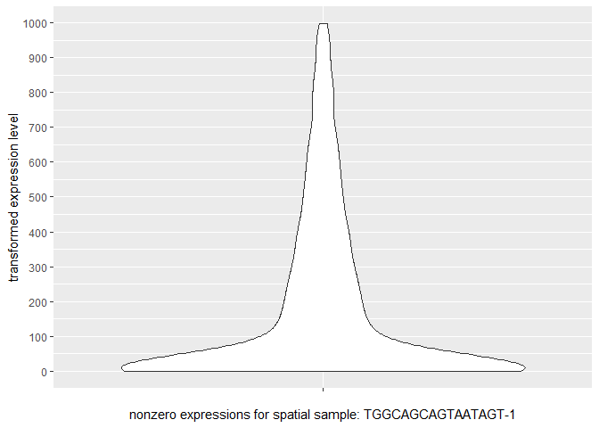

Ben Mescher

In Seurat (v3.1) spatial vignette, the spatial dataset was matched up to
a reference scRNA-seq dataset ("allen\_reference"). According to the
Seurat authors: &gt;*We consistently found superior performance using
integration methods (as opposed to deconvolution methods), likely
because of substantially different noise models that characterize
spatial and single-cell datasets, and integration methods are
specifiically designed to be robust to these differences.*

An anchor-based integration was used to transfer labels from
allen\_reference to the spatial data. This took ~3 hours originally, but
I saved the \_final results from my run of the vignette.

The cell type labels for the reference single-cell dataset are saved in
the "subclass" column. For 14,249 cells, there are 23 cell types:

    #length(allen_reference_final$subclass)
    #table(allen_reference_final$subclass)

Predicted Cell-Type Compositions
--------------------------------

The `cortex` Seurat object created in the vignette is a subset of the
spatial dataset, for clusters 1, 2, 3, 5, 6, & 7 in a specific section
of the slide. Assays in the Seurat object include SCT (the normalized
data), pca & umap results, and "predictions" from the anchor-based label
transfer.

    cortex_final <- readRDS('../2/cortex_final.rds') #342MB
    cortex_final

    ## An object of class Seurat 
    ## 47094 features across 1072 samples within 3 assays 
    ## Active assay: predictions (24 features, 0 variable features)
    ##  2 other assays present: Spatial, SCT
    ##  2 dimensional reductions calculated: pca, umap

    names(cortex_final)

    ## [1] "Spatial"     "SCT"         "predictions" "pca"         "umap"       
    ## [6] "anterior1"

Normalization and preprocessing of the data reduced it to 16,017 genes
for 1,072 sample spots (named 'cells' here).

    #cortex_final[['Spatial']] #The original subset contained 31,053 genes for 1,072 sample spots from the brain slide (available on 10x site).
    cortex_final[['SCT']] #the normalized dataset contains only 16,017 genes (note that the normalized dataset has a different list of top-10 most variable genes)

    ## Assay data with 16017 features for 1072 cells
    ## Top 10 variable features:
    ##  Mbp, Plp1, Hbb-bs, Hba-a1, Hba-a2, Mobp, Ptgds, Hbb-bt, Sst, Mal

The results of the anchor-based label transfer are saved in the
'predictions' assay:

    cortex_final[['predictions']]

    ## Assay data with 24 features for 1072 cells
    ## First 10 features:
    ##  Vip, Lamp5, Sst, Sncg, Serpinf1, Pvalb, Endo, Peri, L6 CT, L6b

The reference listed only 23 subclasses (cell tpes), but there are 24
rows because the final row is a 'max' metadata row.

    cortex_final[['predictions']][,1:5]

    ##            AAACAGAGCGACTCCT-1 AAACCGGGTAGGTACC-1 AAACCGTTCGTCCAGG-1
    ## Vip                         0        0.031293536       1.937322e-05
    ## Lamp5                       0        0.000000000       1.452998e-05
    ## Sst                         0        0.212139871       0.000000e+00
    ## Sncg                        0        0.000000000       5.811775e-05
    ## Serpinf1                    0        0.000000000       0.000000e+00
    ## Pvalb                       0        0.008067108       0.000000e+00
    ## Endo                        0        0.000000000       2.895847e-02
    ## Peri                        0        0.000000000       0.000000e+00
    ## L6 CT                       0        0.000000000       0.000000e+00
    ## L6b                         0        0.000000000       0.000000e+00
    ## L6 IT                       0        0.000000000       0.000000e+00
    ## L2/3 IT                     1        0.317907995       0.000000e+00
    ## CR                          0        0.000000000       0.000000e+00
    ## L5 PT                       0        0.165947855       0.000000e+00
    ## NP                          0        0.000000000       0.000000e+00
    ## L4                          0        0.264643635       0.000000e+00
    ## L5 IT                       0        0.000000000       0.000000e+00
    ## Oligo                       0        0.000000000       1.205828e-01
    ## Meis2                       0        0.000000000       0.000000e+00
    ## Astro                       0        0.000000000       7.998056e-02
    ## Macrophage                  0        0.000000000       1.847914e-02
    ## VLMC                        0        0.000000000       5.404101e-01
    ## SMC                         0        0.000000000       2.114969e-01
    ## max                         1        0.317907995       5.404101e-01
    ##            AAACTCGTGATATAAG-1 AAAGGGATGTAGCAAG-1
    ## Vip                0.00000000        0.151949496
    ## Lamp5              0.00000000        0.002589553
    ## Sst                0.00000000        0.213093447
    ## Sncg               0.00000000        0.000000000
    ## Serpinf1           0.00000000        0.000000000
    ## Pvalb              0.00000000        0.015878955
    ## Endo               0.00000000        0.000000000
    ## Peri               0.00000000        0.000000000
    ## L6 CT              0.01954665        0.000000000
    ## L6b                0.38149343        0.000000000
    ## L6 IT              0.00000000        0.000000000
    ## L2/3 IT            0.00000000        0.000000000
    ## CR                 0.00000000        0.000000000
    ## L5 PT              0.00000000        0.000000000
    ## NP                 0.01035563        0.000000000
    ## L4                 0.00000000        0.053772517
    ## L5 IT              0.00000000        0.562716033
    ## Oligo              0.58860429        0.000000000
    ## Meis2              0.00000000        0.000000000
    ## Astro              0.00000000        0.000000000
    ## Macrophage         0.00000000        0.000000000
    ## VLMC               0.00000000        0.000000000
    ## SMC                0.00000000        0.000000000
    ## max                0.58860429        0.562716033

Exploring Cell Type Compositions
--------------------------------

    library(tidyr)

    ## Warning: package 'tidyr' was built under R version 3.6.3

    library(ggplot2)

    ## Warning: package 'ggplot2' was built under R version 3.6.3

    x <- as.data.frame(cortex_final[['predictions']]@data[-24,1:10])
    x['celltype'] <- rownames(x)
    x <- x %>% pivot_longer(-celltype, names_to='sample', values_to='composition')
    ggplot(x, aes(fill=celltype, y = composition, x = sample))+ 
      ggtitle('Predicted Cell Type Compositions for 10 Random Spots')+
      geom_bar(position="stack", stat="identity")+
      theme(axis.text.x=element_blank())+
      xlab('Samples (random 10)')

The spatial data was already clustered (this cortex dataset is a subset
of clusters 1, 2, 3, 5, 6, & 7).

    table(cortex_final$seurat_clusters)

    ## 
    ##   0   1   2   3   4   5   6   7   8   9  10  11  12  13  14 
    ##   0  70 255 217   0 131 202 197   0   0   0   0   0   0   0

    SpatialDimPlot(cortex_final, label = TRUE, label.size = 3)

    ## Warning: Using `as.character()` on a quosure is deprecated as of rlang 0.3.0.
    ## Please use `as_label()` or `as_name()` instead.
    ## This warning is displayed once per session.

    #SpatialPlot(cortex_final, label = TRUE, label.size = 3, group.by="seurat_clusters") #identical

    cl <- 1
    x <- as.data.frame(cortex_final[['predictions']]@data[-24,cortex_final$seurat_clusters==cl])
    x['celltype'] <- rownames(x)
    x <- x %>% pivot_longer(-celltype, names_to='sample', values_to='composition')
    ggplot(x, aes(fill=celltype, y = composition, x = sample))+ 
      ggtitle(paste('Predicted Cell Type Compositions for Samples in Seurat-defined cluster #',cl))+
      geom_bar(position="stack", stat="identity")+
      theme(axis.text.x=element_blank())+
      xlab(paste('Samples for cluster #',cl))

    cl <- 6
    x <- as.data.frame(cortex_final[['predictions']]@data[-24,cortex_final$seurat_clusters==cl])
    x['celltype'] <- rownames(x)
    x <- x %>% pivot_longer(-celltype, names_to='sample', values_to='composition')
    ggplot(x, aes(fill=celltype, y = composition, x = sample))+ 
      ggtitle(paste('Predicted Cell Type Compositions for Samples in Seurat-defined cluster #',cl))+
      geom_bar(position="stack", stat="identity")+
      theme(axis.text.x=element_blank())+
      xlab(paste('Samples for cluster #',cl))

A markvariogram (similar to Trensceek, model cell type compositions as a
mark point process) was also used to determine which cell types were
spatially-influenced. The ranks for the most-to-least spatially
influenced cell types were saved:

    cortex_final[['predictions']]@meta.features

    ##            r.metric.5 markvariogram.spatially.variable
    ## Vip         0.7676498                             TRUE
    ## Lamp5       0.8540721                             TRUE
    ## Sst         0.6525428                             TRUE
    ## Sncg        0.6999538                             TRUE
    ## Serpinf1    1.0734591                             TRUE
    ## Pvalb       0.8931907                             TRUE
    ## Endo        0.7449121                             TRUE
    ## Peri        1.0236166                             TRUE
    ## L6 CT       0.4204862                             TRUE
    ## L6b         0.5639461                             TRUE
    ## L6 IT       0.3499588                             TRUE
    ## L2/3 IT     0.3160667                             TRUE
    ## CR          0.3909516                             TRUE
    ## L5 PT       0.7754341                             TRUE
    ## NP          0.4959785                             TRUE
    ## L4          0.3729534                             TRUE
    ## L5 IT       0.5364736                             TRUE
    ## Oligo       0.2276253                             TRUE
    ## Meis2       0.5271437                             TRUE
    ## Astro       0.4338565                             TRUE
    ## Macrophage  0.8418007                             TRUE
    ## VLMC        0.4835839                             TRUE
    ## SMC         0.3887069                             TRUE
    ## max         0.6514962                             TRUE
    ##            markvariogram.spatially.variable.rank
    ## Vip                                           18
    ## Lamp5                                         21
    ## Sst                                           15
    ## Sncg                                          16
    ## Serpinf1                                      24
    ## Pvalb                                         22
    ## Endo                                          17
    ## Peri                                          23
    ## L6 CT                                          7
    ## L6b                                           13
    ## L6 IT                                          3
    ## L2/3 IT                                        2
    ## CR                                             6
    ## L5 PT                                         19
    ## NP                                            10
    ## L4                                             4
    ## L5 IT                                         12
    ## Oligo                                          1
    ## Meis2                                         11
    ## Astro                                          8
    ## Macrophage                                    20
    ## VLMC                                           9
    ## SMC                                            5
    ## max                                           14

May 22nd: Overlaying Plots onto Tissue Images
---------------------------------------------

Can use "predictions" assay of cell types to overlay onto tissue image:

    DefaultAssay(cortex_final) <- "predictions"
    SpatialFeaturePlot(cortex_final, features = c("L2/3 IT", "L4"), pt.size.factor = 1.6, ncol = 2, crop = TRUE)

Can set default assay back to the transformed data to plot specific gene
expressions overlayed onto the slide image:

    DefaultAssay(cortex_final) <- "SCT"
    SpatialPlot(cortex_final, images='anterior1', features=c("Hpca", "Ttr","Mbp"), ncol=1)

    DefaultAssay(cortex_final) <- "predictions"

Clusters from dimensionality reduction (PCA or UMAP) analysis:

    SpatialPlot(cortex_final, group.by="seurat_clusters")

    #SpatialPlot(cortex_final, images='anterior1')
    SpatialDimPlot(cortex_final, cells.highlight = CellsByIdentities(object = cortex_final, idents = c(1,2,3,5,6,7)), facet.highlight = TRUE, ncol = 2)

Image & sample coordinates are saved in the object:

    slotNames(cortex_final[['anterior1']])

    ## [1] "image"         "scale.factors" "coordinates"   "spot.radius"  
    ## [5] "assay"         "key"

    head(cortex_final[['anterior1']]@coordinates)

    ##                    tissue row col imagerow imagecol
    ## AAACAGAGCGACTCCT-1      1  14  94     3164     7950
    ## AAACCGGGTAGGTACC-1      1  42  28     6517     3407
    ## AAACCGTTCGTCCAGG-1      1  52  42     7715     4371
    ## AAACTCGTGATATAAG-1      1  23 113     4242     9258
    ## AAAGGGATGTAGCAAG-1      1  24  62     4362     5747
    ## AAATAACCATACGGGA-1      1  14  88     3164     7537

    plot(cortex_final[['anterior1']]@coordinates$col,cortex_final[['anterior1']]@coordinates$row * -1) #same rotation as the breast tissue (2016), must be a 10x thing

    #plot(cortex_final[['anterior1']]@coordinates$imagecol, cortex_final[['anterior1']]@coordinates$imagerow * -1) #upscaled coordinates?

    predictions <- t(as.matrix((cortex_final[['predictions']]@data)))
    dim(predictions)

    ## [1] 1072   24

    head(predictions)

    ##                             Vip        Lamp5       Sst         Sncg Serpinf1
    ## AAACAGAGCGACTCCT-1 0.000000e+00 0.000000e+00 0.0000000 0.000000e+00        0
    ## AAACCGGGTAGGTACC-1 3.129354e-02 0.000000e+00 0.2121399 0.000000e+00        0
    ## AAACCGTTCGTCCAGG-1 1.937322e-05 1.452998e-05 0.0000000 5.811775e-05        0
    ## AAACTCGTGATATAAG-1 0.000000e+00 0.000000e+00 0.0000000 0.000000e+00        0
    ## AAAGGGATGTAGCAAG-1 1.519495e-01 2.589553e-03 0.2130934 0.000000e+00        0
    ## AAATAACCATACGGGA-1 3.022401e-01 8.213392e-02 0.0000000 1.093476e-04        0
    ##                          Pvalb       Endo Peri      L6 CT       L6b L6 IT
    ## AAACAGAGCGACTCCT-1 0.000000000 0.00000000    0 0.00000000 0.0000000     0
    ## AAACCGGGTAGGTACC-1 0.008067108 0.00000000    0 0.00000000 0.0000000     0
    ## AAACCGTTCGTCCAGG-1 0.000000000 0.02895847    0 0.00000000 0.0000000     0
    ## AAACTCGTGATATAAG-1 0.000000000 0.00000000    0 0.01954665 0.3814934     0
    ## AAAGGGATGTAGCAAG-1 0.015878955 0.00000000    0 0.00000000 0.0000000     0
    ## AAATAACCATACGGGA-1 0.000000000 0.00000000    0 0.00000000 0.0000000     0
    ##                      L2/3 IT CR     L5 PT         NP         L4    L5 IT
    ## AAACAGAGCGACTCCT-1 1.0000000  0 0.0000000 0.00000000 0.00000000 0.000000
    ## AAACCGGGTAGGTACC-1 0.3179080  0 0.1659479 0.00000000 0.26464364 0.000000
    ## AAACCGTTCGTCCAGG-1 0.0000000  0 0.0000000 0.00000000 0.00000000 0.000000
    ## AAACTCGTGATATAAG-1 0.0000000  0 0.0000000 0.01035563 0.00000000 0.000000
    ## AAAGGGATGTAGCAAG-1 0.0000000  0 0.0000000 0.00000000 0.05377252 0.562716
    ## AAATAACCATACGGGA-1 0.6155166  0 0.0000000 0.00000000 0.00000000 0.000000
    ##                        Oligo Meis2      Astro Macrophage      VLMC       SMC
    ## AAACAGAGCGACTCCT-1 0.0000000     0 0.00000000 0.00000000 0.0000000 0.0000000
    ## AAACCGGGTAGGTACC-1 0.0000000     0 0.00000000 0.00000000 0.0000000 0.0000000
    ## AAACCGTTCGTCCAGG-1 0.1205828     0 0.07998056 0.01847914 0.5404101 0.2114969
    ## AAACTCGTGATATAAG-1 0.5886043     0 0.00000000 0.00000000 0.0000000 0.0000000
    ## AAAGGGATGTAGCAAG-1 0.0000000     0 0.00000000 0.00000000 0.0000000 0.0000000
    ## AAATAACCATACGGGA-1 0.0000000     0 0.00000000 0.00000000 0.0000000 0.0000000
    ##                          max
    ## AAACAGAGCGACTCCT-1 1.0000000
    ## AAACCGGGTAGGTACC-1 0.3179080
    ## AAACCGTTCGTCCAGG-1 0.5404101
    ## AAACTCGTGATATAAG-1 0.5886043
    ## AAAGGGATGTAGCAAG-1 0.5627160
    ## AAATAACCATACGGGA-1 0.6155166

<https://www.r-graph-gallery.com/2d-density-plot-with-ggplot2.html>

    d <- data.frame(cortex_final[['anterior1']]@coordinates[,c('col','row')])
    d['row'] <- d['row'] * -1
    colnames(d) <- c('x','y')
    dim(d)

    ## [1] 1072    2

    all <- cbind(d,predictions)
    ggplot(all, aes(x,y,color=Vip)) + 
      geom_bin2d(bins = 70) +
      scale_fill_continuous(type = "viridis") +
      theme_bw()

    ggplot(all, aes(x,y,color=`L6 CT`)) + 
      geom_point()  +
      scale_colour_gradient2()

    ggplot(all, aes(x,y,color=Vip)) + 
      geom_point() +
      scale_colour_gradient2()

Wonder if kernel density estimation (see "kde2d {MASS}) would be useful
algorithm for encircling hotspots of clusters?

    ggplot(all, aes(x, y) ) +
      geom_density_2d()

May 25th, Compare scRNA with one spatial sample
===============================================

Dive into the data for a specific single cell and a single spatial
sample which was enriched for that cell's cell type.

Compare spatial expression from the target sample with single cell references of the same cell type
---------------------------------------------------------------------------------------------------

Our target spatial sample (and almost all other "cluster 1" samples) was
composed mainly of Oligo cells. Lets look at some Oligo cells from an
scRNA-seq reference set: *Come up with a measure of similarity? Then use
that same measure to measure similarities to spatial neighbors too.*

    #cortex_final
    #names(cortex_final) 
    #spatial is the base data, sct is the normalized data, predictions are the anchor-based integration results, pca & umap dim reduction results, anterior1 are the tissue image and mapping tables

There are 70 spatial samples that were placed in cluster 1 in an earlier
analysis. The Oligo celltype seems to be the dominant label for most,
but not all, of the cluster 1 samples. Median anchor-based integration
output for cluster 1 cells is .9933 (out of 1.0).

    cl <- 1
    target.celltype <- "Oligo"
    x <- as.data.frame(cortex_final[['predictions']]@data[-24,cortex_final$seurat_clusters==cl])
    #dim(x)
    summary(t(x[rownames(x)==target.celltype,]))

    ##      Oligo       
    ##  Min.   :0.2361  
    ##  1st Qu.:0.9477  
    ##  Median :0.9933  
    ##  Mean   :0.9428  
    ##  3rd Qu.:0.9969  
    ##  Max.   :0.9999

    #boxplot(x[rownames(x)==target.celltype,])

Our randomly selected cluster 1 sample is "TGGCAGCAGTAATAGT-1", which
was predicted to be componsed of .9949 Oligo celltype.

    set.seed(1989)
    target.sample <- sample(colnames(x),1)
    target.sample #"TGGCAGCAGTAATAGT-1"

    ## [1] "TGGCAGCAGTAATAGT-1"

    x[,colnames(x)==target.sample]

    ##  [1] 0.000000000 0.000000000 0.000000000 0.000000000 0.000000000 0.000000000
    ##  [7] 0.000000000 0.000000000 0.000000000 0.000000000 0.000000000 0.000000000
    ## [13] 0.000000000 0.000000000 0.000000000 0.000000000 0.000000000 0.994897235
    ## [19] 0.000000000 0.000000000 0.005102765 0.000000000 0.000000000

That spatial sample contains 16,017 normalized gene expression levels
between 0.0 and 7.35:

    m <- which(cortex_final[['SCT']]@data@Dimnames[[2]] == target.sample) #our target sample is the 974th out of 1,072 in the SCT & Spatial assays
    spatial.sample <- as.data.frame(cortex_final[['SCT']]@data[,m]) #to save space, could always set row.names = NULL and get gene names from the original seurat object
    dim(spatial.sample) #16,017 genes for this one transformed spot

    ## [1] 16017     1

    colnames(spatial.sample) <- 'SCT'
    #spatial.sample <- cbind(spatial.sample, as.data.frame(cortex_final[['Spatial']]@data[,m])) #would like to see how they normalized from Spatial assay to SCT assay. Cant do a simble cbind because the original Spatial data had 31053 genes but only 16017 are included in the cleaned SCT assay
    summary(spatial.sample)

    ##       SCT        
    ##  Min.   :0.0000  
    ##  1st Qu.:0.0000  
    ##  Median :0.0000  
    ##  Mean   :0.4183  
    ##  3rd Qu.:0.6931  
    ##  Max.   :7.3531

Identify highly expressed genes
-------------------------------

Out of 16,017 genes, 11,092 were zero \[69%\] and 4,925 were above zero
\[31%\].

    sum(spatial.sample == 0)

    ## [1] 11092

    sum(spatial.sample > 0)

    ## [1] 4925

    spatial.sample.nonzeros <- as.data.frame(spatial.sample[spatial.sample > 0,])
    colnames(spatial.sample.nonzeros) <- 'SCT'
    summary(spatial.sample.nonzeros)

    ##       SCT        
    ##  Min.   :0.6931  
    ##  1st Qu.:1.0986  
    ##  Median :1.0986  
    ##  Mean   :1.3602  
    ##  3rd Qu.:1.6094  
    ##  Max.   :7.3531

Majority of the SCT (normalized) expressions for this sample were below
3.

    ggplot(spatial.sample.nonzeros, aes("",SCT)) + 
      geom_violin() + #couldnt get seurat VlnPlot to cooperate
      scale_y_continuous('transformed expression level', seq(0,7,1)) +
      scale_x_discrete(paste("nonzero expressions for spatial sample:",target.sample))

Lets bin the data for the expressions from the spatial sample and see
how many genes are in each bin:

    breaks <- c(seq(0,3,.25), seq(4,8,1))
    spatial.sample.bins <- cut(as.numeric(spatial.sample[,1]), breaks, include.lowest = TRUE)
    table(spatial.sample.bins)

    ## spatial.sample.bins
    ##   [0,0.25] (0.25,0.5] (0.5,0.75]   (0.75,1]   (1,1.25] (1.25,1.5] (1.5,1.75] 
    ##      11092          0       1094          0       1849        509        427 
    ##   (1.75,2]   (2,2.25] (2.25,2.5] (2.5,2.75]   (2.75,3]      (3,4]      (4,5] 
    ##        407        181        138         68         75        143         22 
    ##      (5,6]      (6,7]      (7,8] 
    ##          6          5          1

There are only a 34 genes with expression over 4.

    target.high.expr.genes <- row.names(spatial.sample)[spatial.sample > 4]
    length(target.high.expr.genes)

    ## [1] 34

Is 34 genes over expression 4 a lot? Lets compare to the other spatial
samples... The median number of genes over normalized expression level 4
is 27 \[IQR 25,29\]

    x <- colSums(as.matrix(cortex_final[['SCT']]@data>4))
    length(x)

    ## [1] 1072

    summary(x)

    ##    Min. 1st Qu.  Median    Mean 3rd Qu.    Max. 
    ##    19.0    25.0    27.0    27.4    29.0    44.0

Is 34 genes over expression 4 a lot for this particular cluster \[1\]?
Not necessarily, as clusters 1 & 2 have a higher mean number of 4.0+
genes. *Not sure if the cell density of sample spots affects the gene
counts, or if that has been claculated out in the normalization
process.*

    #identical(names(x), names(cortex_final$seurat_clusters)) #samples are listed in the same order
    x <- cbind.data.frame(x,cortex_final$seurat_clusters)
    dim(x)

    ## [1] 1072    2

    names(x) <- c('Number of genes over 4.0','seurat cluster')
    ggplot(x, aes(x=`seurat cluster`,y=`Number of genes over 4.0`)) + 
      geom_jitter(aes(color='blue'),alpha=0.2) +
      geom_boxplot(fill="bisque",color="black",alpha=0.3) + 
      #labs(x='mean education per house') +
      guides(color=FALSE) +
      theme_minimal() 

So are there genes that are just high in all clusters? Or are some genes
only high in some clusters (can do chi squared test for enrichment?)

Looking at only the first 4 high-epxression genes from the target
sample, some are higher across the whole tissue, while others are more
localized in high expression:

    target.high.expr.genes

    ##  [1] "Cst3"    "Rps21"   "Plp1"    "Tmsb4x"  "Rpl21"   "Gapdh"   "Apoe"   
    ##  [8] "Hbb-bs"  "Bc1"     "Rpl41"   "Cox4i1"  "Rpl13"   "Rps24"   "Tpt1"   
    ## [15] "Rplp1"   "Eef1a1"  "Mobp"    "Hba-a1"  "Hba-a2"  "Rps29"   "Ckb"    
    ## [22] "Rpl37"   "Mbp"     "Cox8a"   "Fth1"    "mt-Nd1"  "mt-Nd2"  "mt-Co1" 
    ## [29] "mt-Co2"  "mt-Atp6" "mt-Co3"  "mt-Nd3"  "mt-Nd4"  "mt-Cytb"

    DefaultAssay(cortex_final) <- "SCT"
    SpatialPlot(cortex_final, images='anterior1', features=target.high.expr.genes[1:4], ncol=2)

For each of the 34 high expr genes... take one gene, compare its level to its level in the neighboring spots?
-------------------------------------------------------------------------------------------------------------

Can turn this one-gene-level data into a network graph, segmentation on
it? Look for areas with a steep drop off?? Could do the same with
celltype predictions too. Plp1 or Tmsb4x look like a good candidates
because they have a wide range of levels in the slide.

Find reference single cells of the target celltype
--------------------------------------------------

    allen_reference_final <- readRDS('../2/allen_reference_final.rds') #6GB!
    allen_reference_final[['SCT']] #SCT assay is the normalized data, which was done using the same method, sctransform(), used to normalize the spatial dataset

    ## Assay data with 34608 features for 14249 cells
    ## Top 10 variable features:
    ##  Vip, Sst, Npy, Tac2, Crh, Calb2, Tac1, Cxcl14, Penk, Gad1

The allen scRNA-seq reference contains 14,249 cells belonging to 23
labeled cell types:

    x <- as.data.frame(t(as.matrix(table(allen_reference_final$subclass))))
    x <- pivot_longer(x, colnames(x),names_to="celltype",values_to="cellcount")
    ggplot(x, aes(fill=celltype, y = cellcount, x = celltype))+
      geom_bar(position="stack", stat="identity")+
      theme(axis.text.x=element_blank())

    table(allen_reference_final$subclass)

    ## 
    ##      Astro         CR       Endo    L2/3 IT         L4      L5 IT      L5 PT 
    ##        368          7         94        982       1401        880        544 
    ##      L6 CT      L6 IT        L6b      Lamp5 Macrophage      Meis2         NP 
    ##        960       1872        358       1122         51         45        362 
    ##      Oligo       Peri      Pvalb   Serpinf1        SMC       Sncg        Sst 
    ##         91         32       1337         27         55        125       1741 
    ##        Vip       VLMC 
    ##       1728         67

We only have 91 Oligo cells in the reference set. Choosing the 80th one
at random (cell \#11,728 in the reference set). In transforming the
reference set, only the 3,000 most variable genes were used to make SCT.

    #names(allen_reference_final) #rna is base data, sct is transformed and normalized, pca & umap are the dimension reduction results
    r <- which(allen_reference_final$subclass == "Oligo")[80] #cell 3551 in the dataset
    dim(allen_reference_final[['RNA']]@data)

    ## [1] 34617 14249

    rownames(allen_reference_final[['SCT']]@meta.features)[1:5] #gene names...

    ## [1] "0610005C13Rik" "0610006L08Rik" "0610007P14Rik" "0610009B22Rik"
    ## [5] "0610009E02Rik"

    x <- allen_reference_final[['RNA']]@data[,r]
    names(x) <- allen_reference_final[['SCT']]@data@Dimnames[[2]]
    allen_reference_final[['SCT']]@data@Dimnames[[2]][1:5]

    ## [1] "F1S4_160108_001_A01" "F1S4_160108_001_B01" "F1S4_160108_001_C01"
    ## [4] "F1S4_160108_001_D01" "F1S4_160108_001_E01"

    summary(x)

    ##      Min.   1st Qu.    Median      Mean   3rd Qu.      Max. 
    ##      0.00      0.00      0.00     44.69      0.00 101216.00

25 out of 34 high expression genes are in the reference set:

    length(target.high.expr.genes)

    ## [1] 34

    sum(rownames(allen_reference_final[['SCT']]@meta.features) %in% target.high.expr.genes)

    ## [1] 25

    sum(rownames(allen_reference_final[['RNA']]@meta.features) %in% target.high.expr.genes)

    ## [1] 25

    length(x)

    ## [1] 34617

    length(x[x<100000])

    ## [1] 34616

    hist(x[x>0 & x<1000])

Perform the same analysis on this Oligo cell that was done on the
spatial sample. The distribution is extremely wide for this single cell.

    ggplot(as.data.frame(x[x>0 & x < 1000]), aes("",x[x>0 & x < 1000])) + 
      geom_violin() +
      scale_y_continuous('transformed expression level', seq(0,1000,100)) +
      scale_x_discrete(paste("nonzero expressions for spatial sample:",target.sample))

There are 84 genes above 2,000 expression value. Only 1 of them was one
of the 25 (/34) high expression genes in our sample. Is that just noise
from our one cell? From our target spatial sample?

    sum(rownames(allen_reference_final[['SCT']]@meta.features[which(x>2000),]) %in% target.high.expr.genes)

    ## [1] 1

    length(x[x>2000])

    ## [1] 84

    rm(allen_reference_final)
