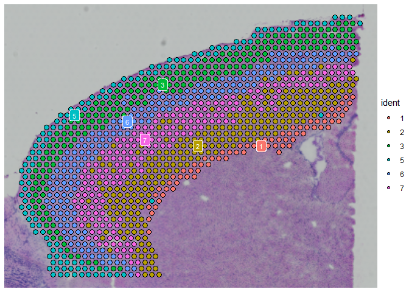

Ben Mescher

In Seurat (v3.1) spatial vignette, the spatial dataset was matched up to
a reference scRNA-seq dataset ("allen\_reference"). According to the
Seurat authors: &gt;*We consistently found superior performance using
integration methods (as opposed to deconvolution methods), likely
because of substantially different noise models that characterize
spatial and single-cell datasets, and integration methods are
specifiically designed to be robust to these differences.*

An anchor-based integration was used to transfer labels from
allen\_reference to the spatial data. This took ~3 hours originally, but
I saved the \_final results from my run of the vignette.

    library(Seurat)
    allen_reference_final <- readRDS('allen_reference_final.rds') #6GB!
    allen_reference_final[['SCT']] #SCT assay is the normalized data, which was done using the same method, sctransform(), used to normalize the spatial dataset

    ## Assay data with 34608 features for 14249 cells
    ## Top 10 variable features:
    ##  Vip, Sst, Npy, Tac2, Crh, Calb2, Tac1, Cxcl14, Penk, Gad1

The cell type labels for the reference single-cell dataset are saved in
the "subclass" column. For 14,249 cells, there are 23 cell types:

    length(allen_reference_final$subclass)

    ## [1] 14249

    table(allen_reference_final$subclass)

    ## 
    ##      Astro         CR       Endo    L2/3 IT         L4      L5 IT      L5 PT 
    ##        368          7         94        982       1401        880        544 
    ##      L6 CT      L6 IT        L6b      Lamp5 Macrophage      Meis2         NP 
    ##        960       1872        358       1122         51         45        362 
    ##      Oligo       Peri      Pvalb   Serpinf1        SMC       Sncg        Sst 
    ##         91         32       1337         27         55        125       1741 
    ##        Vip       VLMC 
    ##       1728         67

Predicted Cell-Type Compositions
--------------------------------

The `cortex` Seurat object created in the vignette is a subset of the
spatial dataset, for clusters 1, 2, 3, 5, 6, & 7 in a specific section
of the slide. Assays in the Seurat object include SCT (the normalized
data), pca & umap results, and "predictions" from the anchor-based label
transfer.

    cortex_final <- readRDS('cortex_final.rds') #342MB
    names(cortex_final)

    ## [1] "Spatial"     "SCT"         "predictions" "pca"         "umap"       
    ## [6] "anterior1"

Normalization and preprocessing of the data reduced it to 16,017 genes
for 1,072 sample spots (named 'cells' here).

    #cortex_final[['Spatial']] #The original subset contained 31,053 genes for 1,072 sample spots from the brain slide (available on 10x site).
    cortex_final[['SCT']] #the normalized dataset contains only 16,017 genes (note that the normalized dataset has a different list of top-10 most variable genes)

    ## Assay data with 16017 features for 1072 cells
    ## Top 10 variable features:
    ##  Mbp, Plp1, Hbb-bs, Hba-a1, Hba-a2, Mobp, Ptgds, Hbb-bt, Sst, Mal

The results of the anchor-based label transfer are saved in the
'predictions' assay:

    cortex_final[['predictions']]

    ## Assay data with 24 features for 1072 cells
    ## First 10 features:
    ##  Vip, Lamp5, Sst, Sncg, Serpinf1, Pvalb, Endo, Peri, L6 CT, L6b

The reference listed only 23 subclasses (cell tpes), but there are 24
rows because the final row is a 'max' metadata row.

    cortex_final[['predictions']][,1:5]

    ##            AAACAGAGCGACTCCT-1 AAACCGGGTAGGTACC-1 AAACCGTTCGTCCAGG-1
    ## Vip                         0        0.031293536       1.937322e-05
    ## Lamp5                       0        0.000000000       1.452998e-05
    ## Sst                         0        0.212139871       0.000000e+00
    ## Sncg                        0        0.000000000       5.811775e-05
    ## Serpinf1                    0        0.000000000       0.000000e+00
    ## Pvalb                       0        0.008067108       0.000000e+00
    ## Endo                        0        0.000000000       2.895847e-02
    ## Peri                        0        0.000000000       0.000000e+00
    ## L6 CT                       0        0.000000000       0.000000e+00
    ## L6b                         0        0.000000000       0.000000e+00
    ## L6 IT                       0        0.000000000       0.000000e+00
    ## L2/3 IT                     1        0.317907995       0.000000e+00
    ## CR                          0        0.000000000       0.000000e+00
    ## L5 PT                       0        0.165947855       0.000000e+00
    ## NP                          0        0.000000000       0.000000e+00
    ## L4                          0        0.264643635       0.000000e+00
    ## L5 IT                       0        0.000000000       0.000000e+00
    ## Oligo                       0        0.000000000       1.205828e-01
    ## Meis2                       0        0.000000000       0.000000e+00
    ## Astro                       0        0.000000000       7.998056e-02
    ## Macrophage                  0        0.000000000       1.847914e-02
    ## VLMC                        0        0.000000000       5.404101e-01
    ## SMC                         0        0.000000000       2.114969e-01
    ## max                         1        0.317907995       5.404101e-01
    ##            AAACTCGTGATATAAG-1 AAAGGGATGTAGCAAG-1
    ## Vip                0.00000000        0.151949496
    ## Lamp5              0.00000000        0.002589553
    ## Sst                0.00000000        0.213093447
    ## Sncg               0.00000000        0.000000000
    ## Serpinf1           0.00000000        0.000000000
    ## Pvalb              0.00000000        0.015878955
    ## Endo               0.00000000        0.000000000
    ## Peri               0.00000000        0.000000000
    ## L6 CT              0.01954665        0.000000000
    ## L6b                0.38149343        0.000000000
    ## L6 IT              0.00000000        0.000000000
    ## L2/3 IT            0.00000000        0.000000000
    ## CR                 0.00000000        0.000000000
    ## L5 PT              0.00000000        0.000000000
    ## NP                 0.01035563        0.000000000
    ## L4                 0.00000000        0.053772517
    ## L5 IT              0.00000000        0.562716033
    ## Oligo              0.58860429        0.000000000
    ## Meis2              0.00000000        0.000000000
    ## Astro              0.00000000        0.000000000
    ## Macrophage         0.00000000        0.000000000
    ## VLMC               0.00000000        0.000000000
    ## SMC                0.00000000        0.000000000
    ## max                0.58860429        0.562716033

Exploring Cell Type Compositions
--------------------------------

    library(tidyr)

    ## Warning: package 'tidyr' was built under R version 3.6.3

    library(ggplot2)

    ## Warning: package 'ggplot2' was built under R version 3.6.3

    x <- as.data.frame(cortex_final[['predictions']]@data[-24,1:10])
    x['celltype'] <- rownames(x)
    x <- x %>% pivot_longer(-celltype, names_to='sample', values_to='composition')
    ggplot(x, aes(fill=celltype, y = composition, x = sample))+ 
      ggtitle('Predicted Cell Type Compositions for 10 Random Spots')+
      geom_bar(position="stack", stat="identity")+
      theme(axis.text.x=element_blank())+
      xlab('Samples (random 10)')

The spatial data was already clustered (this cortex dataset is a subset
of clusters 1, 2, 3, 5, 6, & 7).

    table(cortex_final$seurat_clusters)

    ## 
    ##   0   1   2   3   4   5   6   7   8   9  10  11  12  13  14 
    ##   0  70 255 217   0 131 202 197   0   0   0   0   0   0   0

    cl <- 1
    x <- as.data.frame(cortex_final[['predictions']]@data[-24,cortex_final$seurat_clusters==cl])
    x['celltype'] <- rownames(x)
    x <- x %>% pivot_longer(-celltype, names_to='sample', values_to='composition')
    ggplot(x, aes(fill=celltype, y = composition, x = sample))+ 
      ggtitle(paste('Predicted Cell Type Compositions for Samples in Seurat-defined cluster #',cl))+
      geom_bar(position="stack", stat="identity")+
      theme(axis.text.x=element_blank())+
      xlab(paste('Samples for cluster #',cl))

    cl <- 6
    x <- as.data.frame(cortex_final[['predictions']]@data[-24,cortex_final$seurat_clusters==cl])
    x['celltype'] <- rownames(x)
    x <- x %>% pivot_longer(-celltype, names_to='sample', values_to='composition')
    ggplot(x, aes(fill=celltype, y = composition, x = sample))+ 
      ggtitle(paste('Predicted Cell Type Compositions for Samples in Seurat-defined cluster #',cl))+
      geom_bar(position="stack", stat="identity")+
      theme(axis.text.x=element_blank())+
      xlab(paste('Samples for cluster #',cl))

A markvariogram (similar to Trensceek, model cell type compositions as a
mark point process) was also used to determine which cell types were
spatially-influenced. The ranks for the most-to-least spatially
influenced cell types were saved:

    cortex_final[['predictions']]@meta.features

    ##            r.metric.5 markvariogram.spatially.variable
    ## Vip         0.7676498                             TRUE
    ## Lamp5       0.8540721                             TRUE
    ## Sst         0.6525428                             TRUE
    ## Sncg        0.6999538                             TRUE
    ## Serpinf1    1.0734591                             TRUE
    ## Pvalb       0.8931907                             TRUE
    ## Endo        0.7449121                             TRUE
    ## Peri        1.0236166                             TRUE
    ## L6 CT       0.4204862                             TRUE
    ## L6b         0.5639461                             TRUE
    ## L6 IT       0.3499588                             TRUE
    ## L2/3 IT     0.3160667                             TRUE
    ## CR          0.3909516                             TRUE
    ## L5 PT       0.7754341                             TRUE
    ## NP          0.4959785                             TRUE
    ## L4          0.3729534                             TRUE
    ## L5 IT       0.5364736                             TRUE
    ## Oligo       0.2276253                             TRUE
    ## Meis2       0.5271437                             TRUE
    ## Astro       0.4338565                             TRUE
    ## Macrophage  0.8418007                             TRUE
    ## VLMC        0.4835839                             TRUE
    ## SMC         0.3887069                             TRUE
    ## max         0.6514962                             TRUE
    ##            markvariogram.spatially.variable.rank
    ## Vip                                           18
    ## Lamp5                                         21
    ## Sst                                           15
    ## Sncg                                          16
    ## Serpinf1                                      24
    ## Pvalb                                         22
    ## Endo                                          17
    ## Peri                                          23
    ## L6 CT                                          7
    ## L6b                                           13
    ## L6 IT                                          3
    ## L2/3 IT                                        2
    ## CR                                             6
    ## L5 PT                                         19
    ## NP                                            10
    ## L4                                             4
    ## L5 IT                                         12
    ## Oligo                                          1
    ## Meis2                                         11
    ## Astro                                          8
    ## Macrophage                                    20
    ## VLMC                                           9
    ## SMC                                            5
    ## max                                           14
