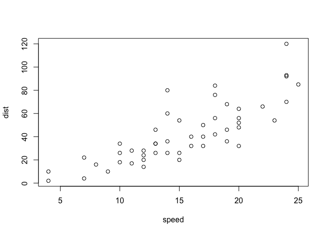

This is an [R Markdown](http://rmarkdown.rstudio.com) Notebook. When you execute code within the notebook, the results appear beneath the code. 

Try executing this chunk by clicking the *Run* button within the chunk or by placing your cursor inside it and pressing *Cmd+Shift+Enter*. 


```r
plot(cars)
```

<!-- -->


#Future
Computational geometry. 
https://www.cgal.org/projects.html#astronomy

One featured example that uses that package: taking redshift data and creating structure. Could perform similar operation to expression data? To create compartments of tissue based on different cell types in each subtissue component...
#


