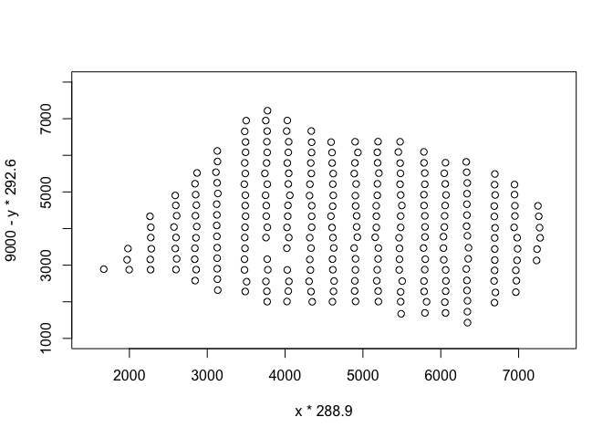
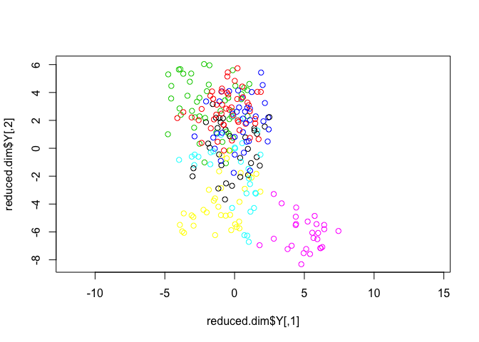
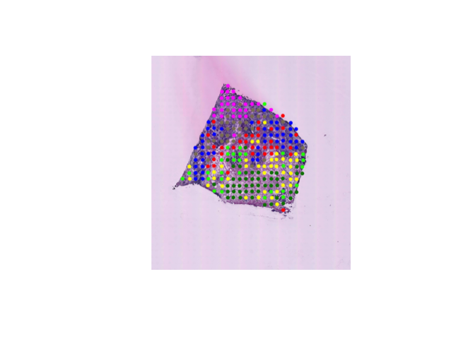

Load count data for breast cancer layer 1. For each of 254 locations on the tissue, load counts of 14,881 genes expressed at that location.  Source data from "Visualization and analysis of gene expression in tissue sections by spatial transcriptomics" (Stahl, Patrik, et al 2016). 


```r
st <- read.csv('Layer1_BC_count_matrix-1.tsv',header=TRUE,sep="\t")
dim(st)
```

```
## [1]   254 14881
```

Counts for 14,881 genes are listed for each of 254 locations:

```r
head(st[1:5,1:6])
```

```
##              X GAPDH UBE2G2 MAPKAPK2 NDUFA7 ASNA1
## 1 13.064x6.086    12      0        6      0     0
## 2 12.116x7.015     7      0        1      0     0
## 3 13.945x6.999    15      1        4      0     0
## 4 12.987x7.011     8      0        0      0     1
## 5 15.011x7.984     4      0        1      0     0
```

The first column lists the coordinates of the locations. 

```r
coordinates <- st$X
x <- as.numeric(substr(coordinates,1,as.integer(regexpr("x",coordinates))-1))
y <- as.numeric(substr(coordinates,as.integer(regexpr("x",coordinates))+1,nchar(as.character(coordinates))))

#head(coordinates)
#head(x)
#head(y)
#plot(x,y)
plot(x * 288.9, y * 292.6,ylim=c(0,9000),xlim=c(0,9000)) #upscale coordinates (or can resize image down to 33x35)
```

<!-- -->


# Using T-SNE to cluster locations

```r
library(Rtsne)
set.seed(1989)
#st_mat <- as.matrix(st[,-1])
test2 <- Rtsne(st,dim=3)
#sample_names <- st[,1]
#test <- normalize_input(st_mat)
#dim(test)
#head(test[1:5,1:5])
#dim(st)
#head(st)
```

Cluster first 2 dimension results from T-SNE, using k-means(7)

```r
set.seed(1989)
clusters <- kmeans(test2$Y,7)$cluster
plot(test2$Y,col=clusters,asp=1)
```

<!-- -->

# Overlay original tissue slide
Load stained image of breast cancer layer 1 (source: https://www.spatialresearch.org/resources-published-datasets/)

```r
library(magick)
```

```
## Linking to ImageMagick 6.9.9.39
## Enabled features: cairo, fontconfig, freetype, lcms, pango, rsvg, webp
## Disabled features: fftw, ghostscript, x11
```

```r
full_img <- image_read('README_files/screenshots/HE_layer1_BC.jpg')
image_info(full_img)
```

```
##   format width height colorspace matte filesize density
## 1   JPEG  9245   9949       sRGB FALSE  4464971   72x72
```

Downscale and preview image:

```r
plot(image_scale(full_img, "1000"))
```

<!-- -->

Annotate tissue image with clusters from tSNE-reduced gene counts:

```r
overlay <- image_scale(full_img, "1000")
cols <- c("red","green","blue","yellow","lime","magenta","wheat4")
dot.size <- 75
for (i in seq(1,length(x))) {
  xi <- x[i] * 288.9 * (image_info(overlay)$width/9245) #upscale to 9k x 9k, then downscale to 1k x 1k
  yi <- y[i] * 292.6 * (image_info(overlay)$height/9949)
  locationi <- paste("+",as.character(xi-dot.size/2)
                     ,"+",as.character(image_info(overlay)$height-yi),sep="")
  overlay <- image_annotate(overlay, "•", size = dot.size, gravity = "southwest", color = cols[clusters[i]], location=locationi)
}
plot(overlay)
```

<!-- -->

The clusters can be used in the plot of x-y location coordinates from the tissue sample. (Save as a gif)

```r
test <- image_scale(c(full_img,overlay), "1000")
image_write(image_animate(image_morph(test, 10)), "README_files/screenshots/bc1.gif")
```

#


# Resources
* Source: Ståhl, Patrik L., et al. "Visualization and analysis of gene expression in tissue sections by spatial transcriptomics." Science 353.6294 (2016): 78-82.
  * Source data: https://www.spatialresearch.org/resources-published-datasets/

* Trendsceek, by Daniel Edsgärd. Vignette: 
  * https://github.com/edsgard/trendsceek/blob/master/vignettes/trendsceek.Rmd
  * Source Paper? "Identification of spatial expression trends in single-cell gene expression data"
    * https://www.ncbi.nlm.nih.gov/pmc/articles/PMC6314435/
    
* Gene expression atlas of a developing tissue by single cell expression correlation analysis
  * https://www.nature.com/articles/s41592-019-0492-x
  * Data here: https://www.ncbi.nlm.nih.gov/search/all/?term=GSE127832

* Subsample large sc datasets: https://www.cell.com/cell-systems/pdfExtended/S2405-4712(19)30152-8


# Future
Computational geometry. 
https://www.cgal.org/projects.html#astronomy

One featured example that uses that package: taking redshift data and creating structure. Could perform similar operation to expression data? To create compartments of tissue based on different cell types in each subtissue component...
#


