Ben Mescher From this
[source](https://satijalab.org/seurat/v3.1/pbmc3k_tutorial.html).

Peripheral Blood Mononuclear Cells (PBMC) freely available from 10X
Genomics. There are 2,700 single cells

    library(dplyr)

    ## 
    ## Attaching package: 'dplyr'

    ## The following objects are masked from 'package:stats':
    ## 
    ##     filter, lag

    ## The following objects are masked from 'package:base':
    ## 
    ##     intersect, setdiff, setequal, union

    library(Seurat)

    ## Warning: package 'Seurat' was built under R version 3.6.3

    library(patchwork)

    ## Warning: package 'patchwork' was built under R version 3.6.3

    # Load the PBMC dataset
    data.dir <- paste(getwd(), "/filtered_gene_bc_matrices/hg19/", sep="")
    data.dir 

    ## [1] "C:/Users/bmescher/Desktop/UTH/Practicum/Seurat_Vignettes/filtered_gene_bc_matrices/hg19/"

    pbmc.data <- Read10X(data.dir = data.dir)
    # Initialize the Seurat object with the raw (non-normalized data).
    pbmc <- CreateSeuratObject(counts = pbmc.data, project = "pbmc3k", min.cells = 3, min.features = 200)

    ## Warning: Feature names cannot have underscores ('_'), replacing with dashes
    ## ('-')

    pbmc

    ## An object of class Seurat 
    ## 13714 features across 2700 samples within 1 assay 
    ## Active assay: RNA (13714 features, 0 variable features)

#### The names like “AAACATACAACCAC-1” are the cells (2700 samples); the names “AL627309.1” are the genes (13714 features)

    pbmc@assays$RNA

    ## Assay data with 13714 features for 2700 cells
    ## First 10 features:
    ##  AL627309.1, AP006222.2, RP11-206L10.2, RP11-206L10.9, LINC00115, NOC2L,
    ## KLHL17, PLEKHN1, RP11-54O7.17, HES4

    pbmc@assays$RNA[1:5,1:5]

    ## 5 x 5 sparse Matrix of class "dgCMatrix"
    ##               AAACATACAACCAC-1 AAACATTGAGCTAC-1 AAACATTGATCAGC-1
    ## AL627309.1                   .                .                .
    ## AP006222.2                   .                .                .
    ## RP11-206L10.2                .                .                .
    ## RP11-206L10.9                .                .                .
    ## LINC00115                    .                .                .
    ##               AAACCGTGCTTCCG-1 AAACCGTGTATGCG-1
    ## AL627309.1                   .                .
    ## AP006222.2                   .                .
    ## RP11-206L10.2                .                .
    ## RP11-206L10.9                .                .
    ## LINC00115                    .                .

I ran this after scaling, but I bet before scaling, these counts for the
AGRN gene would all be integers…

    table(as.numeric(pbmc@assays$RNA[row.names(pbmc@assays$RNA)=="AGRN",]))

    ## 
    ##    0    1 
    ## 2692    8

Preprocessing
-------------

Includes “selection and filtration of cells based on QC metrics, data
normalization and scaling, and the detection of highly variable
features.”

QC: \* The percentage of reads that map to the mitochondrial genome \*
Low-quality / dying cells often exhibit extensive mitochondrial
contamination \* We calculate mitochondrial QC metrics with the
PercentageFeatureSet function, which calculates the percentage of counts
originating from a set of features \* We use the set of all genes
starting with MT- as a set of mitochondrial genes:

    # The [[ operator can add columns to object metadata. This is a great place to stash QC stats
    pbmc[["percent.mt"]] <- PercentageFeatureSet(pbmc, pattern = "^MT-")

The number of unique genes and total molecules are automatically
calculated during CreateSeuratObject for each of the cells (cells are
named “AAACATACAACCAC-1”, etc). See here also the “percent
mitochondrial” feature we just calculated:

    # Show QC metrics for the first 5 cells
    head(pbmc@meta.data, 5)

    ##                  orig.ident nCount_RNA nFeature_RNA percent.mt
    ## AAACATACAACCAC-1     pbmc3k       2419          779  3.0177759
    ## AAACATTGAGCTAC-1     pbmc3k       4903         1352  3.7935958
    ## AAACATTGATCAGC-1     pbmc3k       3147         1129  0.8897363
    ## AAACCGTGCTTCCG-1     pbmc3k       2639          960  1.7430845
    ## AAACCGTGTATGCG-1     pbmc3k        980          521  1.2244898

-   We filter cells that have unique feature counts over 2,500 or less
    than 200
-   We filter cells that have &gt;5% mitochondrial counts

<!-- -->

    # Visualize QC metrics as a violin plot
    VlnPlot(pbmc, features = c("nFeature_RNA", "nCount_RNA", "percent.mt"), ncol = 3)

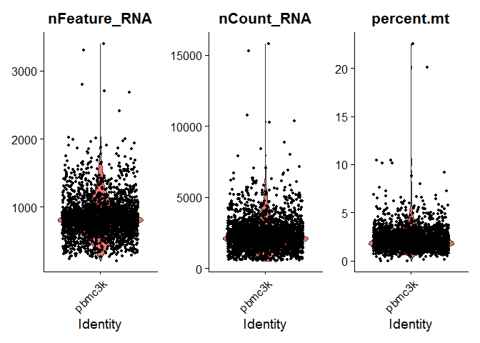

    # FeatureScatter is typically used to visualize feature-feature relationships, but can be used
    # for anything calculated by the object, i.e. columns in object metadata, PC scores etc.

    plot1 <- FeatureScatter(pbmc, feature1 = "nCount_RNA", feature2 = "percent.mt")
    plot2 <- FeatureScatter(pbmc, feature1 = "nCount_RNA", feature2 = "nFeature_RNA")
    plot1 + plot2

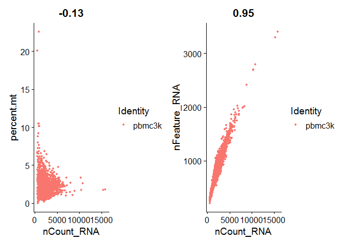

    pbmc <- subset(pbmc, subset = nFeature_RNA > 200 & nFeature_RNA < 2500 & percent.mt < 5)
    dim(pbmc@meta.data) #now only 2,638 cells

    ## [1] 2638    4

### Normalizing the data

By default, we employ a global-scaling normalization method
“LogNormalize” that normalizes the feature expression measurements for
each cell by the total expression, multiplies this by a scale factor
(10,000 by default), and log-transforms the result. Normalized values
are stored in `pbmc[["RNA"]]@data`.

    pbmc <- NormalizeData(pbmc, normalization.method = "LogNormalize", scale.factor = 10000)

### Identification of highly variable features (feature selection)

We next calculate a subset of features that exhibit high cell-to-cell
variation in the dataset (i.e, they are highly expressed in some cells,
and lowly expressed in others). We and others have found that focusing
on these genes in downstream analysis helps to highlight biological
signal in single-cell datasets.

Our procedure in Seurat3 is described in detail here, and improves on
previous versions by directly modeling the mean-variance relationship
inherent in single-cell data, and is implemented in the
FindVariableFeatures function. By default, we return 2,000 features per
dataset. These will be used in downstream analysis, like PCA.

    pbmc <- FindVariableFeatures(pbmc, selection.method = "vst", nfeatures = 2000)

    # Identify the 10 most highly variable genes
    top10 <- head(VariableFeatures(pbmc), 10)

    # plot variable features with and without labels
    plot1 <- VariableFeaturePlot(pbmc)
    plot2 <- LabelPoints(plot = plot1, points = top10, repel = TRUE)

    ## When using repel, set xnudge and ynudge to 0 for optimal results

    plot1 + plot2

    ## Warning: Transformation introduced infinite values in continuous x-axis

    ## Warning: Transformation introduced infinite values in continuous x-axis

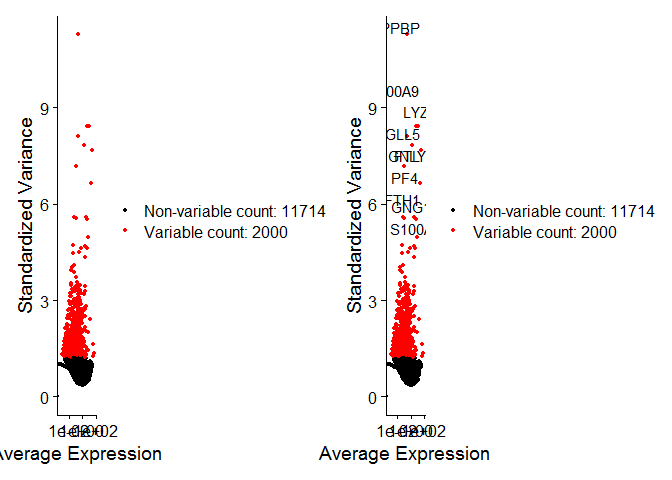

### Scaling the data

Next, we apply a linear transformation (‘scaling’) that is a standard
pre-processing step prior to dimensional reduction techniques like PCA.
The ScaleData function:

-   Shifts the expression of each gene, so that the mean expression
    across cells is 0
-   Scales the expression of each gene, so that the variance across
    cells is 1
-   This step gives equal weight in downstream analyses, so that
    highly-expressed genes do not dominate
-   The results of this are stored in `pbmc[["RNA"]]@scale.data`

Seurat heatmaps (produced as shown below with DoHeatmap) require genes
in the heatmap to be scaled, to make sure highly-expressed genes don’t
dominate the heatmap. To make sure we don’t leave any genes out of the
heatmap later, we are scaling all genes in this tutorial.

    all.genes <- rownames(pbmc)
    pbmc <- ScaleData(pbmc, features = all.genes)

    ## Centering and scaling data matrix

How can I remove unwanted sources of variation, as in Seurat v2? In
Seurat v2 we also use the ScaleData function to remove unwanted sources
of variation from a single-cell dataset. For example, we could ‘regress
out’ heterogeneity associated with (for example) cell cycle stage, or
mitochondrial contamination. These features are still supported in
ScaleData in Seurat v3, i.e.:

`pbmc <- ScaleData(pbmc, vars.to.regress = "percent.mt")`

However, particularly for advanced users who would like to use this
functionality, we strongly recommend the use of our new normalization
workflow, sctransform. The method is described in our recent preprint,
with a separate vignette using Seurat v3 here. As with ScaleData, the
function SCTransform also includes a vars.to.regress parameter.

### Perform linear dimensional reduction

    pbmc <- RunPCA(pbmc, features = VariableFeatures(object = pbmc))

    ## PC_ 1 
    ## Positive:  CST3, TYROBP, LST1, AIF1, FTL, FTH1, LYZ, FCN1, S100A9, TYMP 
    ##     FCER1G, CFD, LGALS1, S100A8, CTSS, LGALS2, SERPINA1, IFITM3, SPI1, CFP 
    ##     PSAP, IFI30, SAT1, COTL1, S100A11, NPC2, GRN, LGALS3, GSTP1, PYCARD 
    ## Negative:  MALAT1, LTB, IL32, IL7R, CD2, B2M, ACAP1, CD27, STK17A, CTSW 
    ##     CD247, GIMAP5, AQP3, CCL5, SELL, TRAF3IP3, GZMA, MAL, CST7, ITM2A 
    ##     MYC, GIMAP7, HOPX, BEX2, LDLRAP1, GZMK, ETS1, ZAP70, TNFAIP8, RIC3 
    ## PC_ 2 
    ## Positive:  CD79A, MS4A1, TCL1A, HLA-DQA1, HLA-DQB1, HLA-DRA, LINC00926, CD79B, HLA-DRB1, CD74 
    ##     HLA-DMA, HLA-DPB1, HLA-DQA2, CD37, HLA-DRB5, HLA-DMB, HLA-DPA1, FCRLA, HVCN1, LTB 
    ##     BLNK, P2RX5, IGLL5, IRF8, SWAP70, ARHGAP24, FCGR2B, SMIM14, PPP1R14A, C16orf74 
    ## Negative:  NKG7, PRF1, CST7, GZMB, GZMA, FGFBP2, CTSW, GNLY, B2M, SPON2 
    ##     CCL4, GZMH, FCGR3A, CCL5, CD247, XCL2, CLIC3, AKR1C3, SRGN, HOPX 
    ##     TTC38, APMAP, CTSC, S100A4, IGFBP7, ANXA1, ID2, IL32, XCL1, RHOC 
    ## PC_ 3 
    ## Positive:  HLA-DQA1, CD79A, CD79B, HLA-DQB1, HLA-DPB1, HLA-DPA1, CD74, MS4A1, HLA-DRB1, HLA-DRA 
    ##     HLA-DRB5, HLA-DQA2, TCL1A, LINC00926, HLA-DMB, HLA-DMA, CD37, HVCN1, FCRLA, IRF8 
    ##     PLAC8, BLNK, MALAT1, SMIM14, PLD4, LAT2, IGLL5, P2RX5, SWAP70, FCGR2B 
    ## Negative:  PPBP, PF4, SDPR, SPARC, GNG11, NRGN, GP9, RGS18, TUBB1, CLU 
    ##     HIST1H2AC, AP001189.4, ITGA2B, CD9, TMEM40, PTCRA, CA2, ACRBP, MMD, TREML1 
    ##     NGFRAP1, F13A1, SEPT5, RUFY1, TSC22D1, MPP1, CMTM5, RP11-367G6.3, MYL9, GP1BA 
    ## PC_ 4 
    ## Positive:  HLA-DQA1, CD79B, CD79A, MS4A1, HLA-DQB1, CD74, HLA-DPB1, HIST1H2AC, PF4, TCL1A 
    ##     SDPR, HLA-DPA1, HLA-DRB1, HLA-DQA2, HLA-DRA, PPBP, LINC00926, GNG11, HLA-DRB5, SPARC 
    ##     GP9, AP001189.4, CA2, PTCRA, CD9, NRGN, RGS18, GZMB, CLU, TUBB1 
    ## Negative:  VIM, IL7R, S100A6, IL32, S100A8, S100A4, GIMAP7, S100A10, S100A9, MAL 
    ##     AQP3, CD2, CD14, FYB, LGALS2, GIMAP4, ANXA1, CD27, FCN1, RBP7 
    ##     LYZ, S100A11, GIMAP5, MS4A6A, S100A12, FOLR3, TRABD2A, AIF1, IL8, IFI6 
    ## PC_ 5 
    ## Positive:  GZMB, NKG7, S100A8, FGFBP2, GNLY, CCL4, CST7, PRF1, GZMA, SPON2 
    ##     GZMH, S100A9, LGALS2, CCL3, CTSW, XCL2, CD14, CLIC3, S100A12, CCL5 
    ##     RBP7, MS4A6A, GSTP1, FOLR3, IGFBP7, TYROBP, TTC38, AKR1C3, XCL1, HOPX 
    ## Negative:  LTB, IL7R, CKB, VIM, MS4A7, AQP3, CYTIP, RP11-290F20.3, SIGLEC10, HMOX1 
    ##     PTGES3, LILRB2, MAL, CD27, HN1, CD2, GDI2, ANXA5, CORO1B, TUBA1B 
    ##     FAM110A, ATP1A1, TRADD, PPA1, CCDC109B, ABRACL, CTD-2006K23.1, WARS, VMO1, FYB

Seurat provides several useful ways of visualizing both cells and
features that define the PCA, including VizDimReduction, DimPlot, and
DimHeatmap

    # Examine and visualize PCA results a few different ways
    print(pbmc[["pca"]], dims = 1:5, nfeatures = 5)

    ## PC_ 1 
    ## Positive:  CST3, TYROBP, LST1, AIF1, FTL 
    ## Negative:  MALAT1, LTB, IL32, IL7R, CD2 
    ## PC_ 2 
    ## Positive:  CD79A, MS4A1, TCL1A, HLA-DQA1, HLA-DQB1 
    ## Negative:  NKG7, PRF1, CST7, GZMB, GZMA 
    ## PC_ 3 
    ## Positive:  HLA-DQA1, CD79A, CD79B, HLA-DQB1, HLA-DPB1 
    ## Negative:  PPBP, PF4, SDPR, SPARC, GNG11 
    ## PC_ 4 
    ## Positive:  HLA-DQA1, CD79B, CD79A, MS4A1, HLA-DQB1 
    ## Negative:  VIM, IL7R, S100A6, IL32, S100A8 
    ## PC_ 5 
    ## Positive:  GZMB, NKG7, S100A8, FGFBP2, GNLY 
    ## Negative:  LTB, IL7R, CKB, VIM, MS4A7

    VizDimLoadings(pbmc, dims = 1:2, reduction = "pca")

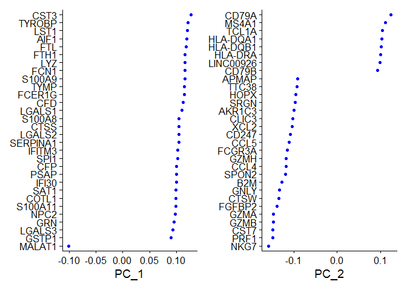

    DimPlot(pbmc, reduction = "pca")

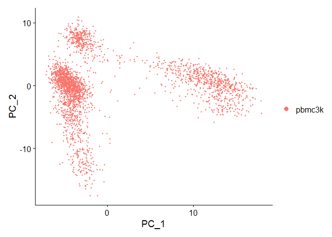

In particular DimHeatmap allows for easy exploration of the primary
sources of heterogeneity in a dataset, and can be useful when trying to
decide which PCs to include for further downstream analyses. Both cells
and features are ordered according to their PCA scores. Setting cells to
a number plots the ‘extreme’ cells on both ends of the spectrum, which
dramatically speeds plotting for large datasets. Though clearly a
supervised analysis, we find this to be a valuable tool for exploring
correlated feature sets.

    DimHeatmap(pbmc, dims = 1, cells = 500, balanced = TRUE)

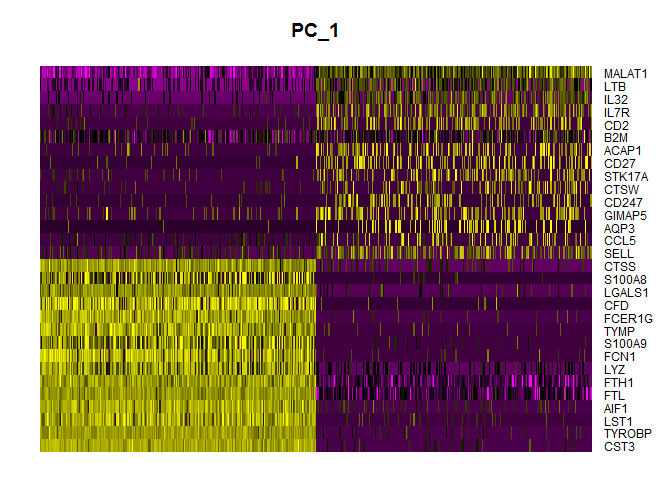

    DimHeatmap(pbmc, dims = 1:15, cells = 500, balanced = TRUE)

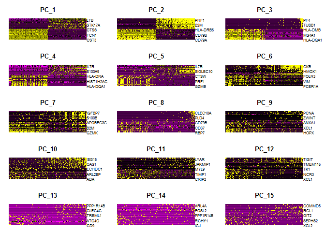

Determine the ‘dimensionality’ of the dataset
---------------------------------------------

To overcome the extensive technical noise in any single feature for
scRNA-seq data, Seurat clusters cells based on their PCA scores, with
each PC essentially representing a ‘metafeature’ that combines
information across a correlated feature set. The top principal
components therefore represent a robust compression of the dataset.
However, how many componenets should we choose to include? 10? 20? 100?

In Macosko et al, we implemented a resampling test inspired by the
JackStraw procedure. We randomly permute a subset of the data (1% by
default) and rerun PCA, constructing a ‘null distribution’ of feature
scores, and repeat this procedure. We identify ‘significant’ PCs as
those who have a strong enrichment of low p-value features.

    # NOTE: This process can take a long time for big datasets, comment out for expediency. More
    # approximate techniques such as those implemented in ElbowPlot() can be used to reduce
    # computation time
    pbmc <- JackStraw(pbmc, num.replicate = 100)
    pbmc <- ScoreJackStraw(pbmc, dims = 1:20)

The JackStrawPlot function provides a visualization tool for comparing
the distribution of p-values for each PC with a uniform distribution
(dashed line). ‘Significant’ PCs will show a strong enrichment of
features with low p-values (solid curve above the dashed line). In this
case it appears that there is a sharp drop-off in significance after the
first 10-12 PCs.

    JackStrawPlot(pbmc, dims = 1:15)

    ## Warning: Removed 23496 rows containing missing values (geom_point).

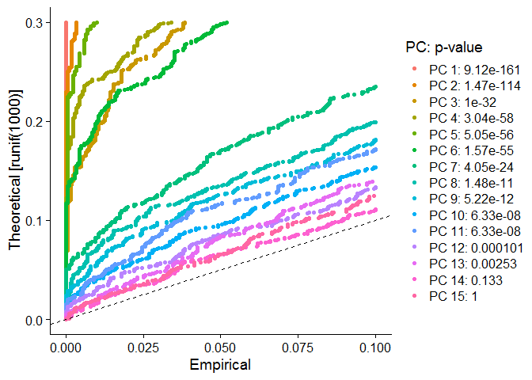

Identifying the true dimensionality of a dataset – can be
challenging/uncertain for the user. We therefore suggest these three
approaches to consider. The first is more supervised, exploring PCs to
determine relevant sources of heterogeneity, and could be used in
conjunction with GSEA for example. The second implements a statistical
test based on a random null model, but is time-consuming for large
datasets, and may not return a clear PC cutoff. The third is a heuristic
that is commonly used, and can be calculated instantly. In this example,
all three approaches yielded similar results, but we might have been
justified in choosing anything between PC 7-12 as a cutoff.

We chose 10 here, but encourage users to consider the following:

-   Dendritic cell and NK aficionados may recognize that genes strongly
    associated with PCs 12 and 13 define rare immune subsets (i.e. MZB1
    is a marker for plasmacytoid DCs). However, these groups are so
    rare, they are difficult to distinguish from background noise for a
    dataset of this size without prior knowledge.
-   We encourage users to repeat downstream analyses with a different
    number of PCs (10, 15, or even 50!). As you will observe, the
    results often do not differ dramatically.
-   We advise users to err on the higher side when choosing this
    parameter. For example, performing downstream analyses with only 5
    PCs does signifcanltly and adversely affect results.

Cluster the cells
-----------------

Seurat v3 applies a graph-based clustering approach, building upon
initial strategies in (Macosko et al). Importantly, the distance metric
which drives the clustering analysis (based on previously identified
PCs) remains the same. However, our approach to partioning the cellular
distance matrix into clusters has dramatically improved. Our approach
was heavily inspired by recent manuscripts which applied graph-based
clustering approaches to scRNA-seq data \[SNN-Cliq, Xu and Su,
Bioinformatics, 2015\] and CyTOF data \[PhenoGraph, Levine et al., Cell,
2015\]. Briefly, these methods embed cells in a graph structure - for
example a K-nearest neighbor (KNN) graph, with edges drawn between cells
with similar feature expression patterns, and then attempt to partition
this graph into highly interconnected ‘quasi-cliques’ or ‘communities’.

    pbmc <- FindNeighbors(pbmc, dims = 1:10)

    ## Computing nearest neighbor graph

    ## Computing SNN

    pbmc <- FindClusters(pbmc, resolution = 0.5)

    ## Modularity Optimizer version 1.3.0 by Ludo Waltman and Nees Jan van Eck
    ## 
    ## Number of nodes: 2638
    ## Number of edges: 96033
    ## 
    ## Running Louvain algorithm...
    ## Maximum modularity in 10 random starts: 0.8720
    ## Number of communities: 9
    ## Elapsed time: 0 seconds

    # Look at cluster IDs of the first 5 cells
    head(Idents(pbmc), 5)

    ## AAACATACAACCAC-1 AAACATTGAGCTAC-1 AAACATTGATCAGC-1 AAACCGTGCTTCCG-1 
    ##                1                3                1                2 
    ## AAACCGTGTATGCG-1 
    ##                6 
    ## Levels: 0 1 2 3 4 5 6 7 8

### Run non-linear dimensional reduction (UMAP/tSNE)

Seurat offers several non-linear dimensional reduction techniques, such
as tSNE and UMAP, to visualize and explore these datasets. The goal of
these algorithms is to learn the underlying manifold of the data in
order to place similar cells together in low-dimensional space. *Cells
within the graph-based clusters determined above should co-localize on
these dimension reduction plots*. As input to the UMAP and tSNE, we
suggest using the same PCs as input to the clustering analysis.

    # If you haven't installed UMAP, you can do so via reticulate::py_install(packages =
    # 'umap-learn')
    pbmc <- RunUMAP(pbmc, dims = 1:10)

    ## Warning: The default method for RunUMAP has changed from calling Python UMAP via reticulate to the R-native UWOT using the cosine metric
    ## To use Python UMAP via reticulate, set umap.method to 'umap-learn' and metric to 'correlation'
    ## This message will be shown once per session

    ## 15:14:04 UMAP embedding parameters a = 0.9922 b = 1.112

    ## 15:14:04 Read 2638 rows and found 10 numeric columns

    ## 15:14:04 Using Annoy for neighbor search, n_neighbors = 30

    ## 15:14:04 Building Annoy index with metric = cosine, n_trees = 50

    ## 0%   10   20   30   40   50   60   70   80   90   100%

    ## [----|----|----|----|----|----|----|----|----|----|

    ## **************************************************|
    ## 15:14:05 Writing NN index file to temp file C:\Users\bmescher\AppData\Local\Temp\RtmpAjv8ii\file3cbc34c9e3b
    ## 15:14:05 Searching Annoy index using 1 thread, search_k = 3000
    ## 15:14:07 Annoy recall = 100%
    ## 15:14:07 Commencing smooth kNN distance calibration using 1 thread
    ## 15:14:08 Initializing from normalized Laplacian + noise
    ## 15:14:08 Commencing optimization for 500 epochs, with 105386 positive edges
    ## 15:14:18 Optimization finished

    # note that you can set `label = TRUE` or use the LabelClusters function to help label
    # individual clusters
    DimPlot(pbmc, reduction = "umap")

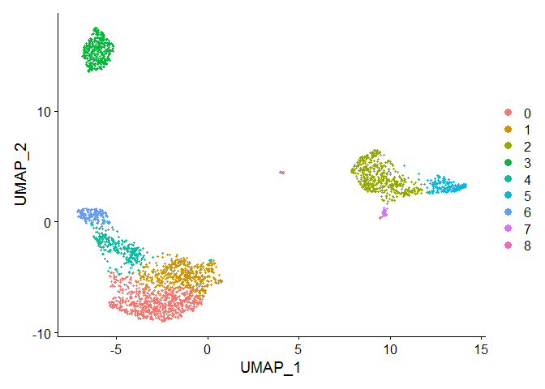

You can save the object at this point so that it can easily be loaded
back in without having to rerun the computationally intensive steps
performed above, or easily shared with collaborators.

    #saveRDS(pbmc, file = "../pbmc_tutorial.rds")

Finding differentially expressed features (cluster biomarkers)
--------------------------------------------------------------

Seurat can help you find markers that define clusters via differential
expression. By default, it identifes positive and negative markers of a
single cluster (specified in ident.1), compared to all other cells.
FindAllMarkers automates this process for all clusters, but you can also
test groups of clusters vs. each other, or against all cells.

The min.pct argument requires a feature to be detected at a minimum
percentage in either of the two groups of cells, and the thresh.test
argument requires a feature to be differentially expressed (on average)
by some amount between the two groups. You can set both of these to 0,
but with a dramatic increase in time - since this will test a large
number of features that are unlikely to be highly discriminatory. As
another option to speed up these computations, max.cells.per.ident can
be set. This will downsample each identity class to have no more cells
than whatever this is set to. While there is generally going to be a
loss in power, the speed increases can be significiant and the most
highly differentially expressed features will likely still rise to the
top.

    # find all markers of cluster 1
    cluster1.markers <- FindMarkers(pbmc, ident.1 = 1, min.pct = 0.25)
    head(cluster1.markers, n = 5)

    ##             p_val avg_logFC pct.1 pct.2    p_val_adj
    ## IL32 1.894810e-92 0.8373872 0.948 0.464 2.598542e-88
    ## LTB  7.953303e-89 0.8921170 0.981 0.642 1.090716e-84
    ## CD3D 1.655937e-70 0.6436286 0.919 0.431 2.270951e-66
    ## IL7R 3.688893e-68 0.8147082 0.747 0.325 5.058947e-64
    ## LDHB 2.292819e-67 0.6253110 0.950 0.613 3.144372e-63

    # find all markers distinguishing cluster 5 from clusters 0 and 3
    cluster5.markers <- FindMarkers(pbmc, ident.1 = 5, ident.2 = c(0, 3), min.pct = 0.25)
    head(cluster5.markers, n = 5)

    ##                       p_val avg_logFC pct.1 pct.2     p_val_adj
    ## FCGR3A        7.583625e-209  2.963144 0.975 0.037 1.040018e-204
    ## IFITM3        2.500844e-199  2.698187 0.975 0.046 3.429657e-195
    ## CFD           1.763722e-195  2.362381 0.938 0.037 2.418768e-191
    ## CD68          4.612171e-192  2.087366 0.926 0.036 6.325132e-188
    ## RP11-290F20.3 1.846215e-188  1.886288 0.840 0.016 2.531900e-184

    # find all markers distinguishing cluster 5 from clusters 0 and 3
    cluster5.markers <- FindMarkers(pbmc, ident.1 = 5, ident.2 = c(0, 3), min.pct = 0.25)
    head(cluster5.markers, n = 5)

    ##                       p_val avg_logFC pct.1 pct.2     p_val_adj
    ## FCGR3A        7.583625e-209  2.963144 0.975 0.037 1.040018e-204
    ## IFITM3        2.500844e-199  2.698187 0.975 0.046 3.429657e-195
    ## CFD           1.763722e-195  2.362381 0.938 0.037 2.418768e-191
    ## CD68          4.612171e-192  2.087366 0.926 0.036 6.325132e-188
    ## RP11-290F20.3 1.846215e-188  1.886288 0.840 0.016 2.531900e-184

    # find markers for every cluster compared to all remaining cells, report only the positive ones
    pbmc.markers <- FindAllMarkers(pbmc, only.pos = TRUE, min.pct = 0.25, logfc.threshold = 0.25)

    ## Calculating cluster 0

    ## Calculating cluster 1

    ## Calculating cluster 2

    ## Calculating cluster 3

    ## Calculating cluster 4

    ## Calculating cluster 5

    ## Calculating cluster 6

    ## Calculating cluster 7

    ## Calculating cluster 8

    pbmc.markers %>% group_by(cluster) %>% top_n(n = 2, wt = avg_logFC)

    ## # A tibble: 18 x 7
    ## # Groups:   cluster [9]
    ##        p_val avg_logFC pct.1 pct.2 p_val_adj cluster gene    
    ##        <dbl>     <dbl> <dbl> <dbl>     <dbl> <fct>   <chr>   
    ##  1 1.96e-107     0.730 0.901 0.594 2.69e-103 0       LDHB    
    ##  2 1.61e- 82     0.922 0.436 0.11  2.20e- 78 0       CCR7    
    ##  3 7.95e- 89     0.892 0.981 0.642 1.09e- 84 1       LTB     
    ##  4 1.85e- 60     0.859 0.422 0.11  2.54e- 56 1       AQP3    
    ##  5 0.            3.86  0.996 0.215 0.        2       S100A9  
    ##  6 0.            3.80  0.975 0.121 0.        2       S100A8  
    ##  7 0.            2.99  0.936 0.041 0.        3       CD79A   
    ##  8 9.48e-271     2.49  0.622 0.022 1.30e-266 3       TCL1A   
    ##  9 2.96e-189     2.12  0.985 0.24  4.06e-185 4       CCL5    
    ## 10 2.57e-158     2.05  0.587 0.059 3.52e-154 4       GZMK    
    ## 11 3.51e-184     2.30  0.975 0.134 4.82e-180 5       FCGR3A  
    ## 12 2.03e-125     2.14  1     0.315 2.78e-121 5       LST1    
    ## 13 7.95e-269     3.35  0.961 0.068 1.09e-264 6       GZMB    
    ## 14 3.13e-191     3.69  0.961 0.131 4.30e-187 6       GNLY    
    ## 15 1.48e-220     2.68  0.812 0.011 2.03e-216 7       FCER1A  
    ## 16 1.67e- 21     1.99  1     0.513 2.28e- 17 7       HLA-DPB1
    ## 17 7.73e-200     5.02  1     0.01  1.06e-195 8       PF4     
    ## 18 3.68e-110     5.94  1     0.024 5.05e-106 8       PPBP

Seurat has several tests for differential expression which can be set
with the test.use parameter (see our DE vignette for details). For
example, the ROC test returns the ‘classification power’ for any
individual marker (ranging from 0 - random, to 1 - perfect).

    cluster1.markers <- FindMarkers(pbmc, ident.1 = 0, logfc.threshold = 0.25, test.use = "roc", only.pos = TRUE)

We include several tools for visualizing marker expression. VlnPlot
(shows expression probability distributions across clusters), and
FeaturePlot (visualizes feature expression on a tSNE or PCA plot) are
our most commonly used visualizations. We also suggest exploring
RidgePlot, CellScatter, and DotPlot as additional methods to view your
dataset.

    VlnPlot(pbmc, features = c("MS4A1", "CD79A"))

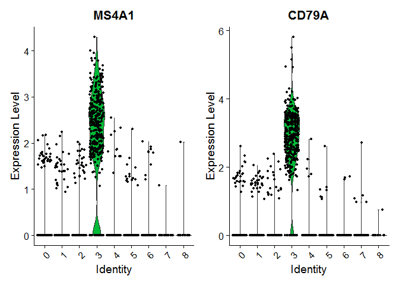

    # you can plot raw counts as well
    VlnPlot(pbmc, features = c("NKG7", "PF4"), slot = "counts", log = TRUE)

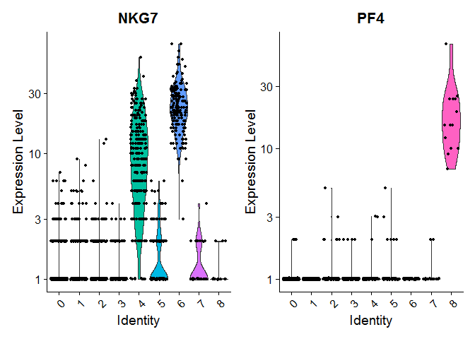

    FeaturePlot(pbmc, features = c("MS4A1", "GNLY", "CD3E", "CD14", "FCER1A", "FCGR3A", "LYZ", "PPBP", 
        "CD8A"))

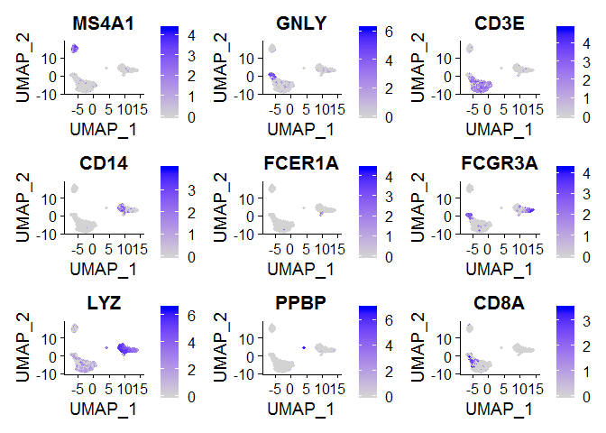

DoHeatmap generates an expression heatmap for given cells and features.
In this case, we are plotting the top 20 markers (or all markers if less
than 20) for each cluster.

    top10 <- pbmc.markers %>% group_by(cluster) %>% top_n(n = 10, wt = avg_logFC)
    DoHeatmap(pbmc, features = top10$gene) + NoLegend()

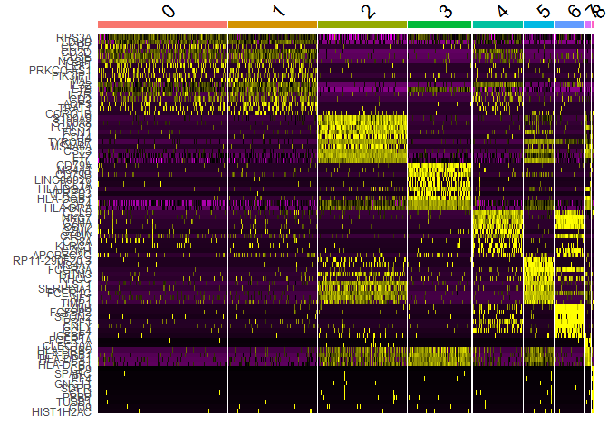

Assigning cell type identity to clusters Fortunately in the case of this
dataset, we can use canonical markers to easily match the unbiased
clustering to known cell types:

Cluster ID Markers Cell Type 0 IL7R, CCR7 Naive CD4+ T 1 IL7R, S100A4
Memory CD4+ 2 CD14, LYZ CD14+ Mono 3 MS4A1 B 4 CD8A CD8+ T 5 FCGR3A,
MS4A7 FCGR3A+ Mono 6 GNLY, NKG7 NK 7 FCER1A, CST3 DC 8 PPBP Platelet

    new.cluster.ids <- c("Naive CD4 T", "Memory CD4 T", "CD14+ Mono", "B", "CD8 T", "FCGR3A+ Mono", 
        "NK", "DC", "Platelet")
    names(new.cluster.ids) <- levels(pbmc)
    pbmc <- RenameIdents(pbmc, new.cluster.ids)
    DimPlot(pbmc, reduction = "umap", label = TRUE, pt.size = 0.5) + NoLegend()

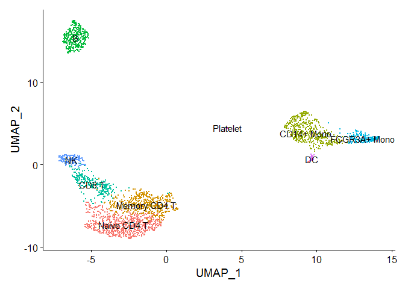

    #saveRDS(pbmc, file = "../pbmc3k_final.rds")
